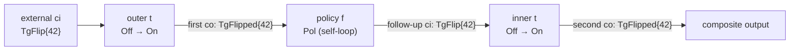

<Callout type="info">
This chapter is part of the composition source tour. Start at
[00 — Start here](/docs/keiki/walkthrough/composition/00-start-here) for the map of the whole tour.
</Callout>

The previous chapter read `alternative` and the `Either` lifters — disjoint-input dispatch where two
aggregates run side by side. This chapter reads `feedback1` in `keiki/src/Keiki/Composition.hs`: a
combinator that models *one round* of an aggregate reacting to its own emitted event through a
stateless policy. It is the smallest combinator in the module — its entire body is a single
expression — but the type it carries, and the constraint that type forces, repay a careful read.

## The reduction: two stacked composes

`feedback1` is not a new piece of machinery. It is `compose` applied twice:

```haskell
-- keiki/src/Keiki/Composition.hs
feedback1
  :: forall rs1 rs2 s1 s2 ci co.
     ( WeakenR rs1
     , WeakenR rs2
     , Disjoint (Names rs2) (Names rs1)
     , Disjoint (Names rs1) (Names (Append rs2 rs1))
     )
  => SymTransducer (HsPred rs1 ci) rs1 s1 ci co
  -> SymTransducer (HsPred rs2 co) rs2 s2 co ci
  -> SymTransducer (HsPred (Append rs1 (Append rs2 rs1)) ci)
                   (Append rs1 (Append rs2 rs1))
                   (Composite s1 (Composite s2 s1))
                   ci
                   co
feedback1 t f = compose t (compose f t)
```

Read the two arguments by their alphabets. `t` is the **aggregate**: it consumes an external command
`ci` and emits an event `co`. `f` is the **policy** (the stateless reactor): it consumes that same
event `co` and emits a follow-up command `ci`. The body wires them in a specific nesting:

<Steps>
<Step>
The inner `compose f t` chains the policy's output — a command for `t` — straight into a *second*
invocation of `t`. Its input alphabet is `co` (the policy reads events), its output is `co` (the
second `t` emits events).
</Step>
<Step>
The outer `compose t (compose f t)` feeds the *first* `t`'s emitted event into that inner pipeline.
The first `t` consumes the external `ci`; its `co` output becomes the inner pipeline's `co` input.
</Step>
</Steps>

The aggregate `t` therefore appears **twice** in the composite — once as the outer leg, once buried
inside the inner `compose f t`. That doubling is the whole story of this combinator's type and its
limitations.

## The composite vertex

The composite vertex falls straight out of `compose`'s `Composite` pairing applied twice:

```haskell
Composite s1 (Composite s2 s1)
```

The module haddock spells out how to read it:

```haskell
-- keiki/src/Keiki/Composition.hs
-- The composite vertex is @Composite s1 (Composite s2 s1)@ —
-- "outer t state, then (policy state, inner t state)". Even though
-- the inner @s1@ is the same Haskell type as the outer, it occupies
-- a distinct dimension of the composite vertex tuple, so
-- 'Keiki.Symbolic.isSingleValuedSym''s per-vertex enumeration walks
-- all @|s1| * |s2| * |s1|@ combinations independently.
```

The two copies of `s1` are the **same Haskell type** but **distinct dimensions** of the product. The
inner `t` advances independently of the outer `t` — they do not share state. The acceptance test
makes this observable.

## What one round looks like

The `CompositionFeedback1Spec` fixture (`keiki/test/Keiki/CompositionFeedback1Spec.hs`) is a toggle
aggregate and a stateless echo policy. The aggregate flips `Off` ↔ `On` on each `TgFlip` command and
emits a `TgFlipped` event; the policy emits another `TgFlip` on every `TgFlipped` it observes,
forwarding the value field. The composite is `feedback1 toggleAgg togglePolicy`:

```haskell
-- keiki/test/Keiki/CompositionFeedback1Spec.hs
loop
  :: SymTransducer
       (HsPred (Append ToggleRegs (Append PolicyRegs ToggleRegs)) TgCmd)
       (Append ToggleRegs (Append PolicyRegs ToggleRegs))
       (Composite ToggleVertex (Composite PolicyVertex ToggleVertex))
       TgCmd
       TgEv
loop = feedback1 toggleAgg togglePolicy
```

One external command drives the whole cascade in a single composite step, and the test reads the
composite vertex afterwards to prove the cascade ran:

```haskell
-- keiki/test/Keiki/CompositionFeedback1Spec.hs
it "Composite Off (Composite Pol Off) -- TgFlip{42} --> Composite On (Composite Pol On), emitting TgFlipped{42}" $
  case step loop (initial loop, initialRegs loop) externalCmd of
    Just (Composite outerT (Composite policy innerT), _, [co]) -> do
      outerT `shouldBe` On       -- outer toggle stepped Off → On
      policy `shouldBe` Pol      -- policy self-loops
      innerT `shouldBe` On       -- inner toggle stepped Off → On (proves cascade ran)
      co     `shouldBe` cascadedEvent
```

The key line is `innerT shouldBe On`. Both copies of the toggle have transitioned, which can only
happen if the policy's emitted command was consumed by the second `t`. The output is the **second**
event — the aggregate's `co` emitted after consuming the policy's follow-up — carrying the original
`tValue` forwarded through the cascade by `compose`'s structural substitution.



The emitted event is the **second** one — that is the combinator's defining choice. The first event
is consumed internally by the policy and never reaches the composite's output.

## The stateless-aggregate constraint

Now read the fourth constraint in the signature:

```haskell
-- keiki/src/Keiki/Composition.hs
, Disjoint (Names rs1) (Names (Append rs2 rs1))
```

This is the outer `compose`'s slot-disjointness check, applied to `rs1` (the aggregate's register
file) versus `Append rs2 rs1` (the inner pipeline's register file). The aggregate's slot names appear
on **both sides** of the `Disjoint` — `rs1` is a sub-term of `Append rs2 rs1`. The module haddock
draws the conclusion:

```haskell
-- keiki/src/Keiki/Composition.hs
-- The constraint @'Disjoint' ('Names' rs1) ('Names' ('Append' rs2 rs1))@
-- is the outer 'compose''s slot-disjointness check applied to
-- @rs1@ versus @Append rs2 rs1@. Since @rs1@ appears on both sides,
-- the constraint is only satisfiable when @rs1 = '[]@ — i.e. when
-- t is **stateless** (its register file is empty). For non-empty
-- @rs1@, the call site fails with a slot-collision @TypeError@.
```

<Callout type="warn">
`feedback1` requires the aggregate `t` to have an **empty register file** (`rs1 ~ '[]`). The
constraint is unsatisfiable otherwise: `rs1` would collide with itself across the two copies of `t`.
A non-empty `rs1` fails at the call site with a slot-collision `TypeError`. The aggregate's state
must live entirely in its **control vertex** — exactly as the toggle fixture does (`type ToggleRegs =
'[]`, with `Off`/`On` carrying the state).
</Callout>

This is not an arbitrary restriction. It is a direct consequence of the two-stacked-`compose`
reduction: `t` appears twice, and keiki's register-file model gives each appearance its own copy of
`rs1`. There is no facility for the second `t` to read or write the first `t`'s registers — that
"shared-state" variant is recorded as a future extension in the design note, not shipped here. The
"stateless policy" recommendation for `f` (single vertex, empty `rs2`) is convention rather than
enforced; the toggle fixture follows it (`type PolicyRegs = '[]`).

## Why one round per external command

The pure-core boundary holds because there is **no loop**. The cascade runs exactly once per external
command: command in, aggregate emits, policy reacts, aggregate emits again, done. There is no
fixed-point iteration, no unbounded feedback — `feedback1` consumes one `ci` and produces one `co`,
and the composite is an ordinary `SymTransducer` that `step`, `omega`, and `reconstitute` all run
without special handling. The spec confirms this by replaying the canonical one-event log:

```haskell
-- keiki/test/Keiki/CompositionFeedback1Spec.hs
it "reconstitute on [cascadedEvent] lands at Composite On (Composite Pol On)" $
  case reconstitute loop [cascadedEvent] of
    Just (Composite outerT (Composite policy innerT), _) -> do
      outerT `shouldBe` On
      policy `shouldBe` Pol
      innerT `shouldBe` On
```

The composite also passes `checkHiddenInputs` (no warnings) and `isSingleValuedSym` — it inherits
every keiki guarantee from the underlying `compose`.

## Multi-round patterns: nest, do not loop

There is **no `feedbackN`** in the shipped module. A bounded-step variant `feedbackN n t f` that
iterates the cascade `n` times is documented in the design note but not exported. Multi-round patterns
are expressed by **nesting** `feedback1`:

```haskell
-- keiki/src/Keiki/Composition.hs
--     twoRounds = feedback1 (feedback1 t f) f
```

Each level of nesting adds one more round, and each level adds another copy of the aggregate to the
composite vertex tuple — which is why nesting only typechecks while the inner aggregate stays
stateless. For genuine async, multi-round, durable feedback loops, the composite is a wiring artifact;
the actual reaction loop runs through keiro, which we reach in
[11 — A cross-context process, end to end](/docs/keiki/walkthrough/composition/11-cross-context-process-tour).

Previous: [05 — Either lifters and Alternative](/docs/keiki/walkthrough/composition/05-either-lifters-and-alternative).

Next: [07 — N-ary families](/docs/keiki/walkthrough/composition/07-nary-families).
