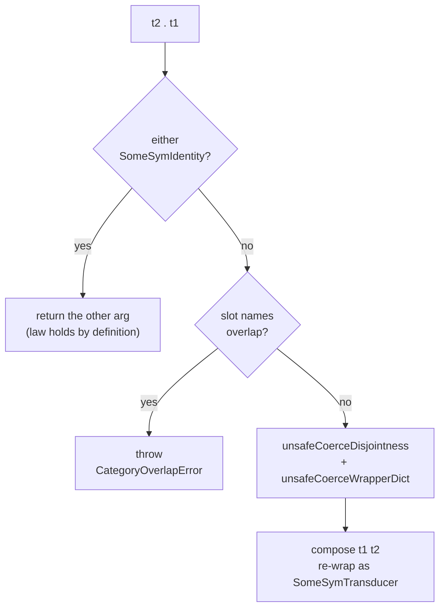

<Callout type="info">
This chapter is part of the composition source tour. Start at
[00 — Start here](/docs/keiki/walkthrough/composition/00-start-here) for the map of the whole tour.
</Callout>

The previous chapter read the wrapper and its variance combinators. This chapter reads the
`Control.Category.Category` instance on `SomeSymTransducer` in `keiki/src/Keiki/Profunctor.hs`. The
instance is small, but it surfaces a real tension: `compose` demands a *static* `Disjoint (Names rs1)
(Names rs2)` constraint, and the wrapper has thrown `rs` away. The resolution is a **runtime**
overlap check, plus an `unsafeCoerce`-backed dictionary smuggle. We read both halves and the
identity short-circuit.

## `id` is the sentinel; `(.)` short-circuits it

```haskell
-- keiki/src/Keiki/Profunctor.hs
instance Cat.Category SomeSymTransducer where
  id = SomeSymIdentity

  SomeSymIdentity              . t                            = t
  t                            . SomeSymIdentity              = t
  SomeSymTransducer t2         . SomeSymTransducer t1         =
    composeWrappers t1 t2
```

`Cat.id` is the `SomeSymIdentity` sentinel — not a real transducer. `Cat..` matches on it in the
first two clauses and returns the *other* argument untouched. This makes the two identity laws hold
**by definition**:

- `id . t = t` — the first clause returns `t`.
- `t . id = t` — the second clause returns `t`.

No behavioural test is needed for the identity laws — they are syntactic. The `CategorySpec`
(`keiki/test/Keiki/CategorySpec.hs`) still checks them behaviourally for good measure, defining
behavioural equality as forward-output equality and treating the sentinel as returning its input
verbatim:

```haskell
-- keiki/test/Keiki/CategorySpec.hs
runOmega :: SomeSymTransducer ci co -> ci -> [co]
runOmega (SomeSymTransducer t) ci =
  omega t (initial t) (initialRegs t) ci
runOmega SomeSymIdentity ci = [ci]
```

The third clause — two real transducers — is where the work happens. It delegates to
`composeWrappers`, factored out so the existential `rs1`/`rs2` skolems are bound to *named* type
variables usable in `TypeApplications` (the instance method's pattern signatures cannot name them on
their own).

## `composeWrappers`: the runtime overlap check

```haskell
-- keiki/src/Keiki/Profunctor.hs
composeWrappers t1 t2 =
  let names1  = slotNames @rs1
      names2  = slotNames @rs2
      overlap = filter (`elem` names2) names1
  in if not (null overlap)
       then throw (CategoryOverlapError overlap)
       else case unsafeCoerceDisjointness @(Names rs1) @(Names rs2) of
              DictDisjoint ->
                case unsafeCoerceWrapperDict @(Append rs1 rs2) of
                  DictWrapper -> SomeSymTransducer (compose t1 t2)
```

Read it top to bottom:

<Steps>
<Step>
Read each transducer's slot names at the **value level** via `slotNames` (available because the
wrapper packed `KnownSlotNames rs`). This is the runtime stand-in for the type-level `Names rs` that
`compose` would have demanded.
</Step>
<Step>
Compute the `overlap` — the slot names present in both. If it is **non-empty**, throw
`CategoryOverlapError overlap`, carrying the colliding names so the message points at the actual
offender.
</Step>
<Step>
If the slot lists are disjoint, fabricate the static evidence `compose` wants with
`unsafeCoerceDisjointness`, and fabricate the wrapper's structural constraints for the composite slot
list with `unsafeCoerceWrapperDict`, then call `compose t1 t2` and re-wrap.
</Step>
</Steps>

### Why the `unsafeCoerce` is sound here

The wrapper hides `rs`, so GHC cannot reduce `compose`'s `Disjoint (Names rs1) (Names rs2)` — the
spines are skolems. `unsafeCoerceDisjointness` smuggles the constraint dictionary in:

```haskell
-- keiki/src/Keiki/Profunctor.hs
unsafeCoerceDisjointness
  :: forall xs ys.
     DictDisjoint xs ys
unsafeCoerceDisjointness =
  unsafeCoerce (DictDisjoint :: DictDisjoint '[] '[])
```

`Disjoint '[] '[]` reduces to the trivially-true constraint `()`, so `DictDisjoint @'[] @'[]` is
always constructible; the coerce rewrites the existential type arguments to whatever the call site
demands. The **only** safety net is the value-level `overlap` check that ran first — calling this
without that prior check could produce a semantically broken composite. The module haddock is blunt
about that:

```haskell
-- keiki/src/Keiki/Profunctor.hs
-- The only safe call site is the body of 'Cat..' on
-- 'SomeSymTransducer', after the value-level check has confirmed
-- the slot lists are disjoint. The 'CategoryOverlapError' exception
-- raised on overlap is the *only* safety net; calling this without
-- a prior check can produce a semantically broken composite.
```

`unsafeCoerceWrapperDict` does the analogous job for the *output* side: it fabricates `WeakenR (Append
rs1 rs2)` and `KnownSlotNames (Append rs1 rs2)`, which are structural facts provable by induction on
`rs1`'s spine — an induction GHC cannot run without a value-level witness.

## The exception

`CategoryOverlapError` is an ordinary `Exception` carrying the colliding slot names:

```haskell
-- keiki/src/Keiki/Profunctor.hs
data CategoryOverlapError = CategoryOverlapError
  { coeSlots :: [String]
  } deriving stock (Eq, Show)
```

Because the throw is buried inside a lazy value, the spec forces it with `evaluate` and inspects the
slot list. Composing `adaptedEmail . someEmail` — two copies of `emailDelivery` that both carry the
`EmailRegs` slots — collides on all three:

```haskell
-- keiki/test/Keiki/CategorySpec.hs
it "raises when both halves share register slots" $ do
  let composed = adaptedEmail . someEmail
  evaluate composed
    `shouldThrow`
    (\e ->
        let slots = coeSlots e
        in    "emailRecipient" `elem` slots
           && "emailSubject"   `elem` slots
           && "emailSentAt"    `elem` slots)
```

And the empty-slot identity never triggers the check — `id` has `rs = '[]`, so the overlap is empty:

```haskell
-- keiki/test/Keiki/CategorySpec.hs
it "does NOT raise when one half is the empty-slot identity" $ do
  let composedL = id . someEmail
      composedR = someEmail . id
  runOmega composedL sampleSendEmail `shouldBe` [sampleEmailEvent]
  runOmega composedR sampleSendEmail `shouldBe` [sampleEmailEvent]
```



<Callout type="warn">
Unlike `compose`'s static check, the `Category` instance's slot-overlap guard fires at **runtime**, as
a synchronous exception when the composite is forced. Wrapping a transducer in `SomeSymTransducer`
trades a compile-time `Disjoint` error for a `CategoryOverlapError` you only see when you `evaluate`
the result. Keep register slot names prefixed per aggregate (as the jitsurei aggregates do in chapter
11) so the check always passes.
</Callout>

The spec also confirms `isSingleValuedSym` survives `id . t` — the symbolic guarantee passes straight
through the sentinel short-circuit.

Previous: [08 — The existential wrapper and Profunctor](/docs/keiki/walkthrough/composition/08-existential-wrapper-and-profunctor).

Next: [10 — Choice, Strong, Arrow](/docs/keiki/walkthrough/composition/10-choice-strong-arrow).
