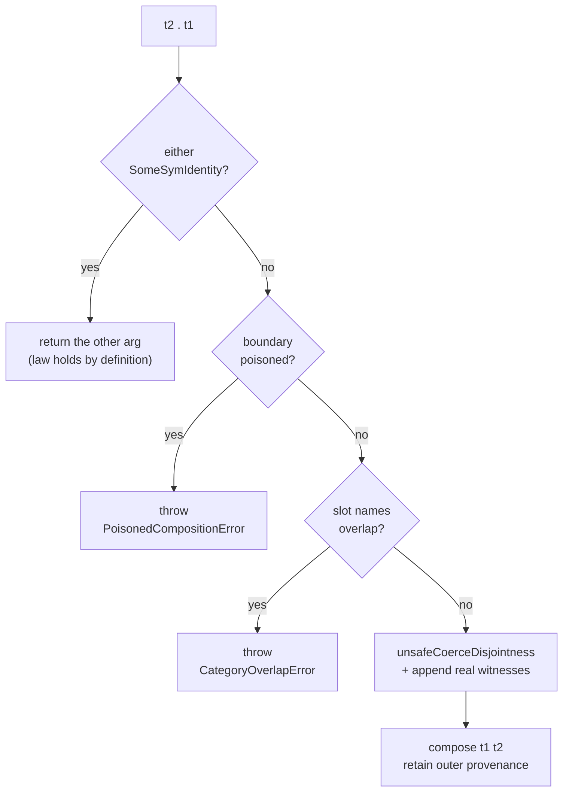

<Callout type="info">
This chapter is part of the composition source tour. Start at
[00 — Start here](/docs/keiki/walkthrough/composition/00-start-here) for the map of the whole tour.
</Callout>

The previous chapter read the wrapper and its variance combinators. This chapter reads the
`Control.Category.Category` instance on `SomeSymTransducer` in `keiki/src/Keiki/Profunctor.hs`. The
instance is small, but it is deliberately partial. Mapped boundaries raise
`PoisonedCompositionError`; overlapping hidden register files raise `CategoryOverlapError`. Only the
methodless `Disjoint` fact is fabricated after the value-level check; real slot-list witnesses derive
the composite's working dictionaries by induction.

## `id` is the sentinel; `(.)` short-circuits it

```haskell
-- keiki/src/Keiki/Profunctor.hs
instance Cat.Category SomeSymTransducer where
  id = SomeSymIdentity

  SomeSymIdentity              . t                            = t
  t                            . SomeSymIdentity              = t
  SomeSymTransducerWith provenance2 t2
    . SomeSymTransducerWith provenance1 t1 =
      composeWrappers provenance1 t1 provenance2 t2
```

`Cat.id` is the `SomeSymIdentity` sentinel — not a real transducer. `Cat..` matches on it in the
first two clauses and returns the *other* argument untouched. This makes the two identity laws hold
**by definition**:

- `id . t = t` — the first clause returns `t`.
- `t . id = t` — the second clause returns `t`.

No behavioural test is needed for the identity laws — they are syntactic. The `CategorySpec`
(`keiki/test/Keiki/CategorySpec.hs`) still checks them behaviourally for good measure, defining
behavioural equality as forward-output equality and treating the sentinel as returning its input
verbatim:

```haskell
-- keiki/test/Keiki/CategorySpec.hs
runOmega :: SomeSymTransducer ci co -> ci -> [co]
runOmega (SomeSymTransducer t) ci =
  omega t (initial t) (initialRegs t) ci
runOmega SomeSymIdentity ci = [ci]
```

The third clause — two real transducers — is where the work happens. It delegates to
`composeWrappers`, factored out so the existential `rs1`/`rs2` skolems are bound to *named* type
variables usable in `TypeApplications` (the instance method's pattern signatures cannot name them on
their own).

## `composeWrappers`: poison first, overlap second

```haskell
-- keiki/src/Keiki/Profunctor.hs
composeWrappers provenance1 t1 provenance2 t2 =
  let names1  = slotNames @rs1
      names2  = slotNames @rs2
      overlap = filter (`elem` names2) names1
      boundaryPoison
        | poisonedOutput provenance1 =
            Just (PoisonedCompositionError "upstream output" "...")
        | poisonedInput provenance2 =
            Just (PoisonedCompositionError "downstream input" "...")
        | otherwise = Nothing
  in case boundaryPoison of
       Just err -> throw err
       Nothing | not (null overlap) -> throw (CategoryOverlapError overlap)
       Nothing -> case unsafeCoerceDisjointness @(Names rs1) @(Names rs2) of
         DictDisjoint ->
           withKnownSlots
             (appendWitness (slotWitness @rs1) (slotWitness @rs2))
             (SomeSymTransducerWith
                (PoisonProvenance
                  { poisonedInput = poisonedInput provenance1
                  , poisonedOutput = poisonedOutput provenance2 })
                (compose t1 t2))
```

Read it top to bottom:

<Steps>
<Step>
Check the boundary provenance. A mapped upstream output or mapped downstream input is not
replay-invertible, so throw `PoisonedCompositionError` before substitution can bypass the map.
</Step>
<Step>
Read the slot names from each real `KnownSlots` witness and compute their overlap. If it is
**non-empty**, throw
`CategoryOverlapError overlap`, carrying the colliding names so the message points at the actual
offender.
</Step>
<Step>
If the boundary is clean and the slot lists are disjoint, fabricate only the methodless static
`Disjoint` evidence that `compose` wants. Append the real slot-list witnesses and let
`withKnownSlots` re-derive weakening and name reflection for the result.
</Step>
</Steps>

### The narrow `unsafeCoerce` boundary

The wrapper hides `rs`, so GHC cannot reduce `compose`'s `Disjoint (Names rs1) (Names rs2)` — the
spines are skolems. `unsafeCoerceDisjointness` smuggles the constraint dictionary in:

```haskell
-- keiki/src/Keiki/Profunctor.hs
unsafeCoerceDisjointness
  :: forall xs ys.
     DictDisjoint xs ys
unsafeCoerceDisjointness =
  unsafeCoerce (DictDisjoint :: DictDisjoint '[] '[])
```

`Disjoint '[] '[]` reduces to the trivially-true constraint `()`, so `DictDisjoint @'[] @'[]` is
always constructible; the coerce rewrites the existential type arguments to whatever the call site
demands. The **only** safety net is the value-level `overlap` check that ran first — calling this
without that prior check could produce a semantically broken composite. The module haddock is blunt
about that:

```haskell
-- keiki/src/Keiki/Profunctor.hs
-- This is the only fabricated dictionary in this module, and its only call
-- site is the body of 'Cat..' after the value-level check has confirmed the
-- slot lists are disjoint. Composite wrappers carry real 'KnownSlots'
-- witnesses, so the checked names remain accurate under arbitrary nesting.
```

No `unsafeCoerceWrapperDict` exists in 0.2. `KnownSlots` carries a `SlotListWitness`; `appendWitness`
builds the actual appended spine, and `withKnownSlots` derives the method-carrying dictionaries by
structural induction. Nested compositions therefore keep accurate slot names instead of fabricating
reflection evidence.

## The exceptions

`CategoryOverlapError` is an ordinary `Exception` carrying the colliding slot names:

```haskell
-- keiki/src/Keiki/Profunctor.hs
data CategoryOverlapError = CategoryOverlapError
  { coeSlots :: [String]
  } deriving stock (Eq, Show)
```

`PoisonedCompositionError` rejects a lossy mapped boundary before the overlap check:

```haskell
data PoisonedCompositionError = PoisonedCompositionError
  { pceSide :: String
  , pceDetail :: String
  } deriving stock (Eq, Show)
```

An upstream `rmap`/`dimap`/`first'`/`arr` poisons the output side; a downstream
`lmap`/`dimap`/`first'` poisons the input side. This makes the `Category` instance explicitly partial
instead of letting name substitution silently discard a forward-only map.

Because the throw is buried inside a lazy value, the spec forces it with `evaluate` and inspects the
slot list. Composing `adaptedEmail . someEmail` — two copies of `emailDelivery` that both carry the
`EmailRegs` slots — collides on all three:

```haskell
-- keiki/test/Keiki/CategorySpec.hs
it "raises when both halves share register slots" $ do
  let composed = adaptedEmail . someEmail
  evaluate composed
    `shouldThrow`
    (\e ->
        let slots = coeSlots e
        in    "emailRecipient" `elem` slots
           && "emailSubject"   `elem` slots
           && "emailSentAt"    `elem` slots)
```

And the empty-slot identity never triggers the check — `id` has `rs = '[]`, so the overlap is empty:

```haskell
-- keiki/test/Keiki/CategorySpec.hs
it "does NOT raise when one half is the empty-slot identity" $ do
  let composedL = id . someEmail
      composedR = someEmail . id
  runOmega composedL sampleSendEmail `shouldBe` [sampleEmailEvent]
  runOmega composedR sampleSendEmail `shouldBe` [sampleEmailEvent]
```



<Callout type="warn">
Unlike `compose`'s static check, the `Category` instance's poison and slot-overlap guards fire at
**runtime**, as synchronous exceptions when the composite is forced. Wrapping a transducer trades a
compile-time `Disjoint` error for `CategoryOverlapError`, and mapped boundaries add
`PoisonedCompositionError`. Concrete `composeChecked` is the supported validation boundary for
aggregate pipelines.
</Callout>

The spec also confirms `isSingleValuedSym` survives `id . t` — the symbolic guarantee passes straight
through the sentinel short-circuit.

Previous: [08 — The existential wrapper and Profunctor](/docs/keiki/walkthrough/composition/08-existential-wrapper-and-profunctor).

Next: [10 — Choice, Strong, Arrow](/docs/keiki/walkthrough/composition/10-choice-strong-arrow).
