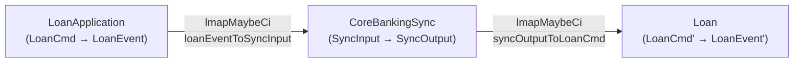

<Callout type="info">
This chapter is part of the composition source tour. Start at
[00 — Start here](/docs/keiki/walkthrough/composition/00-start-here) for the map of the whole tour.
</Callout>

Every previous chapter read a combinator in isolation. This final chapter reads a *worked example*
that uses several of them together: the jitsurei loan workflow, which spans three bounded contexts. We
read the process manager that turns events into commands (`CoreBankingSync`), the downstream aggregate
it drives (`Loan`), and the legacy mapped `loanWorkflow` topology value. The important 0.2 lesson is
why the durable flow runs as separate runtime dispatches rather than through that composite.

## The process manager: events in, commands out

A **process** (or process manager) in the keiki sense is a transducer whose input alphabet is *events
from one context* and whose output alphabet is *commands to another*.
`jitsurei/src/Jitsurei/CoreBankingSync.hs` is exactly that. It reacts to two inbound events and emits
an audit signal and a downstream command.

Its register file holds the pending sync state, prefixed `sync` so it stays disjoint from the other
aggregates' slots:

```haskell
-- jitsurei/src/Jitsurei/CoreBankingSync.hs
type SyncRegs =
  '[ '("syncPendingLoanId",       Text)
   , '("syncPendingApplicantId",  Text)
   , '("syncPendingPrincipal",    Int)
   ]

data SyncVertex
  = SyncIdle
  | SyncRequested
  | SyncSettled
  deriving (Eq, Show, Enum, Bounded)
```

The transducer has two edges. On a `LoanCreatedIn` event it records the pending fields, emits the
`SyncToLegacyRequested` audit event, and moves to `SyncRequested`. On a `LegacyCallbackReceivedIn`
event it confirms the callback's `loanId` matches the pending one, emits `LegacyAssignmentCommanded`
wrapping an `AssignLegacyLoanId` command, and moves to the terminal `SyncSettled`:

```haskell
-- jitsurei/src/Jitsurei/CoreBankingSync.hs
  B.from SyncRequested do
    B.onCmd inCtorLegacyCallbackReceivedIn $ \d -> B.do
      -- Idempotency anchor: the loanId on the callback must match
      -- the pending loanId. A duplicate callback for some other
      -- loan fails this guard; the duplicate-for-same-loan case
      -- is handled by 'SyncSettled' being terminal (no outgoing
      -- edges from it after the first callback resolves).
      B.requireEq d.loanId #syncPendingLoanId
      B.emit wireLegacyAssignmentCommanded
        LegacyAssignmentCommandedTermFields
          { assignment = TApp2 buildAssign d.loanId d.legacyLoanId
          }
      B.goto SyncSettled
```

The `requireEq` guard plus the terminal `SyncSettled` vertex make replay **idempotent by
construction**: a callback for the wrong loan fails the guard and `delta` returns `Nothing`; a
duplicate callback for the *same* loan finds the process already settled (no outgoing edges) and again
yields `Nothing`. The pure layer never performs the actual legacy call — `SyncToLegacyRequested` is an
audit event the runtime adapter consumes to invoke the legacy core-banking system.

## The downstream aggregate

`jitsurei/src/Jitsurei/Loan.hs` is the aggregate the process drives. It is deliberately tiny — three
vertices, two transitions — so the composition is the focus. Its slots are prefixed `loan` so they
stay disjoint from `sync` and `app`:

```haskell
-- jitsurei/src/Jitsurei/Loan.hs
type LoanRegs =
  '[ '("loanLoanId",       LoanId)
   , '("loanApplicantId",  Text)
   , '("loanPrincipal",    Int)
   , '("loanLegacyLoanId", LegacyLoanId)
   ]

data LoanVertex
  = LoanInitial
  | LoanAwaiting
  | LoanLinked
  deriving (Eq, Show, Enum, Bounded)
```

It is `CreateLoan`d into `LoanAwaiting` (recording its fields, emitting `LoanCreated`), then
`AssignLegacyLoanId` carries it to the terminal `LoanLinked`, populating the initially-unset
`loanLegacyLoanId` slot and emitting `LegacyLoanIdAssigned`. The `AssignLegacyLoanId` command is
precisely the one the process emits — that is the seam the workflow stitches.

## The legacy topology value

`jitsurei/src/Jitsurei/LoanWorkflow.hs` retains a single `SymTransducer` value that draws the intended
three-stage topology. Its seams use two `lmapMaybeCi` adapters. In 0.2 those partial contramaps are
explicitly forward-only: they poison inversion and stamp their rewritten boundary names.

The two adapters are plain functions:

```haskell
-- jitsurei/src/Jitsurei/LoanWorkflow.hs
loanEventToSyncInput :: LoanEvent -> Maybe SyncInput
loanEventToSyncInput (ApplicationApproved a) =
  Just (LoanCreatedIn (LoanCreatedInData
    { loanId      = "loan-" <> a.applicantId
    , applicantId = a.applicantId
    , principal   = a.requestedAmount
    }))
loanEventToSyncInput _ = Nothing

syncOutputToLoanCmd :: SyncOutput -> Maybe LoanCmd'
syncOutputToLoanCmd (LegacyAssignmentCommanded d) = Just d.assignment
syncOutputToLoanCmd (SyncToLegacyRequested  _)    = Nothing
```

And here is `loanWorkflow` verbatim — the value this whole chapter builds toward:

```haskell
-- jitsurei/src/Jitsurei/LoanWorkflow.hs
loanWorkflow
  :: Guarded
       (Append LoanAppRegs (Append SyncRegs LoanRegs))
       (Composite LoanAppVertex (Composite SyncVertex LoanVertex))
       LoanCmd
       LoanEvent'
loanWorkflow =
  loanApplication
    `compose`
  lmapMaybeCi loanEventToSyncInput
    (coreBankingSync `compose` lmapMaybeCi syncOutputToLoanCmd loan)
```

Read the type first. The register file is `Append LoanAppRegs (Append SyncRegs LoanRegs)` — a
**right-nested** append of the three aggregates' slots (the mirror of chapter 07's left-fold; same
`compose`, associated the other way). The vertex is the matching `Composite LoanAppVertex (Composite
SyncVertex LoanVertex)`. The input is `LoanApplication`'s command; the output is `Loan`'s event. The
three `loan`-prefixed, `sync`-prefixed, and `app`-prefixed slot namespaces are exactly what let
`compose`'s `Disjoint` constraint discharge at each step. Slot disjointness alone does not validate
the mapped alphabet boundaries.

Read the body next as intended routing. The inner `compose` places `CoreBankingSync` before `Loan` through
`lmapMaybeCi syncOutputToLoanCmd` — the process's `SyncOutput` is filtered to just the
`LegacyAssignmentCommanded` arm and unwrapped into a `LoanCmd'`. The outer `compose` wires
`LoanApplication` to that pipeline through `lmapMaybeCi loanEventToSyncInput` — the application's
`LoanEvent` is filtered to just `ApplicationApproved` and translated into a `LoanCreatedIn` event.



## Why it is not an admitted replay pipeline

Now the caveat the whole jitsurei module is built around, and the most important takeaway of this
tour.

<Callout type="warn">
`compose` is **lockstep**: every non-ε composite edge fires *both* legs simultaneously, in one step.
But real cross-context flows are **async** — the runtime observes `LoanApplication`'s
`ApplicationApproved` event, *then* (in a separate transactional step) issues a command on the
`CoreBankingSync` stream, *then later* the legacy callback channel delivers a
`LegacyCallbackReceivedIn` event. There is no single `LoanCmd` input that fires the entire chain in
one composite firing. In addition, `lmapMaybeCi` is poison-stamped: `composeChecked` reports
`PoisonedNameInComposition`, and the existential `Category` wrapper raises
`PoisonedCompositionError` before crossing the mapped input boundary. `loanWorkflow` is therefore an
illustrative topology value, not a validated replay pipeline. The durable reaction loop runs through
**keiro**.
</Callout>

The module haddock states it directly:

```haskell
-- jitsurei/src/Jitsurei/LoanWorkflow.hs
-- | The three-aggregate composition. Type-level only — see the
-- module's variance caveat.
```

This is why `jitsurei/test/Jitsurei/LoanWorkflowSpec.hs` does **not** fire the composite. It drives
each aggregate directly through the adapter functions, mirroring what the runtime adapter actually
does. The end-to-end test walks the four hops by hand:

```haskell
-- jitsurei/test/Jitsurei/LoanWorkflowSpec.hs
-- Stage 2: simulate the runtime feeding ApplicationApproved
-- to CoreBankingSync via the adapter. Land at SyncRequested
-- with the audit emit.
Just syncInput <- pure (loanEventToSyncInput appApproved)
Just (sync1State, sync1Regs) <-
  pure (delta coreBankingSync (initial coreBankingSync)
                              (initialRegs coreBankingSync) syncInput)
sync1State `shouldBe` SyncRequested
```

and finishes by driving the unwrapped command into `Loan` to reach `LoanLinked`:

```haskell
-- jitsurei/test/Jitsurei/LoanWorkflowSpec.hs
case step loan (loan1State, loan1Regs) loanCmd' of
  Just (LoanLinked, _, [LegacyLoanIdAssigned d]) -> do
    d.loanId       `shouldBe` "loan-alice"
    d.legacyLoanId `shouldBe` "LEG-42"
```

The adapter functions and the individual aggregates together produce the expected end-to-end output;
the composite stands beside them as the proof that the wiring is sound.

## Where to go next

That closes the composition tour. You have read every combinator in `Keiki.Composition` and every
ecosystem instance in `Keiki.Profunctor`, and seen them assembled into a real cross-context workflow.
Two directions from here:

<Cards>
<Card title="Back to the walkthrough hub" href="/docs/keiki/walkthrough">
The other source tours — core and builder, derivations — and the rest of the keiki walkthrough.
</Card>
<Card title="The reference" href="/docs/keiki/reference">
The exhaustive per-module API surface, including the full `Keiki.Composition` and `Keiki.Profunctor`
export catalogues.
</Card>
</Cards>

Previous: [10 — Choice, Strong, Arrow](/docs/keiki/walkthrough/composition/10-choice-strong-arrow).
