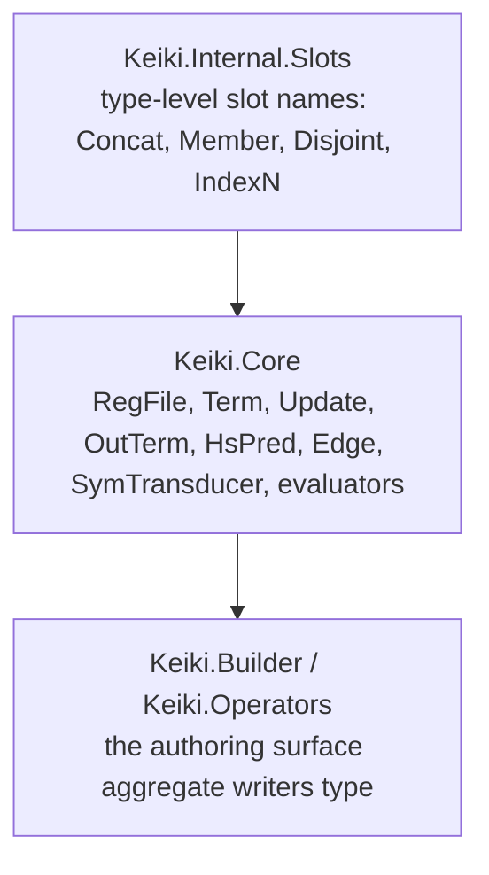

This is an **ordered source tour** of keiki (継起)'s pure core and the builder that authors it. It reads
the real Haskell in `src/Keiki/Internal/Slots.hs`, `src/Keiki/Core.hs`, and `src/Keiki/Builder.hs` /
`src/Keiki/Operators.hs` — bottom-up, from the type-level slot machinery up to the operator surface an
aggregate author types. Every chapter QUOTES the source verbatim, names the file the excerpt comes from,
and points at the test that exercises it. The intended reader is a would-be contributor who wants to
understand *why* the core is shaped the way it is, not just how to call it.

This tour reads the real source end to end. Pinned at keiki `0.2.0.0`, commit `ce5748b`.

## Why read it bottom-up

The module stack is a tower. Each layer adds vocabulary the next layer consumes, so reading from the
bottom means every type you meet is already explained when you reach the code that uses it:



`Keiki.Internal.Slots` owns the type-family / GADT machinery for slot names. `Keiki.Core` imports it and
builds the transducer AST and its evaluators on top. `Keiki.Builder` and `Keiki.Operators` are pure
sugar over `Keiki.Core` — they construct the same AST a hand author would, but read like a fluent EDSL.

## Two authoring paths, one behaviour

There are two ways to author a keiki aggregate: by hand-writing the `Keiki.Core` AST (as the core spec
does), or through the `Keiki.Builder` EDSL. These are not two semantics — they are two front-ends that
produce **identical** AST values. The builder↔AST equivalence specs prove it: each constructs the same
aggregate both ways and asserts identical `delta` / `omega` / `reconstitute` behaviour.

```text
jitsurei/test/Jitsurei/EmailDeliveryBuilderSpec.hs
jitsurei/test/Jitsurei/UserRegistrationBuilderSpec.hs
jitsurei/test/Jitsurei/OrderCartBuilderSpec.hs
```

Reading bottom-up therefore pays off twice: by the time you reach the builder chapters, you can see that
each combinator is "just" a constructor from a chapter you have already read.

## The chapters

<Cards>
  <Card title="01 — Internal slots" href="/docs/keiki/walkthrough/core-and-builder/01-internal-slots" description="Concat / Member / Disjoint / Names, the IndexN GADT, HasIndexN and its IsLabel instance — the type-level engine behind the slot write form." />
  <Card title="02 — RegFile and Index" href="/docs/keiki/walkthrough/core-and-builder/02-regfile-and-index" description="The Slot kind, the RegFile GADT, Index / (!) / HasIndex, the lazy slot field with the uninit sentinel and WHNF-on-write." />
  <Card title="03 — The term language" href="/docs/keiki/walkthrough/core-and-builder/03-term-language" description="NumOp, the Term constructors, the ifs input-field schema, InCtor, the smart constructors, and evalTerm." />
  <Card title="04 — The update language" href="/docs/keiki/walkthrough/core-and-builder/04-update-language" description="Update, the combine smart constructor and its Disjoint static check, and runUpdate." />
  <Card title="05 — Output and predicate" href="/docs/keiki/walkthrough/core-and-builder/05-output-and-predicate" description="WireCtor / OutFields / OPack / pack, HsPred / Cmp, the BoolAlg / Sat algebra, the operator table, evalOut / evalPred." />
  <Card title="06 — Edges and step semantics" href="/docs/keiki/walkthrough/core-and-builder/06-edges-and-step-semantics" description="Edge, SymTransducer, delta / omega / step, and the replay entry points." />
  <Card title="07 — The builder, three layers" href="/docs/keiki/walkthrough/core-and-builder/07-builder-three-layers" description="How Keiki.Builder layers a fluent EDSL over the Core AST." />
  <Card title="08 — The builder edge body" href="/docs/keiki/walkthrough/core-and-builder/08-builder-edge-body" description="Authoring an edge's guard, update, and output through the builder." />
  <Card title="09 — Operators and namespacing" href="/docs/keiki/walkthrough/core-and-builder/09-operators-and-namespacing" description="Keiki.Operators, the readable guard DSL, and import hygiene." />
</Cards>

For the conceptual version of this material, read [The SymTransducer](/docs/keiki/explanation/the-symtransducer)
and [Registers vs state](/docs/keiki/explanation/registers-vs-state) first.

Next: [01 — Internal slots](/docs/keiki/walkthrough/core-and-builder/01-internal-slots).
