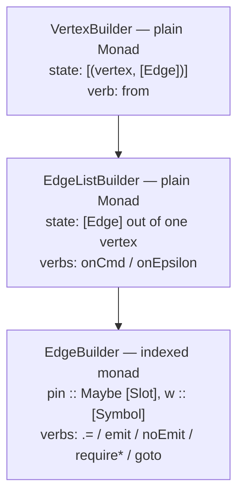

Chapter 06 read the `Edge` and `SymTransducer` types and the evaluators that run them. Authoring those
values by hand is verbose — every edge wants an `Edge` record literal, an `IndexN` annotation on each
register write, a `combine` chain, and an `OFCons … OFNil` output chain. `keiki/src/Keiki/Builder.hs`
collapses all of that into a fluent EDSL that produces the **same** AST a hand author would. This
chapter reads the builder's *structure* — its three nested carriers and the indexed monad at the
bottom; chapter 08 reads the verbs you type inside an edge body.

## Three carriers, one indexed

The builder is a tower of three monads, mirroring the three nesting levels of a transducer
definition. The module header states it plainly:

```haskell
-- keiki/src/Keiki/Builder.hs
-- == Three-layer monad shape
--
-- Three carriers, only the innermost is indexed:
--
--   1. 'VertexBuilder' (plain 'Monad') — the top-level. State is
--      a list @[(v, [Edge ...])]@; 'from' writes one entry.
--   2. 'EdgeListBuilder' (plain 'Monad') — the per-source-vertex
--      layer. State is the list of edges out of that vertex;
--      'onCmd' \/ 'onEpsilon' each prepend one.
--   3. 'EdgeBuilder' (indexed) — the per-edge body. Type-level
--      @(w :: [Symbol])@ tracks the slots written so far; '(.=)'
--      extends @w@ and inherits a 'Disjoint'-driven static check.
```



The crucial detail: **only the innermost layer is indexed.** The `QualifiedDo` machinery rebinds
`(>>=)` / `(>>)` only for `EdgeBuilder`; the outer two layers use ordinary `Prelude.do`. That is why
an aggregate module mixes `do` (outer) with `B.do` (edge body) — we will see exactly that in the
worked example.

## Layer 1: `VertexBuilder` and `buildTransducer`

The top layer is a plain state monad over a list of `(vertex, edges)` entries:

```haskell
-- keiki/src/Keiki/Builder.hs
newtype VertexBuilder rs ci co v a = VertexBuilder
  { runVertexBuilder
      :: [(v, [Either BuilderDefect (Edge (HsPred rs ci) rs ci co v)])]
      -> (a, [(v, [Either BuilderDefect (Edge (HsPred rs ci) rs ci co v)])])
  }
```

It has the textbook `Functor` / `Applicative` / `Monad` instances — nothing exotic, just threaded
state. The verb that writes one entry is `from`:

```haskell
-- keiki/src/Keiki/Builder.hs
from
  :: v
  -> EdgeListBuilder rs ci co v ()
  -> VertexBuilder rs ci co v ()
from v eb = VertexBuilder $ \vs ->
  let (_, accFinal) = runEdgeListBuilder eb v []
      entry         = (v, Prelude.reverse accFinal)
  in ((), entry : vs)
```

`from v` runs the inner `EdgeListBuilder` against an empty accumulator, then reverses it so
declaration order is preserved (the inner layer *prepends*). A vertex never mentioned in any `from`
block defaults to no outgoing edges — i.e. terminal. To assert terminality explicitly, the source
recommends `from V (Prelude.pure ())`.

`buildTransducer` is the entry point that turns the whole do-block into a `SymTransducer`:

```haskell
-- keiki/src/Keiki/Builder.hs
buildTransducerEither
  :: forall rs ci co v.
     (DistinctNames (Names rs), Eq v)
  => v
  -> RegFile rs
  -> (v -> Bool)
  -> VertexBuilder rs ci co v ()
  -> Either
       (NonEmpty (BuilderError v))
       (SymTransducer (HsPred rs ci) rs v ci co)
```

Three scalar arguments (initial vertex, initial register file, finality predicate) plus the
`VertexBuilder` do-block. The implementation runs the whole block, merges duplicate-vertex entries,
assigns stable edge indices, forces the entire table, and returns every `BuilderError`. The
`DistinctNames (Names rs)` constraint also rejects duplicate register slot names at compile time.
`buildTransducer` adds `Show v` and delegates to this function, rendering the same error list as an
exception for compatibility.

## Layer 2: `EdgeListBuilder`, `onCmd` and `onEpsilon`

The middle layer accumulates the edges out of one source vertex:

```haskell
-- keiki/src/Keiki/Builder.hs
newtype EdgeListBuilder rs ci co v a = EdgeListBuilder
  { runEdgeListBuilder :: v
                       -> [Either BuilderDefect (Edge (HsPred rs ci) rs ci co v)]
                       -> (a, [Either BuilderDefect (Edge (HsPred rs ci) rs ci co v)]) }
```

Again a plain `Monad`. Its two verbs each add one edge. `onCmd` registers a command-triggered edge:
it pins the input constructor's match-guard, hands the body a `PayloadProj` handle (so
`OverloadedRecordDot` resolves `d.field` — chapter 08), runs the body, and finalizes:

```haskell
-- keiki/src/Keiki/Builder.hs
onCmd ic body = EdgeListBuilder $ \_src acc ->
  let initial = PartialEdge
        { peGuard         = matchInCtor ic
        , peUpdate        = UKeep
        , peOutput        = []
        , peTargets       = []
        , pePinned        = PinCtor ic
        , peOutputDecided = False
        }
      (_, finalPE) = runEdgeBuilder (body (PayloadProj ic)) initial
      edge         = finalizeEdge finalPE
  in ((), edge : acc)
```

Read the seeded `PartialEdge`: the guard starts at `matchInCtor ic` (so the edge only fires for that
command constructor), the update at `UKeep` (writes nothing yet), output empty, no target, and the
`InCtor` stashed in `pePinned` so a bare `emit` can recover it. `peOutputDecided` starts false.
`onEpsilon` is the same shape with no
input projection and a `PTop` starting guard (so whatever the body conjoins *is* the full guard) and
`pePinned = PinNone`.

`finalizeEdge` closes a `PartialEdge` into an `Either BuilderDefect Edge`. It checks target count,
explicit output intent, and consistency between an enclosing `onCmd` and any `emitWith` constructor:

```haskell
-- keiki/src/Keiki/Builder.hs
finalizeEdge pe = case peTargets pe of
  [t] -> case outputCtorMismatch (pePinned pe) (peOutput pe) of
    Just defect -> Left defect
    Nothing
      | not (peOutputDecided pe) -> Left DefectMissingOutputIntent
      | otherwise -> Right Edge
          { guard = peGuard pe, update = peUpdate pe
          , output = peOutput pe, target = t }
  []      -> Left DefectMissingGoto
  targets -> Left (DefectMultipleGoto (length targets))
```

`peTargets` is the reverse-order list of every `goto` in the body; finalization requires **exactly
one**. It also refuses to infer silence: one of `emit`, `emitWith`, or `noEmit` must set
`peOutputDecided`. The top-level builder locates each defect after duplicate-`from` merging, so a
caller receives its source vertex and stable edge index. `BuilderSpec` asserts that multiple defects
are returned together:

```haskell
-- keiki/test/Keiki/BuilderSpec.hs
case B.buildTransducerEither A emptyR (const False) malformedBody of
  Left errors -> NonEmpty.toList errors `shouldBe`
    [ B.BuilderError A 0 B.DefectMissingGoto
    , B.BuilderError B 0 (B.DefectMultipleGoto 2)
    ]
  Right _ -> expectationFailure "expected structured builder defects"
```

## Layer 3: `EdgeBuilder`, the indexed monad

The innermost layer is where the type system earns its keep. `EdgeBuilder` is **not** a plain monad —
it is an indexed monad with two phantom slot-set indices, one for the slots written *before* this
step and one for *after*:

```haskell
-- keiki/src/Keiki/Builder.hs
newtype EdgeBuilder rs ci co v (pin :: Maybe [Slot])
                    (w :: [Symbol]) (w' :: [Symbol]) a
  = EdgeBuilder
      { runEdgeBuilder :: PartialEdge rs ci co v pin w
                       -> (a, PartialEdge rs ci co v pin w') }
```

The `pin` index is `'Just ifs` for `onCmd` and `'Nothing` for `onEpsilon`. That type-level distinction
is why `emit` can recover the exact command schema inside `onCmd` and is a compile error inside
`onEpsilon`; `emitWith` supplies the missing schema explicitly.

The source explains why the instances are not the ordinary ones:

```haskell
-- keiki/src/Keiki/Builder.hs
-- Functor / Applicative / Monad instances are not provided because
-- they would be 'IxFunctor' / 'IxApplicative' / 'IxMonad' (the
-- type-level slot-set changes between operand and result), which
-- requires a separate type-class hierarchy. Instead, this module
-- exports its own @(>>=)@ / @(>>)@ / 'pure' / 'return' for use
-- with @QualifiedDo@.
```

The indexed bind is the heart of it — the first action's *output* index `w2` becomes the second
action's *input* index, and the second's output `w3` becomes the whole bind's output:

```haskell
-- keiki/src/Keiki/Builder.hs
(>>=)
  :: EdgeBuilder rs ci co v pin w1 w2 a
  -> (a -> EdgeBuilder rs ci co v pin w2 w3 b)
  -> EdgeBuilder rs ci co v pin w1 w3 b
EdgeBuilder f >>= k = EdgeBuilder $ \pe ->
  let (a, pe1)        = f pe
      EdgeBuilder g   = k a
  in g pe1
infixl 1 >>=
```

`pure` leaves the indices untouched (`EdgeBuilder rs ci co v pin w w a`). Because `QualifiedDo` desugars
`B.do { … }` to `B.>>=` / `B.>>` / `B.pure`, every statement in an edge body threads the type-level
slot set through this bind — which is exactly what makes the next property hold.

## How a duplicate slot write becomes a compile error

This is the payoff of the indexed monad. A slot write extends the write-set index by the slot it
writes, and demands that slot be **disjoint** from everything written so far:

```haskell
-- keiki/src/Keiki/Builder.hs
(.=)
  :: forall name r rs ci ifs co v w.
     ( KnownSymbol name, Disjoint '[name] w )
  => IndexN name rs r
  -> Term rs ci ifs r
  -> EdgeBuilder rs ci co v pin w (Concat '[name] w) ()
ix .= t = EdgeBuilder $ \pe ->
  ((), pe { peUpdate = USet ix t `combine` peUpdate pe })
infixr 6 .=
```

Trace the index. The action's input index is `w` (the slots written so far); its output index is
`Concat '[name] w` (now including `name`). Through the indexed bind, that output `w` flows into the
*next* `(.=)`'s input `w` — so each successive write sees the accumulated set. The `Disjoint '[name]
w` constraint then fires per statement: write `#email` twice in one body and GHC rejects the
*second* `(.=)` at its own line, with the `Disjoint` `TypeError` from `Keiki.Internal.Slots` naming
the duplicated slot. The same check is the one `combine` carries in `Keiki.Core` (chapter 04) — the
builder just inherits it through the index. The module header summarizes it:

```haskell
-- keiki/src/Keiki/Builder.hs
-- * Duplicate '(.=)' to the same slot: caught at compile time via
--   the 'Keiki.Internal.Slots.Disjoint' 'GHC.TypeError.TypeError',
--   which names the duplicated slot.
```

<Callout type="info">
This is a genuine *compile-time* guarantee, not a runtime check. Two writes to distinct slots
type-check (`BuilderSpec` case 2: "sequential `(.=)` to distinct slots writes both"); two writes to
the *same* slot do not compile. Contrast with the missing-`goto` diagnostic above, which is an eager
structured builder defect — target count is a value-level property of the body, while the write-set
is tracked in the type.
</Callout>

## The three pragmas an author needs

Because the bottom layer is `QualifiedDo` and the verbs are operators, an aggregate module declares:

```haskell
-- keiki/src/Keiki/Builder.hs (worked-example header)
--   * @{-\# LANGUAGE QualifiedDo \#-}@ — so @B.do@ resolves to this
--     module's indexed bind.
--   * @{-\# LANGUAGE BlockArguments \#-}@ — so a @B.do@ block can
--     appear as a function argument without parentheses.
--   * @import qualified Keiki.Builder as B@ /and/
--     @import Keiki.Builder ((.=))@ — the operator must be in scope
--     unqualified; @B.(.=)@ is unreadable.
```

You can confirm all three in the real worked example's pragma block and import list, which we open in
the next chapter. The general structural facts — three layers, one indexed — are anchored across
`keiki/test/Keiki/BuilderSpec.hs` (`describe "EP-15 M6: Keiki.Builder unit cases"`), whose cases walk
each verb in isolation: single and sequential `(.=)`, `emit`/`solveOutput` round-trip, required
`noEmit`, every eager `BuilderDefect`, `requireEq`, `onEpsilon`, and duplicate `from` merging.

Previous: [06 — Edges and step semantics](/docs/keiki/walkthrough/core-and-builder/06-edges-and-step-semantics).

Next: [08 — The builder edge body](/docs/keiki/walkthrough/core-and-builder/08-builder-edge-body).
