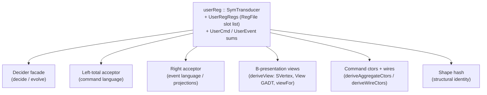

This is an **ordered source tour** of keiki (継起)'s *derivation layer* — the machinery that turns a
single authored aggregate into the dozen-odd artifacts every downstream consumer needs. It reads the
real Haskell in `src/Keiki/Generics.hs`, `src/Keiki/Generics/TH.hs`, and the modules that build the
decider, the two acceptors, the B-presentation views, and the shape hash on top of them. Every chapter
QUOTES the source verbatim, names the file the excerpt comes from, and points at the test that exercises
it. The intended reader is a would-be contributor who wants to understand *why* the layer is shaped the
way it is, not just how to call it.

This tour reads the real source end to end. Pinned at keiki `0.1.0.0`, commit `344c4ca`.

## The through-line: one declaration → every derived artifact

A keiki aggregate is authored once — a `SymTransducer` and its `RegFile` slot list, plus the command
and event sum types it walks over. From that single root, keiki *derives* everything else mechanically.
No artifact is hand-maintained in parallel with the source; each is a pure function (or a Template
Haskell splice, or a generic walk) over the one declaration.



Read that picture as a fan-out: the `SymTransducer` at the root is authored, and every leaf is derived.
The chapters below walk each branch in turn, bottom-up — first the generic record/sum walk the ctor and
wire derivations stand on, then the Template Haskell splices that emit them, then the higher-level
artifacts (zero-enumeration, B-views, the decider facade, the acceptors and projections) that consume
the derived ctors, and finally the shape hash that gives the whole thing a structural identity.

## Why a derivation layer at all

Authoring a transducer by hand already pins down the command alphabet, the event alphabet, the register
schema, and the transition relation. Everything a decider, an acceptor, or a B-view needs is *already
present* in that declaration — it is just projected onto a different shape. Deriving rather than
re-authoring means the projections cannot drift from the source: there is no second copy of the field
list to forget to update. The generics walk and the TH splices in this layer are the mechanism that
keeps that promise.

For the conceptual model behind the root declaration — what a `SymTransducer` *is*, and why keiki picks
that formalism — read [The SymTransducer](/docs/keiki/explanation/the-symtransducer) first.

## The chapters

<Cards>
  <Card title="01 — The input declaration" href="/docs/keiki/walkthrough/derivations/01-symtransducer-and-regfile" description="The single SymTransducer + RegFile declaration the rest of the layer derives from, anchored in the jitsurei UserRegistration aggregate." />
  <Card title="02 — The generic record walk" href="/docs/keiki/walkthrough/derivations/02-generic-record-walk" description="GRecord / GTuple and the RegFieldsOf / FieldsOf type families that walk a record's Generic Rep to a slot list or nested-pair tuple." />
  <Card title="03 — Via-builders and the sum walk" href="/docs/keiki/walkthrough/derivations/03-via-builders-and-sum-walk" description="mkInCtorVia / mkWireCtorVia and the GHasCtor / NameInRep machinery that resolves a constructor by name inside a sum's Rep." />
  <Card title="04 — The ctor and wire splices" href="/docs/keiki/walkthrough/derivations/04-th-ctor-wire-splices" description="deriveAggregateCtors / deriveWireCtors codegen: the three-decl record rule, the singleton rule, and the TermFields record with its ToOutFields instance." />
  <Card title="05 — Zero-enumeration and fused" href="/docs/keiki/walkthrough/derivations/05-zero-enumeration-and-fused" description="The *All variants, the *With override/exclude options, and the fused deriveAggregate splice." />
  <Card title="06 — deriveView: B-presentation" href="/docs/keiki/walkthrough/derivations/06-deriveview-b-presentation" description="The B-presentation view splice: the singletons GADT, the per-vertex View GADT, and the viewFor projection." />
  <Card title="07 — The decider facade" href="/docs/keiki/walkthrough/derivations/07-decider-facade" description="How a SymTransducer projects onto a decide / evolve decider interface." />
  <Card title="08 — Acceptors and projections" href="/docs/keiki/walkthrough/derivations/08-acceptor-projections" description="The command and event acceptors and the projections derived alongside them." />
  <Card title="09 — The shape hash" href="/docs/keiki/walkthrough/derivations/09-shape-hash" description="The structural identity that lets snapshots and codecs detect a changed aggregate shape." />
</Cards>

The source files this tour reads:

```text
src/Keiki/Generics.hs        -- GRecord / GTuple, RegFieldsOf / FieldsOf, GHasCtor, the Via builders
src/Keiki/Generics/TH.hs     -- deriveAggregateCtors / deriveWireCtors / deriveView and the *All / *With variants
jitsurei/src/Jitsurei/UserRegistration.hs  -- the worked aggregate every chapter derives from
test/Keiki/Generics/THSpec.hs              -- the splice-behaviour anchors
```

Next: [01 — The input declaration](/docs/keiki/walkthrough/derivations/01-symtransducer-and-regfile).
