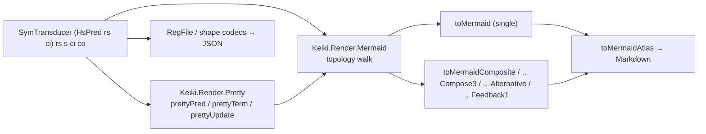

<Callout type="info">
This is the start of the **rendering and codecs** source tour for keiki (継起). Every chapter
links back here: [00 — Start here](/docs/keiki/walkthrough/rendering-and-codecs/00-start-here).
</Callout>

This is an **ordered source tour** of how keiki turns a value — a `SymTransducer` and its predicate,
term, and update sub-trees — into something a human can read: domain-readable text, a Mermaid
`stateDiagram-v2`, a Markdown atlas, and a JSON document. It reads the real Haskell under
`keiki/src/Keiki/Render/` and the codec modules, every exported binding, and explains *why* each
projection is shaped the way it is. Read the chapters in order.

## The design in one picture

Every renderer in this surface is **one pure function from a value to `Text` (or JSON)**. There is no
solver and no IO. The same `SymTransducer` feeds every projection; each renderer reuses the same
two primitives — the pretty-printer for the guard/term/update sub-trees, and the topology walk over
`[minBound .. maxBound]`:



The two foundations everything builds on:

- **The pretty-printer** (`Keiki.Render.Pretty`) renders the guard, term, and update sub-trees as
  domain-readable `Text`. It is the only place that decides how a register read, an input-field read,
  or an opaque applied function prints — and the *unprintable-MARKING* convention (`<fn>(…)`, `<lit>`)
  lives here.
- **The topology walk** (`Keiki.Render.Mermaid`) enumerates the vertex type, emits a
  `stateDiagram-v2` header, an initial-state line, one line per outgoing edge, and a final-state line
  per accepting vertex. The single transducer, every composite shape, the labelled-id variant, and the
  options-aware annotated variant are all the *same walk* with a different vertex-label function.

## The chapters

<Cards>
  <Card title="01 — The pretty-printer" href="/docs/keiki/walkthrough/rendering-and-codecs/01-pretty-printer" description="prettyTerm, prettyPred, prettyUpdate, indexName, and the unprintable-marking convention every renderer reuses." />
  <Card title="02 — Mermaid core" href="/docs/keiki/walkthrough/rendering-and-codecs/02-mermaid-core" description="edgeLabel, edgeInputName, edgeOutputName, the topology walk, and the guard-free default." />
  <Card title="03 — Options and labels" href="/docs/keiki/walkthrough/rendering-and-codecs/03-mermaid-options-and-labels" description="MermaidOptions, the guard-summary chokepoint, the [w: …; g: …] suffix, and stable-id labelling." />
  <Card title="04 — Composites" href="/docs/keiki/walkthrough/rendering-and-codecs/04-composites" description="Flat, nested, alternative, and feedback1 renderers; underscore-joined composite ids." />
  <Card title="05 — Atlas and Markdown" href="/docs/keiki/walkthrough/rendering-and-codecs/05-atlas-and-markdown" description="toMermaidAtlas, typed sections, and in-place Markdown block replacement." />
  <Card title="06 — The edge inspector" href="/docs/keiki/walkthrough/rendering-and-codecs/06-edge-inspector" description="Walking a transducer's edges for the multiline-label and inspection renderers." />
  <Card title="07 — The regfile codec" href="/docs/keiki/walkthrough/rendering-and-codecs/07-regfile-codec" description="Encoding and decoding a RegFile to and from JSON, slot by slot." />
  <Card title="08 — TH derivers" href="/docs/keiki/walkthrough/rendering-and-codecs/08-th-derivers" description="The Template Haskell that derives the instances the codecs and renderers rely on." />
  <Card title="09 — Shape hash and snapshots" href="/docs/keiki/walkthrough/rendering-and-codecs/09-shape-hash-and-snapshots" description="Hashing a transducer's shape and the snapshot-compatibility check." />
</Cards>

The source files this tour reads:

```text
keiki/src/Keiki/Render/Pretty.hs    -- domain-readable guard/term/update printer
keiki/src/Keiki/Render/Mermaid.hs   -- stateDiagram-v2 topology renderer + atlas
keiki/src/Keiki/Render/Markdown.hs  -- in-place Markdown diagram-block replacement
keiki/src/Keiki/Render/...          -- edge inspector, regfile codec, shape hash
```

For the conceptual version of this material, read
[The SymTransducer](/docs/keiki/explanation/the-symtransducer) and
[Diagrams from one declaration](/docs/keiki/explanation/diagrams-from-one-declaration) first.

Next: [01 — The pretty-printer](/docs/keiki/walkthrough/rendering-and-codecs/01-pretty-printer).
