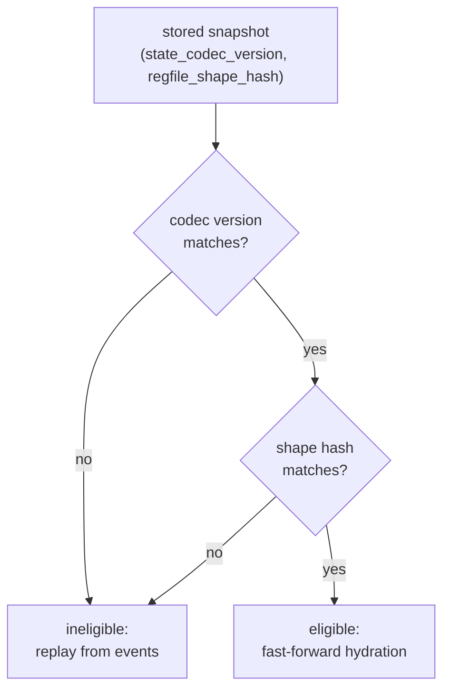

<Callout type="info">
Part of the rendering-and-codecs source tour. Start at
[00 — Start here](/docs/keiki/walkthrough/rendering-and-codecs/00-start-here) for the overview and the
full chapter list. This is the final chapter.
</Callout>

The previous two chapters read the codec that *serialises* a register file and the derivers that *emit*
codec functions for ordinary types. This chapter zooms out to the question those tools exist to answer:
**when is a persisted snapshot safe to load back?** The answer is a two-discriminant rule that combines
the JSON codec with a second tool — the shape hash — and it is the contract keiro's snapshot-accelerated
hydration is built on.

## The shape hash, in one link

The shape hash lives in `Keiki.Shape` (the `keiki` package), introduced in EP-22. It is **one** SHA-256
over **one** canonical pre-hash string describing the slot list's structure — names, order, and the
stable type representation of each slot's value type. Any structural change to the slot list flips the
hash.

This chapter does not re-document it. For the canonical encoding, the `regFileShapeHash` entry point,
and the `CanonicalTypeName` escape hatch, read the reference:

<Cards>
  <Card title="Reference: shape" href="/docs/keiki/reference/shape" description="regFileShapeHash, the canonical pre-hash encoding, and CanonicalTypeName." />
</Cards>

The one property to carry forward is **sensitivity**: a structural change to the slot list must flip the
hash. `SensitivitySpec` pins this as nine independent drift cases against a baseline `ExemplarSlots`
hash — add a slot, remove a slot, rename a slot, reorder slots, change a slot's type, wrap a type in a
newtype, replace a primitive with a record, split a slot, rename a type — each asserted to produce a
*different* hash:

```haskell
-- keiki-codec-json/test/Keiki/Codec/JSON/SensitivitySpec.hs
  let baseline = regFileShapeHash (Proxy @ExemplarSlots)

  it "#1 add slot flips the hash" $
    regFileShapeHash (Proxy @AddSlots) `shouldSatisfy` (/= baseline)

  it "#4 reorder slots flips the hash (P10)" $
    regFileShapeHash (Proxy @ReorderSlots) `shouldSatisfy` (/= baseline)
```

Alongside the sensitivity tests, a golden test pins the *exact* hash of `ExemplarSlots` for the
current GHC, so a future GHC that moves a base type out of its current module — and thereby changes its
stable type representation — fails loudly rather than silently invalidating every persisted snapshot:

```haskell
-- keiki-codec-json/test/Keiki/Codec/JSON/GoldenSpec.hs
  it "matches the pinned GHC-9.12.* value" $
    regFileShapeHash (Proxy @ExemplarSlots)
      `shouldBe`
      T.pack "a37b2b77042a635f394a082765f3410ea23a0b89745b0c77242b925a03aa172b"
```

<Callout type="warn">
"Sensitivity" here is **structural-drift detection with no silent fallback** — the same discipline you
saw in the strict decoder (chapter 07) and the event deriver (chapter 08). It is *not* redaction. The
hash exists so drift is caught at load time, not papered over.
</Callout>

## The two-discriminant snapshot boundary

The shape hash and the JSON codec are two halves of one story. The hash *discriminates* which snapshots
are eligible; the codec *serialises* the eligible ones. Neither alone is sufficient, because each
catches a class of drift the other misses.

A stored snapshot carries two discriminants:

<TypeTable
  type={{
    state_codec_version: { type: "version stamp", description: "The encoding version the binary that wrote the snapshot used. Catches encoding drift the shape hash cannot see." },
    regfile_shape_hash: { type: "Text (SHA-256 hex)", description: "The regFileShapeHash of the slot list at write time. Catches structural drift the codec version does not." },
  }}
/>

The eligibility rule is a conjunction: a stored snapshot is eligible to fast-forward hydration **iff
both** its `state_codec_version` and its `regfile_shape_hash` match what the running binary expects.



Why both? The shape hash catches the structural drift the codec version does not — a slot renamed,
reordered, or retyped. The codec version catches the encoding drift the shape hash does not — a change
in *how* a structurally-identical slot list is written. An ineligible snapshot is not an error; it just
means hydration falls back to replaying events, exactly as if no snapshot existed.

This is the boundary keiro builds on. keiki provides the two discriminants and the codec; keiro stores
them next to the snapshot bytes and applies the conjunction at hydration time.

## Why two packages: the aeson-free split

A structural detail underpins all of this: the work is split across **two** packages on purpose.

<Tabs items={["keiki (core, aeson-free)", "keiki-codec-json"]}>
<Tab value="keiki (core, aeson-free)">
The core package. It owns `SymTransducer`, `RegFile`, the renderers from chapters 01–06, and the shape
hash in `Keiki.Shape`. It carries **no** `aeson` dependency. The shape hash needs only GHC's stable
type representation, not a JSON library, so it belongs here — a binary can compute and compare shape
hashes without pulling in `aeson` at all.
</Tab>
<Tab value="keiki-codec-json">
The sibling package. It owns the runtime `RegFileToJSON` codec (chapter 07) and the two Template
Haskell derivers (chapter 08). All of this references `aeson`, so it lives here, outside core.
</Tab>
</Tabs>

The TH module header states the rule directly: the splice lives in `keiki-codec-json` because moving it
to `keiki` would "force an `aeson` dependency on `keiki` core — violating the load-bearing
*keiki MUST NOT gain `aeson`* requirement." The event deriver header echoes it. The shape hash and the
codec are deliberately kept on opposite sides of that line: the discriminator (`Keiki.Shape`, aeson-free)
in core, the serialiser (`keiki-codec-json`) in the sibling — so a consumer that only needs to *compare*
shapes never pays for a JSON dependency it does not use.

---

That closes the rendering-and-codecs source tour. From here:

<Cards>
  <Card title="Walkthrough index" href="/docs/keiki/walkthrough" description="Back to the full keiki source-tour index." />
  <Card title="Reference" href="/docs/keiki/reference" description="The per-module reference, including shape and validate." />
</Cards>

Previous: [08 — TH derivers](/docs/keiki/walkthrough/rendering-and-codecs/08-th-derivers)
