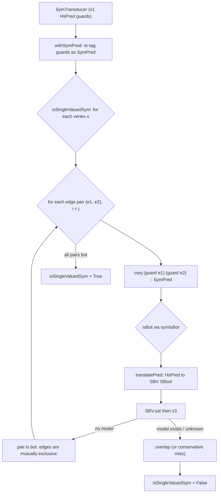

<Callout type="info">
You are at the start of the **symbolic-and-validation** tour. Every chapter links back here, and
each ends with Previous / Next so you can read the whole thing in order.
</Callout>

This is an **ordered source tour** of keiki's symbolic surface — the machinery that turns "are these
two edge guards ever true at once?" from a syntactic guess into a precise, solver-decided answer. It
reads the real Haskell in `keiki/src/Keiki/Symbolic.hs` end to end (and the validation umbrella that
sits on top of it), quoting the source verbatim and pointing at the test anchors that pin each claim.
Read the chapters in order.

The conceptual companions to this material are
[Why keiki uses an SMT solver](/docs/keiki/explanation/why-smt) and
[The SymTransducer](/docs/keiki/explanation/the-symtransducer). Read at least the first if the phrase
"single-valuedness" is new to you.

<Callout type="warn">
The SMT solver (z3, reached through the `sbv` library) is a **build / CI-time** dependency only. It is
never on the runtime hot path: keiki's step semantics evaluate guards concretely via `evalPred`, with
no solver call. `z3` only needs to be on `PATH` when you actually invoke one of the symbolic analyses
below. Everything in this tour is opt-in.
</Callout>

## The design in one picture

The whole tour exists to make one decision precise: at each vertex, for each pair of outgoing edges,
is the conjunction of their guards **bot** (unsatisfiable)? If every pair is bot, the transducer is
single-valued.



## The chapters

<Cards>
  <Card title="01 — The bug and the property" href="/docs/keiki/walkthrough/symbolic-and-validation/01-the-bug-and-the-property" description="The guard-overlap non-determinism bug and the single-valuedness property that retires it." />
  <Card title="02 — The Sym typeclass and registry" href="/docs/keiki/walkthrough/symbolic-and-validation/02-the-sym-typeclass-and-registry" description="Sym / SymRep / toSym / fromSym / symDefault, the unbounded-Integer over-approximation, and the discoverSym registry." />
  <Card title="03 — Translation and the memo cache" href="/docs/keiki/walkthrough/symbolic-and-validation/03-translation-and-the-memo-cache" description="SymEnv, translateTermSym / translatePred, deterministic slot names, and the seVarCache that makes proj #x .== proj #x valid." />
  <Card title="04 — SymPred and the BoolAlg instance" href="/docs/keiki/walkthrough/symbolic-and-validation/04-sympred-and-the-boolalg-instance" description="The SymPred newtype, the structural BoolAlg ops, models = concrete evalPred, isBot = symIsBot, and the Sat instance." />
  <Card title="05 — symIsBot and witness extraction" href="/docs/keiki/walkthrough/symbolic-and-validation/05-symisbot-and-witness-extraction" description="The NOINLINE symIsBot, symSatExt, ExtractRegFile / pickCi / readModel, and the witness round-trip." />
  <Card title="06 — The single-valuedness gate" href="/docs/keiki/walkthrough/symbolic-and-validation/06-the-single-valuedness-gate" description="isSingleValuedSym, withSymPred, the per-vertex pairwise check, and the loan-application capstone." />
  <Card title="07 — Build-time validation umbrella" href="/docs/keiki/walkthrough/symbolic-and-validation/07-build-time-validation-umbrella" description="validateTransducer and the structural checks that run without a solver." />
  <Card title="08 — Opaque guards and the signpost" href="/docs/keiki/walkthrough/symbolic-and-validation/08-opaque-guards-and-the-signpost" description="What the translator cannot see, and how the over-approximation stays sound." />
  <Card title="09 — Solver-backed diagnostics" href="/docs/keiki/walkthrough/symbolic-and-validation/09-solver-backed-diagnostics" description="checkTransitionDeterminismSym and checkDeadEdgesSym — naming the offending edges." />
  <Card title="10 — Runtime rejection diagnostics" href="/docs/keiki/walkthrough/symbolic-and-validation/10-runtime-rejection-diagnostics" description="What the runtime does when a command matches no edge — the concrete, solver-free path." />
</Cards>

The source files this tour reads:

```text
keiki/src/Keiki/Symbolic.hs                                   -- the whole symbolic surface
keiki/test/Keiki/SymbolicSpec.hs                              -- unit anchors for every claim
keiki/jitsurei/test/Jitsurei/LoanApplicationSymbolicSpec.hs   -- the single-valuedness capstone
keiki/jitsurei/test/Jitsurei/OrderCartSymbolicSpec.hs         -- Word*-bearing shipped aggregate
```

Next: [01 — The bug and the property](/docs/keiki/walkthrough/symbolic-and-validation/01-the-bug-and-the-property).
