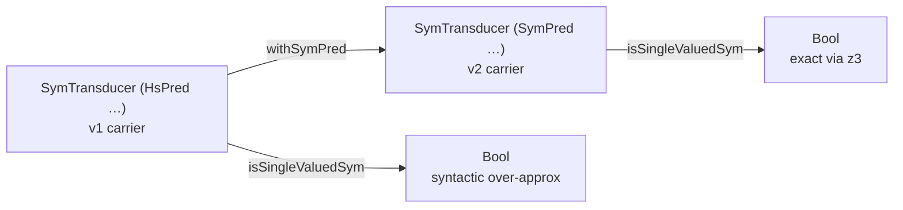

<Callout type="info">
This chapter is part of the symbolic-and-validation source tour. Start at
[00 — Start here](/docs/keiki/walkthrough/symbolic-and-validation/00-start-here) for the overview and
the chapter map.
</Callout>

The previous five chapters built the machinery: the [`Sym` typeclass and
registry](/docs/keiki/walkthrough/symbolic-and-validation/02-the-sym-typeclass-and-registry),
[translation and the memo cache](/docs/keiki/walkthrough/symbolic-and-validation/03-translation-and-the-memo-cache),
the [`SymPred` newtype and its `BoolAlg`
instance](/docs/keiki/walkthrough/symbolic-and-validation/04-sympred-and-the-boolalg-instance), and
[`symIsBot` plus witness
extraction](/docs/keiki/walkthrough/symbolic-and-validation/05-symisbot-and-witness-extraction). This
chapter spends all of that on one question: **is the transducer single-valued?** That is the property
keiki (継起) was built to decide mechanically, and `isSingleValuedSym` is the function that decides it.

Both functions live in `src/Keiki/Symbolic.hs` and are exported under the *Single-valuedness* heading:

```haskell
-- src/Keiki/Symbolic.hs
    -- * Single-valuedness
    isSingleValuedSym,
    withSymPred,
```

## What "single-valued" means

The Haddock states the property and how the check decomposes it:

```haskell
-- src/Keiki/Symbolic.hs
{- | A transducer is /single-valued/ when, at every reachable
vertex, at most one outgoing edge's guard is satisfied for any
given input. The check decomposes into "for every vertex @s@, for
every distinct pair @(e1, e2)@ of outgoing edges, is the
conjunction of their guards 'isBot'?". The function is
'BoolAlg'-polymorphic; precision depends on the chosen 'isBot'
implementation. With 'SymPred', this is the v2 SBV-backed
decision; with the v1 'HsPred' instance the answer is the v1
syntactic over-approximation.
-}
```

Read the property carefully: *at most one* outgoing guard holds for any input. If two guards could both
hold for the same command, the machine has a choice — it is nondeterministic, and `step` would have to
pick. Single-valuedness is the absence of that choice. The decomposition turns a statement about *all
inputs* into a finite set of emptiness checks: for each pair of edges out of a vertex, conjoin their
guards and ask whether that conjunction is `isBot`. If `g1 ∧ g2` is unsatisfiable, no input can satisfy
both, so the pair never overlaps. If every pair at every vertex is unsatisfiable, the machine is
single-valued.

## The per-vertex, per-pair loop

```haskell
-- src/Keiki/Symbolic.hs
isSingleValuedSym ::
    forall phi rs s ci co.
    (BoolAlg phi (RegFile rs, ci), Bounded s, Enum s) =>
    SymTransducer phi rs s ci co ->
    Bool
isSingleValuedSym t = all vertexSV [minBound .. maxBound]
  where
    vertexSV :: s -> Bool
    vertexSV s =
        let es = edgesOut t s
            ies = zip [(0 :: Int) ..] es
            pairs =
                [ (e1, e2)
                | (i, e1) <- ies
                , (j, e2) <- ies
                , i < j
                ]
         in all (\(e1, e2) -> isBot (guard e1 `conj` guard e2)) pairs
```

Three things repay a close read.

<Steps>

<Step>
**The vertex enumeration is `[minBound .. maxBound]`.** The `Bounded s, Enum s` constraints let the
function enumerate every vertex of the control graph without a registry. Note it checks *every* vertex,
not just the reachable ones — single-valuedness at an unreachable vertex costs nothing to verify and
keeps the check independent of the reachability fixpoint (which is the
[validation umbrella](/docs/keiki/walkthrough/symbolic-and-validation/07-build-time-validation-umbrella)'s
job, not this one's).
</Step>

<Step>
**The pairing is `i < j` over indexed edges.** Zipping with indices and keeping only `i < j` yields each
*unordered* distinct pair exactly once — never an edge against itself (`i = j`), never a pair twice in
both orders. A vertex with `n` outgoing edges contributes `n * (n - 1) / 2` solver calls; a vertex with
zero or one outgoing edge contributes none and is trivially single-valued.
</Step>

<Step>
**The per-pair test is `isBot (guard e1 \`conj\` guard e2)`.** This is the load-bearing line, and it is
written entirely in the `BoolAlg` vocabulary — `conj` and `isBot` — with no mention of z3. The function
is `BoolAlg`-polymorphic over the guard carrier `phi`. The *precision* of the answer is whatever the
chosen `isBot` delivers.
</Step>

</Steps>

That last point is the whole design. The same `isSingleValuedSym` runs over the v1 `HsPred` carrier
(whose `isBot` recognizes only the literal `PBot`, a syntactic over-approximation) and over the v2
`SymPred` carrier (whose `isBot` routes through
[`symIsBot`](/docs/keiki/walkthrough/symbolic-and-validation/05-symisbot-and-witness-extraction) to z3,
a precise decision for the supported encoding when the solver returns a proof). To strengthen the
analysis you do not call a different polymorphic function — you change the carrier. An uncertain
solver result never blesses a pair as disjoint.

## `withSymPred`: changing the carrier

`withSymPred` is the carrier swap. It re-tags every edge guard from the pure `HsPred` to the SBV-backed
`SymPred`, leaving everything else — the control graph, the updates, the outputs — untouched:

```haskell
-- src/Keiki/Symbolic.hs
withSymPred ::
    SymTransducer (HsPred rs ci) rs s ci co ->
    SymTransducer (SymPred rs ci) rs s ci co
withSymPred t =
    SymTransducer
        { edgesOut = \s -> map liftEdge (edgesOut t s)
        , initial = initial t
        , initialRegs = initialRegs t
        , isFinal = isFinal t
        }
  where
    liftEdge ::
        Edge (HsPred rs ci) rs ci co s ->
        Edge (SymPred rs ci) rs ci co s
    liftEdge e@Edge{update = u} =
        Edge
            { guard = SymPred (guard e)
            , update = u
            , output = output e
            , target = target e
            }
```

The only field `liftEdge` rewrites is `guard`, wrapping it in the `SymPred` newtype. Because `SymPred`
is a newtype with no runtime representation, this is a free re-tag at the value level; what it changes is
which `BoolAlg` instance the type checker selects. After `withSymPred`, the guards carry the v2
instance — and `isSingleValuedSym (withSymPred t)` is the z3-backed decision.



## The retrospective gate: the User Registration aggregate

The reason this gate exists is a real defect from MasterPlan 1's retrospective: the v1 `BoolAlg HsPred`
instance could not prove that the User Registration aggregate's edge guards were mutually exclusive, so
single-valuedness was only *best-effort*. The v2 SBV upgrade turns that into a mechanical yes. The
symbolic spec for the aggregate pins exactly that:

```haskell
-- jitsurei/test/Jitsurei/UserRegistrationSymbolicSpec.hs
  describe "isSingleValuedSym (withSymPred userReg)" $ do
    it "answers True (the v2 retrospective gate)" $
      isSingleValuedSym (withSymPred userReg) `shouldBe` True
```

The module header of that spec spells out the stakes:

```haskell
-- jitsurei/test/Jitsurei/UserRegistrationSymbolicSpec.hs
-- | Symbolic-side spec for the User Registration aggregate. Asserts
-- the v2 retrospective gate: 'isSingleValuedSym' answers @True@ on
-- the 'userReg' transducer once its guards are lifted to 'SymPred',
-- proved symbolically by z3.
```

This is the contribution-grade anchor for this chapter: `userReg` has edges out of its
`RequiresConfirmation` vertex whose guards branch on the input constructor and a `confirmCode`
equality. The v1 syntactic `isBot` cannot prove those pairwise-disjoint; z3 can. Lifting with
`withSymPred` and re-running `isSingleValuedSym` is the difference between "we could not prove it" and
"`True`, proved by the solver".

<Callout type="warn">
`isSingleValuedSym` over the `SymPred` carrier calls z3 once per edge pair per vertex — it is a
build/CI-time check, not a hot-path one. The runtime `step` and `stepEither` never invoke the solver;
they evaluate guards concretely. Keep the gate in your test suite, not on the command path. We come back
to the runtime side in
[10 — Runtime rejection diagnostics](/docs/keiki/walkthrough/symbolic-and-validation/10-runtime-rejection-diagnostics).
</Callout>

The next chapter steps up one level: `isSingleValuedSym` is the *property*, but a project wants a single
build-time call that runs determinism, reachability, hidden-input, and opaque-guard checks together and
returns structured warnings. That is `validateTransducer`, the umbrella.

Previous: [05 — symIsBot and witness extraction](/docs/keiki/walkthrough/symbolic-and-validation/05-symisbot-and-witness-extraction) ·
Next: [07 — The build-time validation umbrella](/docs/keiki/walkthrough/symbolic-and-validation/07-build-time-validation-umbrella)
