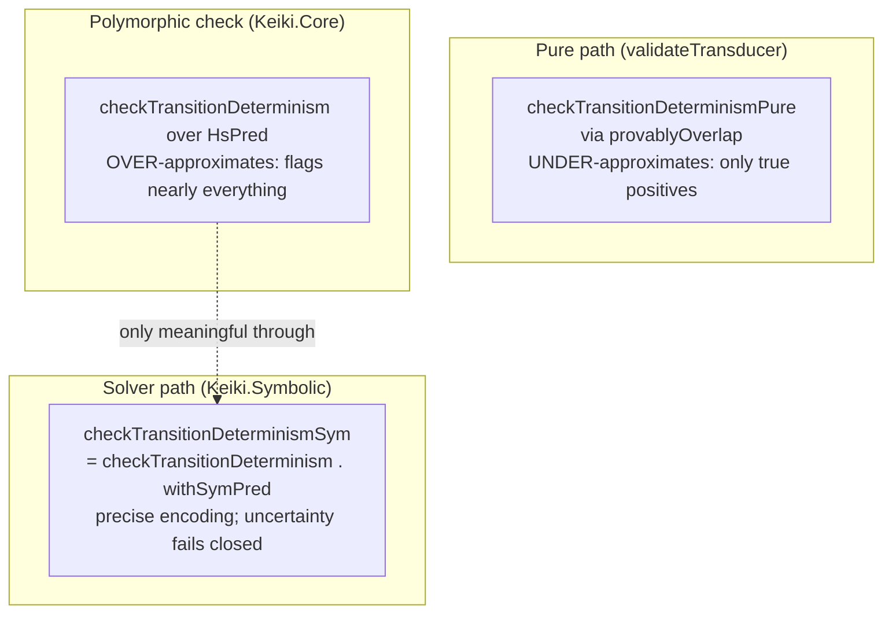

<Callout type="info">
This chapter is part of the symbolic-and-validation source tour. Start at
[00 — Start here](/docs/keiki/walkthrough/symbolic-and-validation/00-start-here) for the overview and
the chapter map.
</Callout>

The [umbrella](/docs/keiki/walkthrough/symbolic-and-validation/07-build-time-validation-umbrella) gave us
fast, pure, false-positive-free determinism and dead-edge checks — at the cost of missing overlaps it
could not prove syntactically. This chapter is the other side of that trade: the **exact, solver-backed**
diagnostics. They prove overlaps the pure path cannot, and they come with four gotchas that explain why
the `…Sym` variants are the only ones you should reach for directly. They live in `src/Keiki/Symbolic.hs`
under *Solver-backed validation diagnostics (EP-56)*.

## `checkTransitionDeterminismSym`

The whole function is one line of composition — and that line is the entire idea:

```haskell
-- src/Keiki/Symbolic.hs
checkTransitionDeterminismSym ::
    (Bounded s, Enum s, Show s) =>
    SymTransducer (HsPred rs ci) rs s ci co ->
    [DeterminismWarning s]
checkTransitionDeterminismSym = checkTransitionDeterminism . withSymPred
```

It lifts the transducer with
[`withSymPred`](/docs/keiki/walkthrough/symbolic-and-validation/06-the-single-valuedness-gate) and then
runs the `BoolAlg`-polymorphic `checkTransitionDeterminism` at the `SymPred` carrier — whose `isBot` is
the z3-backed decision. Only a definitive `Unsatisfiable` result proves a pair disjoint; uncertainty
remains a possible overlap. The Haddock states what this buys:

```haskell
-- src/Keiki/Symbolic.hs
{- | Solver-backed determinism diagnostic. Lifts the transducer with
'withSymPred' and runs the 'BoolAlg'-polymorphic 'checkTransitionDeterminism'
at the 'SymPred' carrier, whose 'isBot' accepts only a definitive z3
unsatisfiability proof. Unlike the
pure path in 'validateTransducer', this catches register-value-dependent and
other non-syntactic overlaps. Requires z3 on @PATH@.
-}
```

This is the same `checkTransitionDeterminism` from `Keiki.Core` you met when reading the umbrella — the
per-vertex, per-pair `i < j` loop whose predicate is `not (isBot (guard e1 \`conj\` guard e2))`. Over the
*pure* `HsPred` carrier that loop is useless (more on that below); over the `SymPred` carrier it is
precise for the supported encoding and conservative on solver uncertainty.

## `checkDeadEdgesSym`

```haskell
-- src/Keiki/Symbolic.hs
checkDeadEdgesSym ::
    (Bounded s, Enum s, Show s) =>
    SymTransducer (HsPred rs ci) rs s ci co ->
    [DeadEdgeWarning s]
checkDeadEdgesSym t =
    [ DeadEdgeWarning
        (EdgeRef{edgeSource = s, edgeIndex = i})
        "guard is unsatisfiable in isolation (symbolic)"
    | s <- [minBound .. maxBound]
    , (i, e) <- zip [(0 :: Int) ..] (edgesOut t s)
    , symIsBot (guard e)
    ]
```

This flags an edge whose guard is unsatisfiable *in isolation* via
[`symIsBot`](/docs/keiki/walkthrough/symbolic-and-validation/05-symisbot-and-witness-extraction) — so it
catches an unsatisfiable guard like `amount > 0 && amount < 0` that the structural `checkDeadEdges`
misses unless the guard is literally `PBot`. The Haddock is candid about what it still cannot do:

```haskell
-- src/Keiki/Symbolic.hs
{- | Symbolic dead-edge sketch. Flags edges whose guard is unsatisfiable
/in isolation/ (via 'symIsBot'), which the structural 'checkDeadEdges'
misses unless the guard is literally 'PBot' (e.g. @amount > 0 && amount < 0@).
It does NOT compute the register configurations reachable at each vertex, so
it still cannot catch the FieldResource case (a guard satisfiable in
isolation but never under the registers reachable there); that needs a full
reachable-state fixpoint and is left as future work. Requires z3 on @PATH@.
-}
```

"In isolation" is the key qualifier. A guard like `available == True` is perfectly satisfiable on its
own; whether it is *dead* depends on whether `available` can ever be `True` at this vertex — and that
needs a reachable-state fixpoint this check does not compute. So `checkDeadEdgesSym` is a sketch: it
catches self-contradictory guards, not guards-that-can-never-hold-here.

## The four gotchas

These three facts are why you reach for the `…Sym` variants and not the bare `Keiki.Core` ones.

<Steps>

<Step>
**Pure determinism *under*-approximates.** `validateTransducer`'s pure path uses
`checkTransitionDeterminismPure`, built on `provablyOverlap`, which is `True` only for both-`PTop` or
same-`PInCtor`. Every warning it emits is a true positive, but its silence proves nothing — it misses
every overlap it cannot prove syntactically. From the Haddock: "Every warning it emits is a true
positive; the absence of a warning does NOT prove determinism."
</Step>

<Step>
**Raw `checkTransitionDeterminism` over `HsPred` *over*-approximates.** Run the polymorphic
`checkTransitionDeterminism` on the *pure* carrier and it is meaningless — it flags almost every
multi-edge vertex. The Haddock explains why:

```haskell
-- src/Keiki/Core.hs
Soundness direction: with the pure 'HsPred' carrier, 'isBot' only recognises
the literal 'PBot', so @not (isBot (a \`conj\` b))@ holds for /every/ non-'PBot'
pair — i.e. this polymorphic check over-approximates overlap on the 'HsPred'
carrier (it would flag almost every multi-edge vertex). It is intended to be
run over the /symbolic/ 'SymPred' carrier (via
'Keiki.Symbolic.checkTransitionDeterminismSym'), whose 'isBot' is exact.
```

So `checkTransitionDeterminism` is only meaningful *through* `checkTransitionDeterminismSym`. The pure
carrier's `isBot` recognizes only literal `PBot`, so `not (isBot (a \`conj\` b))` is true for nearly
everything.
</Step>

<Step>
**Solver uncertainty is not emptiness.** `satResultIsProvablyUnsat` returns `True` only for SBV's
`Unsatisfiable` result. `Unknown`, `ProofError`, timeout, `Satisfiable`, and `DeltaSat` all make
`symIsBot` return `False`. The determinism check may therefore report a conservative possible
overlap, but it never turns an inconclusive solver run into a green proof.
</Step>

<Step>
**`checkDeadEdgesSym` flags only guards unsat in isolation.** As shown above, it does not compute the
registers reachable at a vertex, so a guard that is satisfiable on its own but never holds under the
reachable register configurations stays unflagged. It is a self-contradiction detector, not a
reachability analysis.
</Step>

</Steps>



The takeaway: the pure path is safe-but-incomplete, the raw polymorphic check is noise on the
`HsPred` carrier, and the strongest gate is the polymorphic check fed the `SymPred` carrier. A green
result means every solver call returned definitive unsatisfiability; uncertainty is not hidden.

## The motivating case: `PTop` vs `PInCtor`

`test/Keiki/ValidationSpec.hs` builds `symOverlapT` — one `PTop` edge and one `PInCtor` (Foo) edge out of
`Start`. They *do* overlap (`PTop` always holds; the Foo guard holds on Foo), but the pure path cannot
prove it: it is neither both-`PTop` nor same-constructor, so `provablyOverlap` returns `False`. Only the
solver sees the overlap:

```haskell
-- test/Keiki/ValidationSpec.hs
    describe "checkTransitionDeterminismSym (z3-backed)" $ do
        it "mutually-exclusive PInCtor guards yield no determinism warning" $
            checkTransitionDeterminismSym cleanT `shouldBe` []

        it "catches a PTop-vs-PInCtor overlap the pure path cannot prove" $ do
            checkTransitionDeterminismPure symOverlapT `shouldBe` []
            checkTransitionDeterminismSym symOverlapT `shouldSatisfy` (not . null)
```

That two-line assertion is the contribution-grade anchor for this whole chapter: the *same* fixture,
`checkTransitionDeterminismPure` says `[]` (no provable overlap), and `checkTransitionDeterminismSym`
says "not null" (z3 proved the overlap). The dead-edge side has its own anchor against the literal-`PBot`
fixture `botT`:

```haskell
-- test/Keiki/ValidationSpec.hs
    describe "checkDeadEdgesSym (z3-backed)" $ do
        it "flags a literal-PBot guard as unsatisfiable in isolation" $ do
            let isBotEdge (DeadEdgeWarning{dewEdge = EdgeRef{edgeSource = Start, edgeIndex = 0}}) = True
                isBotEdge _ = False
            checkDeadEdgesSym botT `shouldSatisfy` any isBotEdge
```

<Callout type="warn">
Both `…Sym` checks require **z3 on `PATH`** and call the solver once per pair (determinism) or per edge
(dead-edge). They are build/CI-time tools — the [hot path never touches the
solver](/docs/keiki/walkthrough/symbolic-and-validation/10-runtime-rejection-diagnostics). Use the
[pure umbrella](/docs/keiki/walkthrough/symbolic-and-validation/07-build-time-validation-umbrella) for
the fast, always-available gate and the `…Sym` checks for the exact one.
</Callout>

The build-time story is complete: a property (chapter 06), a pure umbrella (07), an opaque-guard signpost
(08), and exact solver-backed checks (09). The last chapter crosses to runtime: what a `step` reports
when it cannot advance, and how that mirrors everything we have just read.

Previous: [08 — Opaque guards and the signpost](/docs/keiki/walkthrough/symbolic-and-validation/08-opaque-guards-and-the-signpost) ·
Next: [10 — Runtime rejection diagnostics](/docs/keiki/walkthrough/symbolic-and-validation/10-runtime-rejection-diagnostics)
