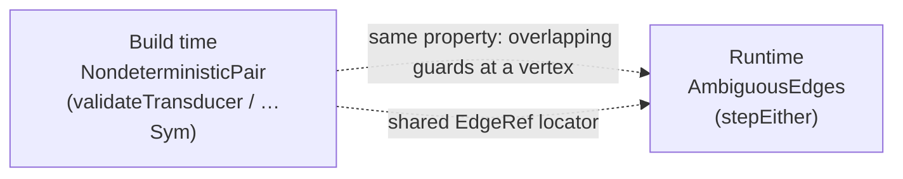

<Callout type="info">
This chapter is part of the symbolic-and-validation source tour. Start at
[00 — Start here](/docs/keiki/walkthrough/symbolic-and-validation/00-start-here) for the overview and
the chapter map.
</Callout>

Every chapter so far has been a build-time story: prove single-valuedness, run the umbrella, read the
opaque signpost, call z3 for the exact answer. This last chapter crosses to **runtime**. When a machine
actually steps and *cannot advance*, what does it report — and how does that runtime report mirror the
build-time warnings? The answer is `stepEither` and `StepFailure`, in `src/Keiki/Core.hs`. Crucially,
this path uses concrete guard evaluation; there is no solver on the hot path.

## `step` collapses, `stepEither` explains

The plain `step` returns `Maybe` — it tells you *whether* a step advanced, not *why* it did not.
`stepEither` is the additive explainer:

```haskell
-- src/Keiki/Core.hs
{- | Like 'step', but returns a precise 'StepFailure' explanation on the
'Left' instead of collapsing every failure into 'Nothing'. On the
'Right' it returns EXACTLY the triple 'step' returns. 'step' is left
unchanged; this is purely additive.
-}
stepEither ::
    (BoolAlg phi (RegFile rs, ci)) =>
    SymTransducer phi rs s ci co ->
    (s, RegFile rs) ->
    ci ->
    Either (StepFailure s) (s, RegFile rs, [co])
```

Note the `Right` payload is the bare triple `(s, RegFile rs, [co])` — the new target vertex, the updated
register file, and the emitted outputs. There is no wrapper type around it; on success `stepEither`
returns exactly what `step` returns inside `Just`.

## The three failure variants: `StepFailure`

```haskell
-- src/Keiki/Core.hs
{- | A precise explanation of why a step could not advance.

  * 'NoOutgoingEdges' — the source vertex has no outgoing edges at all.
  * 'NoMatchingEdge'   — there are outgoing edges, but none matched the
    command; carries one 'RejectedEdgeSummary' per edge, in declaration
    order.
  * 'AmbiguousEdges'   — two or more guards matched the same command, a
    runtime witness of a single-valuedness violation (the property
    EP-56's 'checkTransitionDeterminism' proves statically); carries one
    'MatchedEdgeSummary' per matched edge.
-}
data StepFailure s
    = NoOutgoingEdges s
    | NoMatchingEdge s [RejectedEdgeSummary s]
    | AmbiguousEdges s [MatchedEdgeSummary s]
    deriving stock (Eq, Show)
```

<TypeTable
  type={{
    NoOutgoingEdges: { type: "s", description: "The source vertex has no outgoing edges at all — a dead end." },
    NoMatchingEdge: { type: "s, [RejectedEdgeSummary s]", description: "Edges exist but none matched; one rejected summary per edge, in declaration order." },
    AmbiguousEdges: { type: "s, [MatchedEdgeSummary s]", description: "Two or more guards matched — a runtime witness of a single-valuedness violation. A defect, not an ordinary rejection." },
  }}
/>

The two summary types both locate edges through the shared `EdgeRef`, and both deliberately carry **no
register values** — diagnostics summarize, they do not dump state:

```haskell
-- src/Keiki/Core.hs
data RejectedEdgeSummary s = RejectedEdgeSummary
    { rejectedEdge :: EdgeRef s
    , rejectedTarget :: s
    , rejectedGuard :: Bool
    }
    deriving stock (Eq, Show)

data MatchedEdgeSummary s = MatchedEdgeSummary
    { matchedEdge :: EdgeRef s
    , matchedTarget :: s
    }
    deriving stock (Eq, Show)
```

## How the body decides

The body evaluates every outgoing guard *concretely* — `models (guard e) (regs, ci)`, no solver — and
branches on how many matched:

```haskell
-- src/Keiki/Core.hs
stepEither t (s, regs) ci =
    case zip [0 ..] (edgesOut t s) of
        [] -> Left (NoOutgoingEdges s)
        indexed ->
            let matched =
                    [ (i, e)
                    | (i, e) <- indexed
                    , models (guard e) (regs, ci)
                    ]
             in case matched of
                    [] ->
                        Left $ NoMatchingEdge s [ {- one RejectedEdgeSummary per edge -} ]
                    [(_, e)] ->
                        let !regs' = applyEdgeUpdate e regs ci
                            outs = [evalOut o regs ci | o <- output e]
                         in Right (target e, regs', outs)
                    _ ->
                        Left $ AmbiguousEdges s [ {- one MatchedEdgeSummary per match -} ]
```

The three arms map one-to-one to the three `StepFailure` variants, plus the singleton `Right` arm:

<Steps>

<Step>
**No edges at all** → `Left (NoOutgoingEdges s)`. The vertex is a dead end for this command.
</Step>

<Step>
**Edges exist, none matched** → `Left (NoMatchingEdge s …)` carrying one `RejectedEdgeSummary` per edge,
in declaration order. This is an *ordinary rejection*: the command simply did not apply here.
</Step>

<Step>
**Exactly one matched** → `Right (target e, regs', outs)`. The single accepting edge applies its update
(note the bang — `!regs'` — forcing the register file) and evaluates its outputs. This is the success
path.
</Step>

<Step>
**Two or more matched** → `Left (AmbiguousEdges s …)` carrying one `MatchedEdgeSummary` per match. This
is *not* an ordinary rejection — it is a runtime witness that the machine is not single-valued at `s`.
</Step>

</Steps>

## The build-time ↔ runtime mirror

This is the chapter's keystone. The build-time
[`NondeterministicPair`](/docs/keiki/walkthrough/symbolic-and-validation/07-build-time-validation-umbrella)
and the runtime `AmbiguousEdges` are two views of the *same* property — overlapping guards at one vertex.
The `NondeterministicPair` Haddock names its runtime witness directly:

```haskell
-- src/Keiki/Core.hs
    | {- | Two outgoing edges of the same vertex whose guards can both hold
      for one command — a runtime nondeterminism / single-valuedness
      violation (its dynamic witness is EP-55's @AmbiguousEdges@).
      -}
      NondeterministicPair
```

And the `AmbiguousEdges` Haddock points the other way, back at the static check:

```haskell
-- src/Keiki/Core.hs
  * 'AmbiguousEdges'   — two or more guards matched the same command, a
    runtime witness of a single-valuedness violation (the property
    EP-56's 'checkTransitionDeterminism' proves statically); …
```

They even share the `EdgeRef` vocabulary, so a static `NondeterministicPair{tvwSource, tvwEdgeA,
tvwEdgeB}` and a runtime `AmbiguousEdges s [MatchedEdgeSummary{matchedEdge = EdgeRef …}, …]` describe the
same defect in the same terms.



<Callout type="warn">
`AmbiguousEdges` is a **defect, not an ordinary rejection.** A `NoMatchingEdge` means "this command does
not apply here" — expected, routine business logic. `AmbiguousEdges` means "two guards both fired" — the
machine is nondeterministic, which the build-time checks
([06](/docs/keiki/walkthrough/symbolic-and-validation/06-the-single-valuedness-gate),
[07](/docs/keiki/walkthrough/symbolic-and-validation/07-build-time-validation-umbrella),
[09](/docs/keiki/walkthrough/symbolic-and-validation/09-solver-backed-diagnostics)) exist to prevent.
If you ever see one at runtime, the answer is to fix the guards, not to handle the case.
</Callout>

## The runtime explainer in a test

`test/Keiki/StepEitherSpec.hs` is the contribution-grade anchor. Its `fixture` packs all four outcomes
into one machine: `V0` has two always-true edges (ambiguous), `V1` has one always-false edge (no match),
`V2` has no edges, `V3` has one always-true edge (the accepting case). Each spec pins one outcome
exactly:

```haskell
-- test/Keiki/StepEitherSpec.hs
        it "reports NoOutgoingEdges for a vertex with no edges" $
            case stepEither fixture (V2, RNil) True of
                Left f -> f `shouldBe` NoOutgoingEdges V2
                Right _ -> expectationFailure "expected Left NoOutgoingEdges"

        it "reports AmbiguousEdges listing every matched edge" $
            case stepEither fixture (V0, RNil) True of
                Left f ->
                    f
                        `shouldBe` AmbiguousEdges
                            V0
                            [ MatchedEdgeSummary
                                { matchedEdge = EdgeRef{edgeSource = V0, edgeIndex = 0}
                                , matchedTarget = VEnd
                                }
                            , MatchedEdgeSummary
                                { matchedEdge = EdgeRef{edgeSource = V0, edgeIndex = 1}
                                , matchedTarget = V3
                                }
                            ]
                Right _ -> expectationFailure "expected Left AmbiguousEdges"
```

The `AmbiguousEdges` assertion lists *both* matched edges by `EdgeRef` and target — exactly the runtime
witness of the overlap a build-time `NondeterministicPair` would have flagged. A separate spec proves the
`Right` payload matches `step` exactly on the accepting edge, confirming `stepEither` is purely additive:

```haskell
-- test/Keiki/StepEitherSpec.hs
        it "Right payload matches step exactly on the accepting edge" $
            case (step fixture (V3, RNil) True, stepEither fixture (V3, RNil) True) of
                (Just (s1, _r1, e1), Right (s2, _r2, e2)) -> (s1, e1) `shouldBe` (s2, e2)
                (Nothing, _) -> expectationFailure "step returned Nothing on the accepting edge"
                (_, Left f) -> expectationFailure ("stepEither returned Left: " <> show f)
```

(The spec compares only the inspectable parts because `RegFile` has no `Eq`/`Show`; for the empty slot
list `'[]` the register file has a single inhabitant `RNil`, so equality on the success path is trivially
preserved.)

## Where this tour leaves you

You have now read the symbolic-and-validation surface end to end: the `Sym` registry and translation, the
`SymPred` carrier and its solver-backed `isBot`, the single-valuedness gate, the pure build-time umbrella,
the opaque-guard signpost, the exact solver-backed diagnostics, and — here — the runtime explainer that
mirrors them. The build-time checks exist so the runtime `AmbiguousEdges` never fires; the two speak one
`EdgeRef` vocabulary so a defect reads the same whether you find it in CI or in production.

For the other source tours, return to the [keiki walkthrough index](/docs/keiki/walkthrough). For the
catalogued public surface of every type and function quoted here, see the
[keiki reference](/docs/keiki/reference).

Previous: [09 — Solver-backed diagnostics](/docs/keiki/walkthrough/symbolic-and-validation/09-solver-backed-diagnostics)
