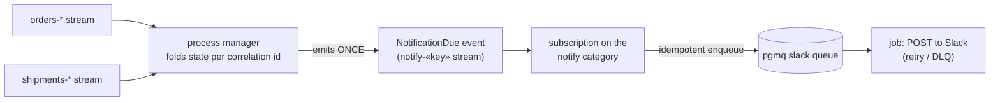

A Slack notifier that fires on a *single* event can dedupe on that event's `eventId`. But the common
case is harder: the notification depends on a **combination** of events from **several streams** —
"alert when the order is paid *and* its shipment is delayed", "page when an incident is reported and
still unacknowledged after triage". There is no one `eventId` to key on, and a subscription sees each
contributing event **at least once**. A process manager is the tool: it folds the contributing events
into one decision, made **exactly once**, and hands the actual send to a job.

<Callout type="info">
**Read [Enqueue work from a subscription](/docs/keiro/cookbook/enqueue-work-from-a-subscription)
first** — it covers the delivery half (why the external call goes on a `keiro-pgmq` job, not inline).
This recipe is about the *decision* half: collapsing a multi-stream trigger into one event to deliver.
</Callout>

## Problem

The trigger spans streams, so you cannot dedupe on a source `eventId`; and the send is an external
HTTP call, so it can never be transactional with your database. You need the notification to go out
**once** even though every contributing event is redelivered, replayed, and crash-recovered.

## The shape: split the decision from the delivery

The trick is to put an **exactly-once internal event** between the trigger and the side effect:



- The **process manager** does the hard part: it watches events from several streams, folds them into
  its own event-sourced state keyed by a correlation id, and — when the condition is finally met —
  emits exactly one `NotificationDue` event into its own stream. Internal, so this *is* exactly-once.
- A **subscription** on the manager's stream reacts to `NotificationDue` and enqueues a Slack job,
  keyed by that event's `eventId`. One source event ⇒ the [single-event dedupe](/docs/keiro/cookbook/enqueue-work-from-a-subscription) applies again.
- The **job** performs the send, effectively-once (retry/DLQ + a Slack-side dedupe marker).

## 1. The process manager folds the trigger into one event

The manager's `input` is a sum of the contributing events; `correlate` ties them together by the key
they share (here, the order id), and the manager's own aggregate folds them until the condition holds:

```haskell
-- The events this notifier reacts to, from two different aggregates:
data NotifyInput
  = OrderWasPaid      OrderId
  | ShipmentDelayed   OrderId

-- The manager's own aggregate (a keiki transducer) folds those into a small state machine:
--   Awaiting {paid :: Bool, delayed :: Bool}  --(both true)-->  Notified  (emits NotificationDue)
-- The transition to Notified is legal ONLY from Awaiting, so a second arrival of either
-- contributing event after the condition is met is a benign no-op (a total transition).

slackNotifier :: ProcessManager NotifyInput {- manager … -} {- target … -}
slackNotifier =
  ProcessManager
    { name        = "order-delay-notifier"
    , correlate   = \case OrderWasPaid o -> orderIdText o
                          ShipmentDelayed o -> orderIdText o   -- same key ⇒ same instance
    , eventStream = notifierEventStream                        -- emits NotificationDue
    , streamFor   = \k -> stream ("notify-" <> k)              -- notify-«orderId»
    , targetEventStream = ...        -- no target aggregate to drive here
    , targetProjections = const []
    , handle      = \input -> ProcessManagerAction
                       { command  = recordTrigger input        -- advance the manager's OWN state
                       , commands = []                         -- nothing to dispatch to a target
                       , timers   = []
                       }
    }
```

Run it as a live subscription over the streams it cares about, decoding only the events it reacts to
(return `Nothing` for the rest — the worker filters them out):

```haskell
runProcessManagerWorker defaultRunCommandOptions slackNotifier adapter decodeNotifyInput
```

The exactly-once guarantee is structural, not luck. The manager-state append uses a
[`deterministicCommandId`](/docs/keiro/reference/process-manager#deterministiccommandid) over
`(name, correlationId, sourceEventId, emitIndex)`, so a redelivered contributing event re-runs the
fold and the store's uniqueness constraint collapses the duplicate append to `PMStateDuplicate` —
nothing new is emitted. Combined with the "legal only from `Awaiting`" guard, `NotificationDue`
lands in the `notify-«orderId»` stream **once**. (This is the same replay-safety argument as
[the two-transaction model](/docs/keiro/explanation/process-managers-and-sagas#the-two-transaction-model-and-why-replay-is-still-safe).)

<Callout type="warn">
Model the "already notified" case as a **total transition** in the manager's aggregate — a second
`OrderWasPaid` after `Notified` must be an accepted no-op, not a rejection. A rejection here surfaces
as a fatal reaction and the subscription [wedges, retrying forever](/docs/keiro/how-to/keep-target-commands-total).
</Callout>

## 2. Deliver the one event, effectively-once

Now there *is* a single event to key on — `NotificationDue` — so the multi-stream problem is gone.
A subscription on the manager's `notify` category enqueues a Slack job at most once, exactly the
[Enqueue work from a subscription](/docs/keiro/cookbook/enqueue-work-from-a-subscription) recipe:

```haskell
-- Subscription handler over the notify-* category — idempotent, no HTTP here:
handleNotificationDue recorded due = do
  let key = recorded ^. #eventId               -- the NotificationDue event id — stable, unique
  claimed <- claimSlackSend key                -- INSERT ... ON CONFLICT (event_id) DO NOTHING RETURNING
  when claimed $
    enqueue slackNotifyJob (slackPayload key due)
```

The job then POSTs to Slack on its own `RetryPolicy` + dead-letter queue, mapping a 5xx/timeout to
`Retry` and a 4xx to `Dead`.

## The one residual duplicate, and how to shrink it

Be precise about what is guaranteed where:

| Hop | Guarantee | Why |
|---|---|---|
| trigger events → `NotificationDue` | **exactly-once** | internal event-store write; deterministic id + uniqueness + the guard |
| `NotificationDue` → job enqueued | **at-most-once** | the `claimSlackSend` dedupe claim, keyed by `eventId` |
| job → Slack POST | **effectively-once** | at-least-once job delivery; a lost ack after a 200 can re-post |

The only place a true duplicate can escape is the last hop: Slack accepts the message but the job's
ack is lost, so it retries and posts again. Shrink that window by carrying a deterministic dedupe
marker the receiver can recognize (Slack has no first-class idempotency key on `chat.postMessage`, so
many teams embed a stable token, or check a small "sent" table immediately before the POST). You
cannot drive it to zero — no external side effect is transactional with your database — but the
process manager has already removed every *other* source of duplication.

## Related

- [Enqueue work from a subscription](/docs/keiro/cookbook/enqueue-work-from-a-subscription) — the delivery half: the job, the retry/DLQ, the idempotent enqueue.
- [Understanding process managers and sagas](/docs/keiro/explanation/process-managers-and-sagas) — the stateful coordinator and its replay-safety model.
- [Your first process manager](/docs/keiro/tutorials/your-first-process-manager) — build one end to end.
- [Make an async projection idempotent](/docs/keiro/how-to/make-an-async-projection-idempotent) — the `ON CONFLICT (source_event_id)` claim used in step 2.
