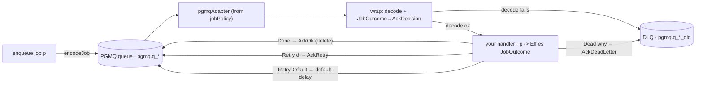

<Callout type="info">
  The executable evidence for this page lives with the libraries: `keiro-pgmq-test` exercises queue
  provisioning, FIFO delivery, producers, retries, dead letters, and both run cadences; the
  keiro-dsl queue conformance suites compile generated policy against the same public types.
</Callout>

`keiro-pgmq` is a separate package in the keiro repository that gives an application a **typed
background-job queue** on top of PostgreSQL. It is the background-work analogue of keiro's
[`EventStream`](/docs/keiro/reference/event-stream-and-stream): where an `EventStream` bundles
everything needed to run a decision against a durable log, a [`Job`](/docs/keiro/reference/pgmq-jobs#job)
bundles everything needed to run *transient work* against a durable queue.

This page is the *why*. For the API, see the [background-jobs reference](/docs/keiro/reference/pgmq-jobs);
to build one, start with [Your first background job](/docs/keiro/tutorials/your-first-background-job).

## The problem it removes

PGMQ is a message queue that lives inside PostgreSQL: you create a named queue, push JSON messages
onto it, and workers read, do work, then delete (ack) or retry them. Haskell reaches it through
[`pgmq-hs`](/docs/pgmq), whose `pgmq-effectful` package exposes the `Pgmq` effect; [shibuya](/docs/shibuya)
turns a queue into a supervised worker loop, and the [shibuya ⇄ pgmq
adapter](/docs/integrations/shibuya-pgmq-adapter) bridges the two and translates a handler's
`AckOk`/`AckRetry`/`AckDeadLetter` into PGMQ operations.

That stack works, but applications that want a background queue otherwise write the *same* skeleton
by hand:

- derive a PGMQ-legal queue name from a logical one (dots and length are footguns);
- construct a `PgmqAdapterConfig`;
- write a producer wrapping `sendMessage`;
- write a handler of type `Ingested es Value -> Eff es AckDecision` that **decodes JSON by hand** and
  maps domain failures to ack decisions;
- assemble an effect stack `Pgmq : Tracing : Error : IOE`.

None of it was shared, and none of it used keiro's versioned [`Codec`](/docs/keiro/reference/codec),
so a payload-shape change was an unversioned break.

## The abstraction

After `keiro-pgmq`, an application declares a `Job` value and writes a plain domain handler:

```haskell
data Job p = Job
  { jobName   :: !Text          -- telemetry / ProcessorId label
  , jobQueue  :: !QueueRef      -- logical name → physical + DLQ names
  , jobCodec  :: !(JobCodec p)  -- p ↔ JSON
  , jobPolicy :: !RetryPolicy   -- retries + dead-letter
  }

-- the handler the application writes:
handle :: p -> Eff es JobOutcome   -- Done | Retry delay | RetryDefault | Dead reason
```

The handler **never touches** shibuya's `Ingested`/`AckDecision` or PGMQ's wire types. The package
absorbs the boilerplate exactly once: per delivery it decodes the raw JSON with the job's codec, runs
your handler, and translates the returned [`JobOutcome`](/docs/keiro/reference/pgmq-jobs#joboutcome)
back into a shibuya ack. A payload the codec rejects is dead-lettered *for* you, before your handler
runs — so your handler only ever sees a well-typed `p`.



That is the whole shape: a declaration, a handler, and the package in between.

## Two layers, on purpose

`keiro-pgmq` is split so a future enhancement stays cheap:

- **`Keiro.PGMQ.Runtime`** (layer 1) is transport-agnostic plumbing every PGMQ user repeats —
  turning a logical queue name into a PGMQ-legal `QueueRef`, and running the `Pgmq : Tracing : Error
  PgmqRuntimeError : IOE` stack against a pool with an optional tracer. It knows nothing about jobs.
- **`Keiro.PGMQ.Job`** (layer 2) is the typed-`Job` ergonomics built on top.

The split exists because using PGMQ as a *transport for domain integration events* (a Kafka
alternative, leveraging PGMQ topics/fan-out under the [inbox](/docs/keiro/reference/inbox) /
[outbox](/docs/keiro/reference/outbox)) is a real future option. That "case B" is **deferred, not
built** — but when it is picked up it can reuse layer 1 without disturbing the `Job` layer.

## Two cadences, both first-class

The same `Job` API drives two genuinely different run shapes, validated against the two real
consumers:

| | `runJobWorkers` (continuous) | `runJobOnce` (one-shot drain) |
|---|---|---|
| Shape | Supervise N processors forever | Drain up to `n` messages, then stop |
| Returns | An `AppHandle` (you decide when to block / shut down) | `()` after the drain |
| Driven by | A long-lived worker process | An external scheduler (`pg_cron`, a [Router](/docs/keiro/reference/router) fan-out) |
| Typical deployment | several queues under one supervisor | one queue, drained per scheduler tick |

`runJobWorkers` is for a process you start once and leave running; it builds every processor with
`jobProcessor` and supervises them with shibuya's `runApp`, and you can `stopAppGracefully` the
handle on a shutdown signal. `runJobOnce` is for a "drain a little, then exit" cadence: it takes `n`
from the adapter's stream, processes each, and returns — ideal when something *else* (a cron tick, a
fan-out) decides when work should be picked up. See [Choose a job run
cadence](/docs/keiro/how-to/choose-a-job-run-cadence).

## What a `.keiro` workqueue owns

When a service is authored with keiro-dsl, its `workqueue` node can capture the queue's stable
logical/physical/DLQ/table names, payload wire fields, retry/disposition table, delivery ordering,
FIFO group derivation, and initial storage provision. The scaffold lowers those decisions into
generated `Queue` and `QueuePolicy` modules; handler behavior and deployment tuning such as batch
size, visibility timeout, polling, and concurrency remain hand-owned.

The ordering vocabulary is `unordered`, `fifo-throughput`, and `fifo-roundrobin`. FIFO is
per-group, remains at-least-once, and requires one resolvable group key. Provision is `standard`,
`unlogged`, or `partitioned(interval="…", retention="…")`; changing an already-created queue still
requires an operational migration. See [Configure FIFO queue ordering and
provisioning](/docs/keiro/how-to/configure-fifo-queue-ordering-and-provisioning) for the complete
checked vertical and conformance commands.

## Payload versioning is opt-in

The default [`JobCodec`](/docs/keiro/reference/pgmq-jobs#jobcodec) is `aesonJobCodec` — raw
`ToJSON`/`FromJSON` — because it is a drop-in match for what hand-rolled queues already do, so
adopting `keiro-pgmq` is mechanical. When you want job payloads to evolve like event streams do,
`keiroJobCodec` bridges keiro's versioned `Codec`: it wraps payloads in a `{ "v", "data" }` envelope
and replays the upcaster chain on decode. You can also hand-write a literal `JobCodec` to pin an
exact wire format. See [Version a job payload](/docs/keiro/how-to/version-a-job-payload).

## When *not* to reach for a job

A `keiro-pgmq` job is for **transient work that is not a domain event** — "go do this thing", where
losing the *record* of the work is acceptable as long as the work eventually runs (and retries/dead-letters
when it doesn't). Choose a different tool when:

- **The thing you are sending *is* a domain event other contexts consume.** That is an [integration
  event](/docs/keiro/explanation/integration-events): publish it transactionally with the
  [outbox](/docs/keiro/explanation/the-outbox-pattern), and consume it idempotently through the
  [inbox](/docs/keiro/explanation/the-inbox-pattern). A job queue has no dedupe table and no
  transactional-publication guarantee.
- **Enqueuing must be atomic with a domain write.** `enqueue` runs in its own PGMQ transaction, so a
  crash between your DB commit and the enqueue loses the job (or vice-versa). When you need
  exactly-once enqueue tied to a row, send via raw SQL in the *same* transaction — see [Enqueue a job
  transactionally](/docs/keiro/cookbook/transactional-job-enqueue).
- **The next action depends on history the coordinator must remember**, or needs a durable timer →
  use a [process manager](/docs/keiro/explanation/process-managers-and-sagas) or a [durable
  workflow](/docs/keiro/explanation/durable-execution). A job handler is stateless between deliveries.

In short: jobs are the *worker* primitive; the outbox/inbox are the *messaging* primitive; process
managers and workflows are the *coordination* primitive. `keiro-pgmq` deliberately owns only the
first.

## Where to go next

<Cards>
  <Card title="Background jobs reference" href="/docs/keiro/reference/pgmq-jobs" description="The Job, JobOutcome, RetryPolicy, the producers, the run shapes, JobCodec, and the QueueRef / JobRuntime plumbing." />
  <Card title="Your first background job" href="/docs/keiro/tutorials/your-first-background-job" description="Declare a Job, enqueue a message, drain it, and watch Done / Retry / Dead." />
  <Card title="Configure FIFO ordering and provisioning" href="/docs/keiro/how-to/configure-fifo-queue-ordering-and-provisioning" description="Capture queue identity, ordering groups, storage provision, generated policy, and cold-start proof in a .keiro workqueue." />
  <Card title="The outbox pattern" href="/docs/keiro/explanation/the-outbox-pattern" description="When the thing you are sending is a domain event, not a transient job." />
  <Card title="shibuya ⇄ pgmq adapter" href="/docs/integrations/shibuya-pgmq-adapter" description="The lower-level bridge keiro-pgmq is built on." />
</Cards>
