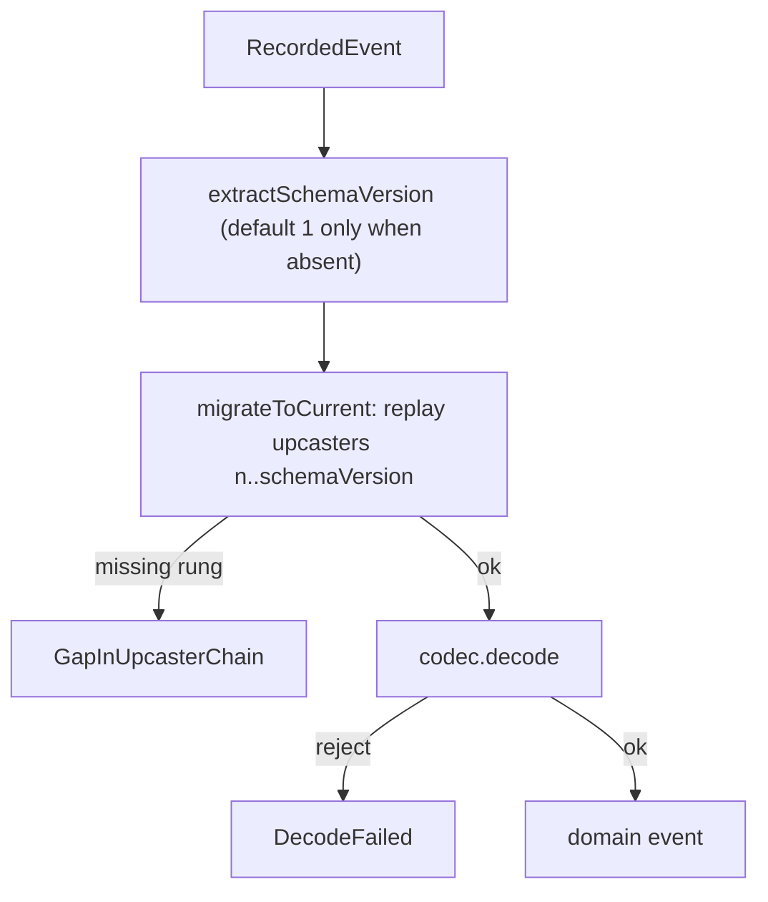

Events live forever, but their shape changes. The order you stored as `OrderPlaced` last year may
have had a `qty` field where this year's code expects `quantity`. keiro handles this with a
**`Codec`** — and the first surprise, if you come from typeclass-based serialization, is that a
`Codec` is not a class at all.

## The Codec is a value, not a typeclass

A `Codec e` is an ordinary record value you build and pass around:

```haskell
data Codec e = Codec
  { eventTypes    :: !(NonEmpty Text)         -- the complete event-type allow-list this codec owns
  , eventType     :: !(e -> Text)             -- project a domain value to its wire tag
  , schemaVersion :: !Int                     -- current payload version; must be >= 1
  , encode        :: !(e -> Value)            -- current-version JSON serialization
  , decode        :: !(EventType -> Value -> Either Text e)
  , upcasters     :: ![Upcaster]              -- migrations keyed by source version
  }
```

This is deliberate. Because the codec is data, one event *type* can carry several different codecs
(for different streams or contexts), and the upcaster chain is first-class data you can inspect and
test, not instance resolution you have to trust. An `Upcaster` is just a numbered, pure migration:

```haskell
type Upcaster = (Int, EventType -> Value -> Either Text Value)
```

## Write: the schema version is stamped into metadata

On append, `encodeForAppendWithMetadata` serializes the event with the codec's current `encode` and
stamps the codec's `schemaVersion` into the event's metadata.

<Callout type="info">
The schema-version key **always wins** over any clashing key in caller-supplied metadata, so the
version recorded on disk is authoritative — you cannot accidentally overwrite it. Caller metadata
must be a JSON object.
</Callout>

## Read: replay the upcaster chain, then decode

On read, `decodeRecorded` reverses the process:

1. `extractSchemaVersion` reads the stamped version off the `RecordedEvent`, **defaulting to `1`**
   when metadata is absent or the key is absent. A present malformed stamp is an error.
2. `migrateToCurrent` replays the upcaster chain from the stored version up to `schemaVersion`,
   applying rung `n`, then `n+1`, and so on.
3. The codec's current `decode` runs on the now-migrated payload.



Two failure modes deserve emphasis:

<Callout type="warn">
An **unknown `eventType` on read is fatal** (`UnknownEventType`), carrying the offending tag and the
allowed set. The upcaster chain must be **contiguous**: if migration reaches version `n` but the next
available upcaster starts later, you get `GapInUpcasterChain n nextVersion`; if the chain simply ends
before the codec's target version, you get `IncompleteUpcasterChain`. An upcaster that returns `Left`
becomes `UpcasterError`.
</Callout>

## The worked example: the jitsurei order codec, v1 → v2

The `jitsurei` order codec (`jitsurei/src/Jitsurei/OrderStream.hs`) is a real two-version codec:

```haskell
orderCodec :: Codec OrderEvent
orderCodec = Codec
  { eventTypes    = "OrderPlaced" :| ["PaymentApproved", "OrderPacked", "OrderShipped", "OrderCancelled"]
  , eventType     = \case OrderPlaced{} -> "OrderPlaced"; ...
  , schemaVersion = 2
  , encode        = ...
  , decode        = parseOrderEvent
  , upcasters     = [(1, upcastOrderPlacedV1)]   -- migrates a v1 OrderPlaced into the v2 shape
  }
```

The single upcaster rewrites a v1 `OrderPlaced` (which used a `"qty"` key and an *optional* `"sku"`)
into the v2 shape (a required `"quantity"` and an `"sku"` defaulted to `"UNKNOWN"`):

```haskell
upcastOrderPlacedV1 :: Value -> Either Text Value
upcastOrderPlacedV1 value = ...   -- read "qty" -> write "quantity"; default a missing "sku" to "UNKNOWN"
```

A reader storing a v1 `OrderPlaced` and decoding it with this v2 codec gets the migrated value with
no change to the stored event. For the step-by-step recipe see
[Evolve an event schema](/docs/keiro/how-to/evolve-an-event-schema); for the exact signatures see the
[Codec reference](/docs/keiro/reference/codec).
