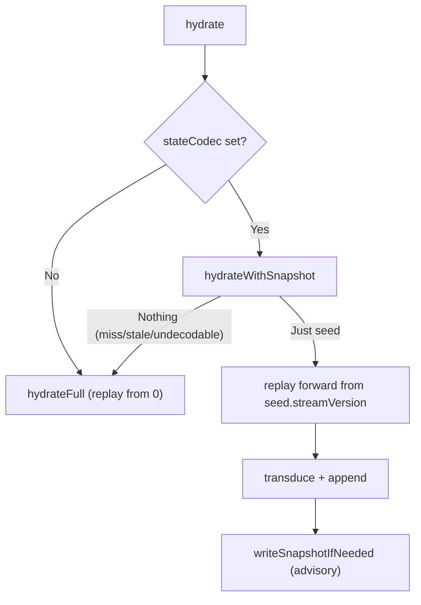

Two read-side questions decide how fresh a read is and how fast a write replays: which
**consistency mode** a query runs under, and whether the aggregate has a usable **snapshot**. Both
have sharp, easily-missed details.

## The three consistency modes

A read model carries a `defaultConsistency :: ConsistencyMode`, and `runQuery` uses it (or you
override it with `runQueryWith`):

- **`Strong`** — capture the store head at query start, wait until the model's subscription cursor
  reaches that position, then read.
- **`Eventual`** — read the table as-is.
- **`PositionWait`** — wait until the model's projection has caught up to a target `GlobalPosition`
  before reading.

<Callout type="warn">
Do not use `Strong` for an inline-only model with no subscription worker: it waits for a subscription
cursor that cannot advance. Use `Eventual` for inline models, `PositionWait` when you have a command
result's `GlobalPosition`, and `Strong` when an async projection should catch up to the store head as
of query start.
</Callout>

`Strong` and `PositionWait` poll the `subscriptions.last_seen` cursor (the kiroku-owned
`subscriptions` table) until the target `GlobalPosition` is reached, or `timeoutMicros` elapses
(→ `ReadModelWaitTimeout`). A `PositionWait` whose `target` is `Nothing` skips waiting. Before any of
this, `runQuery` validates the registered schema: drift hard-fails with `ReadModelStaleSchema`, and a
non-`Live` model fails with `ReadModelNotLive`.

For the decision procedure, see
[Choose a consistency mode](/docs/keiro/how-to/choose-a-consistency-mode).

## How snapshots accelerate hydration

Hydration normally replays an aggregate's whole event log. A snapshot lets it start partway. The
fast path:

A snapshot stores the joint `(state, registers)` as JSON. It is gated on two identities: the
`state_codec_version` and a `regfile_shape_hash` (a SHA-256 over the register-file *shape*, so any
slot change invalidates older snapshots). On write, an upsert with a monotonicity guard keeps the
newest version — a stale write cannot clobber a fresher row.

<Callout type="info">
The snapshot write runs after a successful append and is advisory. If it fails, the command still
succeeds and the optional metrics handle records a snapshot-write failure. If `stateCodec = Nothing`,
or the lookup misses, or the row is incompatible/undecodable, hydration falls back to a full replay
with no error.
</Callout>

See [Add a snapshot](/docs/keiro/how-to/add-a-snapshot) for the recipe and the
[Snapshot reference](/docs/keiro/reference/snapshot) for the exact API.
