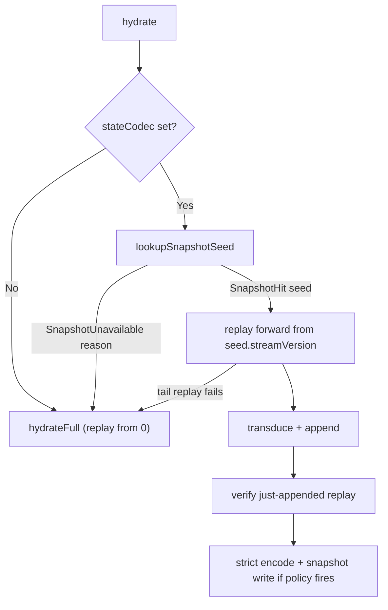

This page covers two independent concerns that share infrastructure but not state:

- a read model's **consistency mode** controls when a query may observe its event-folded table; and
- an aggregate **snapshot** caches Keiki `(state, RegFile)` solely to accelerate command hydration.

A projection never reads the snapshot, and a snapshot never supplies projection state. The event
log is the durable input to both independent replay paths.

## The three consistency modes

A read model carries a `defaultConsistency :: ConsistencyMode`, and `runQuery` uses it (or you
override it with `runQueryWith`):

- **`Strong`** — capture the head selected by the model's `strongScope` at query start, wait until
  the model's subscription cursor reaches that position, then read. `EntireLog` targets `$all`;
  `CategoryHead category` targets the latest global position originating in that category.
- **`Eventual`** — read the table as-is.
- **`PositionWait`** — wait until the model's projection has caught up to a target `GlobalPosition`
  before reading.

<Callout type="warn">
Do not use `Strong` for an inline-only model with no subscription worker: it waits for a subscription
cursor that cannot advance. Use `Eventual` for inline models, `PositionWait` when you have a command
result's `GlobalPosition`, and `Strong` when an async projection should catch up to its selected head
as of query start. Pair a category subscription with `CategoryHead`; unrelated `$all` traffic may
otherwise create a target that Kiroku's category cursor cannot reach.
</Callout>

`Strong` and `PositionWait` poll the `subscriptions.last_seen` cursor (the kiroku-owned
`subscriptions` table) until the target `GlobalPosition` is reached, or `timeoutMicros` elapses
(→ `ReadModelWaitTimeout`). A `PositionWait` whose `target` is `Nothing` skips waiting. Before any of
this, `runQuery` requires a registry row and validates its schema: missing startup registration
returns `ReadModelUnregistered`, drift hard-fails with `ReadModelStaleSchema`, and a non-`Live` model
fails with `ReadModelNotLive`. Queries never register models as a side effect.

For the decision procedure, see
[Choose a consistency mode](/docs/keiro/how-to/choose-a-consistency-mode).

## How snapshots accelerate hydration

Hydration normally replays an aggregate's whole event log. A snapshot lets it start partway. The
fast path:

A snapshot stores the joint `(state, registers)` as JSON. It is gated on two identities: the
`state_codec_version` and a `regfile_shape_hash` over the register-file *shape*, so any slot change
invalidates older snapshots. `SnapshotNoStream`, `SnapshotNotFound`, and `SnapshotDecodeFailed`
retain the reason a lookup could not produce a seed; the command runner turns all three into full
replay while recording hit/miss/decode telemetry.

Snapshot version non-regression is scoped to a fixed codec version and shape hash. A stale compatible
write cannot clobber a fresher row, but an incompatible codec or shape may replace a higher-version
row so a rolled-back deployment can make progress. Mixed versions can thrash the single row and
cause repeated full replay, but cannot replace the event log as truth.

<Callout type="info">
The snapshot fold, strict encode, and write run after a successful append and are advisory. An encode
or store failure leaves the command successful and increments its dedicated counter. A divergence
while replaying the just-appended events also leaves the already-committed result successful, but
records stream-integrity evidence for immediate investigation. If `stateCodec = Nothing`, or the
lookup misses, or the row is incompatible/undecodable, hydration falls back to full replay.
</Callout>

Keiki 0.2's stable built-in shape names deliberately make every old non-empty 0.1 shape hash miss
once. Let the cache miss, replay events from zero, and write a fresh row; the empty `regfile:0` shape
is unchanged, and old bytes must not be relabelled.

See [Add a snapshot](/docs/keiro/how-to/add-a-snapshot) for the recipe and the
[Snapshot reference](/docs/keiro/reference/snapshot) for the exact API.
