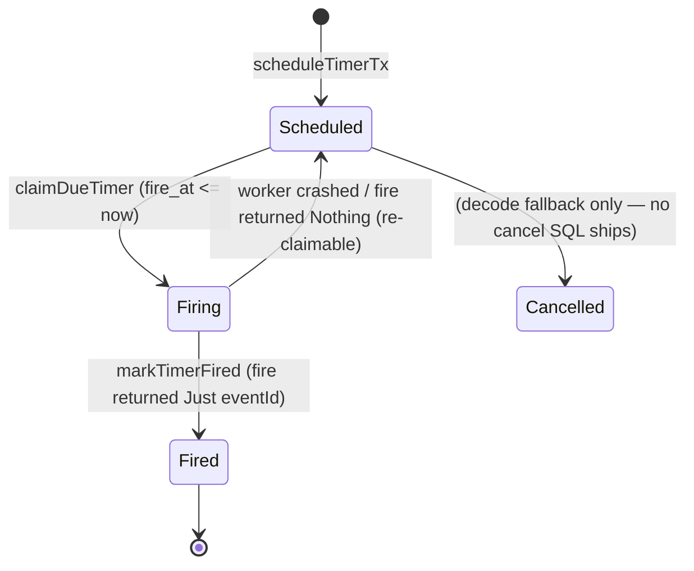

A process manager often needs to act *later*: escalate an unacknowledged incident after five
minutes, time out an unpaid order, retry after a back-off. An in-memory `threadDelay` cannot
survive a restart, and a cron job has no idea which sagas are waiting. keiro's answer is the
**durable timer** — a row in PostgreSQL that a worker wakes up and fires.

## The idea

A **durable timer** is a single row in the `keiro_timers` table scheduled to become *due* at a
future `fire_at`. "Durable" means it lives in your Postgres, so it survives process restarts: a
worker that comes back up after a crash simply finds the still-due rows and fires them. A process
manager creates a timer by including a `TimerRequest` in its `ProcessManagerAction`:

```haskell
data TimerRequest = TimerRequest
  { timerId            :: !TimerId
  , processManagerName :: !Text
  , correlationId      :: !Text
  , fireAt             :: !UTCTime
  , payload            :: !Value
  }
```

The `timerId` is **caller-chosen**, which makes scheduling idempotent: rescheduling the same id
updates the existing row rather than creating a duplicate. The jitsurei escalation timer
(`Jitsurei/EscalationProcess.hs`) derives its id as a UUIDv5 of the incident id, so a redelivered
`IncidentReported` re-arms the *same* row. The `processManagerName` and `correlationId` are how a
fired timer is routed back to the saga that scheduled it (more on that below); the `payload` is
opaque JSON carried through to the firing code.

## The lifecycle

A timer moves through four states (`Keiro.Timer.Schema.TimerStatus`):



- **`Scheduled`** — waiting for its `fireAt`; claimable.
- **`Firing`** — claimed by a worker and being processed. If the worker crashes before completing,
  the row stays `Firing` and becomes claimable again.
- **`Fired`** — successfully fired; terminal.
- **`Cancelled`** — withdrawn before firing. Note: `Cancelled` is **also the decode fallback** for
  an unrecognized stored status string (`statusFromText` maps anything unknown to `Cancelled`).

## At-least-once firing

The worker marks a timer `Fired` **only if** the firing action returns the id of an event it
produced. A firing that returns `Nothing`, or a crash mid-fire, leaves the row `Firing` — and a
`Firing` row is re-claimed on a later pass. The guarantee is therefore **at-least-once**: a timer
may fire more than once (e.g. a crash after the side effect but before `markTimerFired`), so the
firing action must be **idempotent**. In jitsurei this is automatic — the escalation timer
dispatches `EscalateIncident`, which the incident aggregate accepts only from `Triaging`, so a
second firing is a benign no-op.

## Many workers, one table: `FOR UPDATE SKIP LOCKED`

The claim is a single SQL statement that picks the earliest due timer and moves it to `Firing`
atomically:

```sql
WITH due AS (
  SELECT timer_id
  FROM keiro_timers
  WHERE status = 'scheduled'
    AND fire_at <= $1
  ORDER BY fire_at, timer_id
  LIMIT 1
  FOR UPDATE SKIP LOCKED
)
UPDATE keiro_timers kt
SET status = 'firing', attempts = kt.attempts + 1, updated_at = now()
FROM due
WHERE kt.timer_id = due.timer_id
RETURNING ...
```

`FOR UPDATE SKIP LOCKED` is the part that lets many workers share one timer table safely: each
concurrent worker skips rows another worker has already locked and claims a **distinct** timer.
There is no coordinator and no partitioning to configure — you just run more workers.

## The bare-worker reality

It is important to be honest about what `runTimerWorker` is and is not:

```haskell
runTimerWorker ::
  (Store :> es) => UTCTime -> (TimerRow -> Eff es (Maybe EventId)) -> Eff es (Maybe TimerRow)
```

It claims **at most one** due timer, runs your `fire` action, and marks it `Fired` only on a
`Just`. That is the whole of it. There is:

- **no loop** — the caller calls it on a tick;
- **no clock** — the caller supplies `now`, which makes the worker trivially testable and lets you
  drive logical time in tests;
- **no supervisor** — you run it inside your own polling loop or a shibuya worker;
- **no cancellation SQL** — although the `Cancelled` status value exists, keiro 0.1.0.0 ships *no*
  `cancelTimer` function. A timer is either fired or left to be superseded by a re-arm.

A fired timer is bound back to a process manager **only by convention**: your `fire` action reads
the row's `processManagerName` / `correlationId` / `payload` and dispatches the appropriate
command. `Jitsurei/EscalationProcess.hs`'s `incidentIdFromTimer` does exactly this — it checks
`processManagerName == "jitsurei-escalation"` and reads the incident id out of `correlationId`.

## Trade-offs

A bare, caller-driven worker is less convenient than a managed scheduler, but it is dramatically
simpler to reason about and to test: there is no background thread, no hidden clock, and no
recovery protocol beyond "a `Firing` row gets re-claimed". The cost is that *you* own the polling
cadence and the loop, and you must keep firing idempotent. The payoff is that timers live in the
same Postgres as your events, claimed with the same `SKIP LOCKED` discipline as everything else —
no new infrastructure to operate. See [Drive the timer
worker](/docs/keiro/how-to/drive-the-timer-worker) for the polling loop, and the
[Keiro.Timer reference](/docs/keiro/reference/timers) for the full schema.

<Cards>
  <Card title="Understanding process managers and sagas" href="/docs/keiro/explanation/process-managers-and-sagas" />
  <Card title="Keiro.Timer reference" href="/docs/keiro/reference/timers" />
  <Card title="Drive the timer worker" href="/docs/keiro/how-to/drive-the-timer-worker" />
</Cards>
