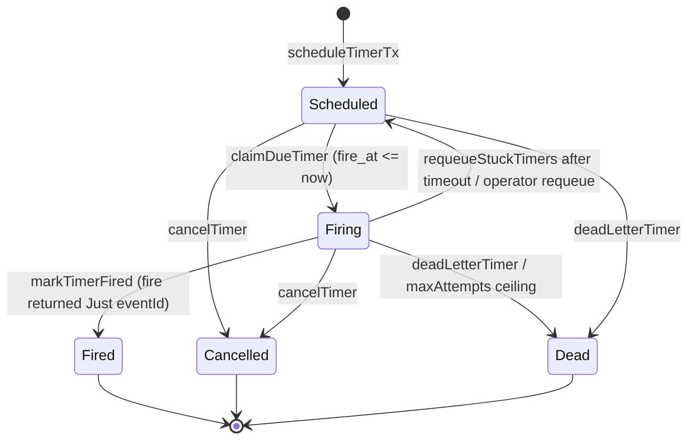

A process manager often needs to act *later*: escalate an unacknowledged incident after five
minutes, time out an unpaid order, retry after a back-off. An in-memory `threadDelay` cannot
survive a restart, and a cron job has no idea which sagas are waiting. keiro's answer is the
**durable timer** — a row in PostgreSQL that a worker wakes up and fires.

## The idea

A **durable timer** is a single row in the `keiro_timers` table scheduled to become *due* at a
future `fire_at`. "Durable" means it lives in your Postgres, so it survives process restarts: a
worker that comes back up after a crash simply finds the still-due rows and fires them. A process
manager creates a timer by including a `TimerRequest` in its `ProcessManagerAction`:

```haskell
data TimerRequest = TimerRequest
  { timerId            :: !TimerId
  , processManagerName :: !Text
  , correlationId      :: !Text
  , fireAt             :: !UTCTime
  , payload            :: !Value
  }
```

The `timerId` is **caller-chosen**, which makes scheduling idempotent: rescheduling the same id
updates the existing row rather than creating a duplicate. The jitsurei escalation timer
(`Jitsurei/EscalationProcess.hs`) derives its id as a UUIDv5 of the incident id, so a redelivered
`IncidentReported` re-arms the *same* row. The `processManagerName` and `correlationId` are how a
fired timer is routed back to the saga that scheduled it (more on that below); the `payload` is
opaque JSON carried through to the firing code.

## The lifecycle

A timer moves through five states (`Keiro.Timer.Schema.TimerStatus`):



- **`Scheduled`** — waiting for its `fireAt`; claimable.
- **`Firing`** — claimed by a worker and being processed. If the worker crashes before completing,
  the row stays `Firing` until the worker's configured stale-row sweep (five minutes by default) or
  an operator call moves it back to `Scheduled`.
- **`Fired`** — successfully fired; terminal.
- **`Cancelled`** — withdrawn before firing via `cancelTimer`; terminal. `Cancelled` is **also the
  decode fallback** for an unrecognized stored status string (`statusFromText` maps anything unknown
  to `Cancelled`).
- **`Dead`** — abandoned after exceeding the attempt ceiling, via `deadLetterTimer` (or the worker's
  `maxAttempts` auto-dead-letter); terminal. Carries a `last_error` explaining why.

## At-least-once firing

The worker marks a timer `Fired` **only if** the firing action returns the id of an event it
produced. A firing that returns `Nothing`, or a crash mid-fire, leaves the row `Firing`. With the
default `requeueStuckAfter = Just 300`, a pass after five minutes moves that row back to `Scheduled`,
where a later claim can fire it again. The guarantee is therefore **at-least-once**: a timer
may fire more than once (e.g. a crash after the side effect but before `markTimerFired`), so the
firing action must be **idempotent**. In jitsurei this is automatic — the escalation timer
dispatches `EscalateIncident`, which the incident aggregate accepts only from `Triaging`, so a
second firing is a benign no-op.

## Many workers, one table: `FOR UPDATE SKIP LOCKED`

The claim is a single SQL statement that picks the earliest due timer and moves it to `Firing`
atomically:

```sql
WITH due AS (
  SELECT timer_id
  FROM keiro_timers
  WHERE status = 'scheduled'
    AND fire_at <= $1
  ORDER BY fire_at, timer_id
  LIMIT 1
  FOR UPDATE SKIP LOCKED
)
UPDATE keiro_timers kt
SET status = 'firing', attempts = kt.attempts + 1, updated_at = now()
FROM due
WHERE kt.timer_id = due.timer_id
RETURNING ...
```

`FOR UPDATE SKIP LOCKED` is the part that lets many workers share one timer table safely: each
concurrent worker skips rows another worker has already locked and claims a **distinct** timer.
There is no coordinator and no partitioning to configure — you just run more workers.

## The bare-worker reality

It is important to be honest about what `runTimerWorker` is and is not:

```haskell
runTimerWorker ::
  (IOE :> es, Store :> es) =>
  Maybe KeiroMetrics -> UTCTime -> (TimerRow -> Eff es (Maybe EventId)) -> Eff es (Maybe TimerRow)
```

It claims **at most one** due timer, runs your `fire` action, and marks it `Fired` only on a
`Just`. That is the core of it. There is:

- **no loop** — the caller calls it on a tick;
- **no clock** — the caller supplies `now`, which makes the worker trivially testable and lets you
  drive logical time in tests;
- **no supervisor** — you run it inside your own polling loop or a shibuya worker;
- **no retry backoff** — a requeued timer is immediately claimable; `requeueStuckAfter` determines
  when a `Firing` row is declared stale, but nothing spaces subsequent claims out.

The leading `Maybe KeiroMetrics` is the opt-in metrics handle (`Nothing` = no instruments); each
pass records the `keiro.timer.*` backlog/stuck/fire-lag/attempts instruments.

A fired timer is bound back to a process manager **only by convention**: your `fire` action reads
the row's `processManagerName` / `correlationId` / `payload` and dispatches the appropriate
command. `Jitsurei/EscalationProcess.hs`'s `incidentIdFromTimer` does exactly this — it checks
`processManagerName == "jitsurei-escalation"` and reads the incident id out of `correlationId`.

## Recovering stuck timers

A `Firing` row left by a crash (or a `fire` that keeps returning `Nothing`) is not directly claimable —
`claimDueTimer` selects only `Scheduled` rows. `runTimerWorkerWith` first runs the bounded
`requeueStuckTimers` sweep when `requeueStuckAfter = Just ttl`; the default is five minutes. Set the
option to `Nothing` only when a separate recovery loop owns this transition. Keiro also ships a
supported per-row recovery API in `Keiro.Timer` / `Keiro.Timer.Schema`:

- **`findStuckTimers now filter`** — list `Firing` rows, filtered by how long they have been firing
  (`minAge`) and how many times claimed (`minAttempts`), oldest-first. `countStuckTimers` is the
  read-only count (and the source for the `keiro.timer.stuck` gauge).
- **`requeueStuckTimer timerId`** — put the row back to `Scheduled` so the ordinary loop re-fires it
  (use when the strand was transient — a crash, a redeploy).
- **`cancelTimer timerId`** — move it to the terminal `Cancelled` state so it never fires.
- **`deadLetterTimer timerId reason`** — move it to the terminal `Dead` state, recording `reason` in
  `last_error` (use for a poison timer you have given up on; inspect with `SELECT * FROM keiro_timers
  WHERE status = 'dead'`).

To bound poison timers automatically, drive the worker with `runTimerWorkerWith` and set
`maxAttempts = Just n` — the first post-claim attempt count greater than `n` dead-letters the timer
instead of firing it. The default `Nothing` never produces that terminal outcome. Choose
`requeueStuckAfter` above the longest legitimate fire duration: if a live action crosses the timeout,
another worker pass can requeue and fire the same timer concurrently.

## Trade-offs

A bare, caller-driven worker is less convenient than a managed scheduler, but it is dramatically
simpler to reason about and to test: there is no background thread and no hidden clock. The recovery
protocol is explicit in `TimerWorkerOptions`: a stale `Firing` row is requeued after the configured
timeout, and a timer becomes `Dead` only under a configured attempt ceiling or an operator call. The
cost is that *you* own the polling cadence and the loop, and
you must keep firing idempotent. The payoff is that timers live in the same Postgres as your events,
claimed with the same `SKIP LOCKED` discipline as everything else — no new infrastructure to operate.
See [Drive the timer worker](/docs/keiro/how-to/drive-the-timer-worker) for the polling loop, and the
[Keiro.Timer reference](/docs/keiro/reference/timers) for the full schema and the recovery API.

<Callout type="info">
**Durable-workflow sleeps reuse this exact table.** A workflow's [`sleepNamed`](/docs/keiro/reference/durable-workflows#durable-sleep)
schedules a `keiro_timers` row carrying a `{"kind":"keiro.workflow.sleep", …}` payload discriminator
and suspends; a timer worker recognises the payload, journals the sleep's completion, and the workflow
resumes — no schema change, and the same recovery API applies. Run `runWorkflowTimerWorker` to drain
both ordinary timers and workflow sleeps from one worker.
</Callout>

<Cards>
  <Card title="Understanding process managers and sagas" href="/docs/keiro/explanation/process-managers-and-sagas" />
  <Card title="Understanding durable execution" href="/docs/keiro/explanation/durable-execution" />
  <Card title="Keiro.Timer reference" href="/docs/keiro/reference/timers" />
  <Card title="Drive the timer worker" href="/docs/keiro/how-to/drive-the-timer-worker" />
</Cards>
