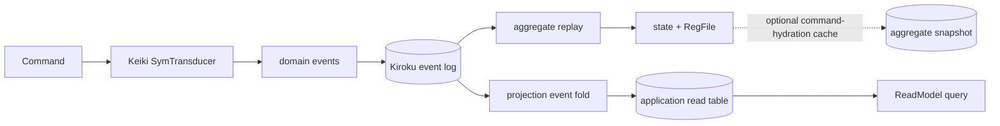

This is the migration guide for developers coming from the legacy `tan-event-source` Decider
pattern. The most important change is not syntax; it is keeping the **decision machine** and the
**read-side event fold** as separate consumers of the event history.

<Callout type="warn">
  **A Keiro projection never reads Keiki's `RegFile`, a Keiro aggregate snapshot, or the result of
  `deriveView`.** A projection folds stored events into application-owned derived data. A
  `ReadModel` queries that data.
</Callout>

## Old and new concepts at a glance

| Legacy `tan-event-source` concept | Keiro / Keiki concept |
| --- | --- |
| `Decider.decide` and `Decider.evolve` | A Keiki `SymTransducer` inside the aggregate's Keiro `EventStream`. Stepping handles the command; replaying emitted events reconstructs its decision state. |
| `View.initialState` and `View.evolve` | The initial projection table plus an `InlineProjection.apply` or `AsyncProjection.applyRecorded` event fold. |
| `deciderWithView` | No replacement. Projection state is not added to aggregate state or `RegFile`. The aggregate and projection consume the same durable events independently. |
| `Process.react` | A Keiro process manager maps recorded events to `ProcessManagerAction`s. Commands dispatched by those actions are processed by their target aggregates' transducers. |
| A query over the folded `View` state | A registered Keiro `ReadModel` querying the application-owned projection table. |
| Cached aggregate fold state | A Keiro `(state, RegFile)` snapshot used only to accelerate later command hydration. |

The new boundary looks like this:



Both paths start with durable events, but their accumulators and lifecycles are independent.

## A legacy `View` becomes an event projection

The old `TanES.View` was an event fold:

```haskell
data View e si so = View
  { initialState :: so
  , evolve       :: si -> e -> so
  , isTerminal   :: si -> Bool
  }

type View' e s = View e s s
```

Map its parts this way:

| Legacy responsibility | Keiro replacement |
| --- | --- |
| `initialState` | An empty or application-initialized projection table. Any non-empty rebuild base must itself be derived from durable events. |
| `evolve state event` | A projection callback that applies one event to the table, which acts as the accumulated fold state. |
| The final folded state | Rows queried through a registered `ReadModel`. |
| `isTerminal` | Usually nothing. A subscription continues folding later relevant events; filter its event feed explicitly when it truly has a bounded history. |

For example:

```haskell
applyOrderSummary :: OrderEvent -> RecordedEvent -> Tx.Transaction ()
applyOrderSummary event recorded =
  case event of
    OrderPlaced payload     -> upsertStatus payload.orderId "placed" recorded
    PaymentApproved payload -> upsertStatus payload.orderId "paid" recorded
    OrderPacked payload     -> upsertStatus payload.orderId "packed" recorded
    OrderShipped payload    -> upsertStatus payload.orderId "shipped" recorded
    OrderCancelled payload  -> upsertStatus payload.orderId "cancelled" recorded
```

Rebuilding the read model means resetting its table and applying the ordered `OrderEvent` history
again. It does not mean hydrating every order aggregate first.

## Why `runCommandWithProjections` mentions the transducer

The name can make the boundary look less strict than it is. The function first runs an aggregate
command through a `ValidatedEventStream`, appends its events, and then passes those events to the
inline callbacks. The projection types themselves are:

```haskell
apply         :: co -> RecordedEvent -> Tx.Transaction ()
applyRecorded :: RecordedEvent -> Tx.Transaction ()
```

There is no aggregate state, `RegFile`, `SnapshotSeed`, or machine view in either projection
callback. The `RegFile` constraint on `runCommandWithProjections` belongs to the command-processing
half of the function, not the projection half.

## The three similarly named “views”

These APIs solve different problems:

| Name | Input | Output and purpose | Event-log rebuild? |
| --- | --- | --- | --- |
| Legacy `TanES.View` | Previous view state and one event | New derived view state | Yes |
| Keiki generated `View` from `deriveView` | A singleton vertex witness and the current `RegFile` | A vertex-indexed, machine-local presentation | No |
| Keiro `ReadModel` | Query parameters | Rows from an event-fed application table | Its table is rebuilt by the projection |

Keiki's generated accessor has a shape such as:

```haskell
userView :: SUserVertex v -> RegFile UserRegRegs -> UserView v
```

It is intentionally coupled to the transducer's vertex and register declarations. Changing the
machine can change that generated API. This is useful for code inspecting current machine state,
but it is exactly why the accessor is not a durable projection contract.

## Snapshots do not bridge the two paths

A Keiro aggregate snapshot stores folded `(state, RegFile)` at a stream version. It is a disposable
command-hydration cache:

- a missing or incompatible snapshot causes full aggregate event replay;
- projection callbacks and `ReadModel` queries never read it; and
- a projection rebuild never uses it as its initial state.

<Callout type="warn">
  If a projection needs a fact available only in `RegFile` or an aggregate snapshot, the projection
  is not replayable from its source of truth. Put the fact in the durable event schema and provide
  historical upcasting where necessary.
</Callout>

## The test that protects the boundary

For every projection, keep a rebuild test with this shape:

1. arrange a representative ordered event history;
2. start from an empty projection table;
3. apply only those events and their recorded metadata;
4. assert the expected read-model rows; and
5. do not construct an aggregate `EventStream`, hydrate `RegFile`, or load a snapshot.

If changing a Keiki transducer breaks that test without changing the durable events, application
projection code has crossed the boundary described above.

For the command-side design, continue with [Why SymTransducer, not
Decider](/docs/keiro/explanation/why-symtransducer-not-decider). For projection ownership and
rebuild mechanics, see [Projections, read models, and
snapshots](/docs/keiro/explanation/projections-read-models-and-snapshots). For Keiki's generated
machine-local accessor, see [B-presentation machine-state
views](/docs/keiki/explanation/b-presentation-views).
