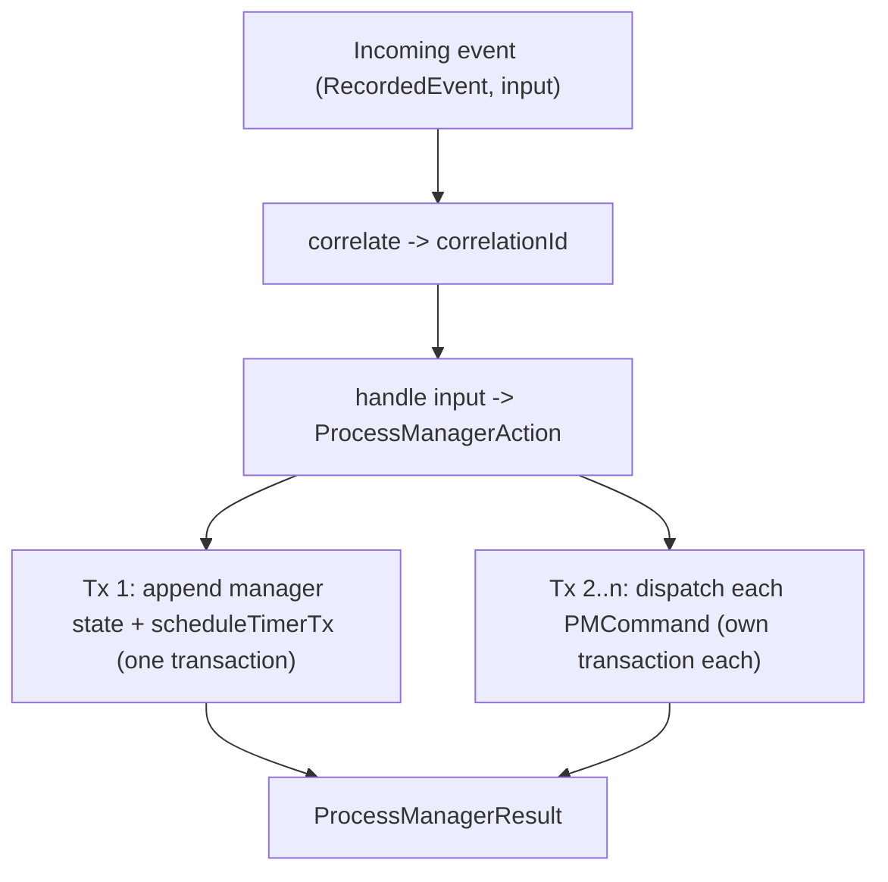

How do you coordinate work that spans several aggregates in reaction to events? An order is
paid, so the warehouse should be told to pack it. An incident is reported, so an escalation
clock should start. Neither step belongs *inside* the aggregate that triggered it — the order
aggregate has no business knowing about packing, and the incident aggregate should not run its
own timer. keiro's answer is the **process manager**.

## The idea

A **process manager** is a stateful, event-driven coordinator. When it sees an incoming event
it does three things in one reaction:

1. it steps its own private, event-sourced **manager state** — a real `EventStream` keyed by a
   *correlation id*;
2. it dispatches zero or more **commands** to *target* aggregates (through the ordinary
   [command cycle](/docs/keiro/explanation/the-command-cycle)); and
3. it schedules zero or more [**durable timers**](/docs/keiro/explanation/durable-timers).

The whole reaction is a single pure function plus the machinery to persist its effects:

```haskell
-- Keiro.ProcessManager
data ProcessManagerAction ci targetCi = ProcessManagerAction
  { command  :: !ci                     -- advance the manager's OWN state
  , commands :: ![PMCommand targetCi]   -- dispatch to target aggregates
  , timers   :: ![TimerRequest]         -- schedule durable timers
  }
```

The `handle` field of a `ProcessManager` is exactly `input -> ProcessManagerAction ci
targetCi`: given the incoming event, it returns the manager-state command, the target commands,
and the timers. There is no hidden mutable state — the manager's memory *is* its event stream.

### A process manager is itself an aggregate

The key insight is that the manager's own state is event-sourced like any other aggregate. The
`ProcessManager` carries its own `eventStream` (a keiki transducer married to a codec) and a
`streamFor` function that maps a correlation id to a manager `Stream`:

```haskell
data ProcessManager input phi rs s ci co targetPhi targetRs targetState targetCi targetCo = ProcessManager
  { name              :: !Text
  , correlate         :: !(input -> Text)
  , eventStream       :: !(ValidatedEventStream phi rs s ci co)
  , streamFor         :: !(Text -> Stream (EventStream phi rs s ci co))
  , targetEventStream :: !(ValidatedEventStream targetPhi targetRs targetState targetCi targetCo)
  , targetProjections :: !(Stream targetCi -> [InlineProjection targetCo])
  , handle            :: !(input -> ProcessManagerAction ci targetCi)
  }
```

In the jitsurei worked example, `Jitsurei/EscalationProcess.hs` keeps an `esc-<incidentId>`
state stream that advances `EscalationIdle → Awaiting → Settled`. That stream is the manager's
durable memory of where each incident's escalation has got to — it is reconstructed by replaying
its own events, exactly like the order or incident aggregates.

### Correlation: which instance handles an event

The `correlate :: input -> Text` function derives a **correlation id** from each incoming event
— an order id, an incident id — and that key selects *which* manager instance handles the event.
The same key ties together the manager's state stream, the commands it dispatches, and the
timers it schedules. In `Jitsurei/FulfillmentProcess.hs`, `correlate = orderIdText .
eventOrderId`: every event for order `o-42` is folded into the `fulfillment-o-42` manager
stream.

## Process managers vs. routers

keiro ships a *stateless* counterpart to the process manager: the content-based
[**router**](/docs/keiro/reference/router) (`Keiro.Router`, documented with the write path).

| | Router | Process manager |
|---|---|---|
| State | none — resolves a target from a read model each time | its own event-sourced manager stream |
| Decides from | the incoming event alone | the manager state folded from everything it has seen |
| Typical use | "route this event to the right aggregate" | "coordinate a multi-step workflow / saga" |

Reach for a router when each event maps to a target independently; reach for a process manager
when the *next* action depends on a history the coordinator must remember. For the router's full
mental model — the EIP lineage, the `resolve` seam, and a side-by-side decision table — see
[Routers and content-based dispatch](/docs/keiro/explanation/routers-and-content-based-dispatch).

## Sagas are vocabulary, not a separate primitive

A **saga** — a long-running transaction that compensates rather than rolls back — is *not* a
distinct keiro type. A saga is simply a process manager whose `handle` matches failure events and
emits **compensating** commands (an undo-style command: cancel, refund, release). keiro ships
exactly one primitive, `ProcessManager`; "saga" is the word we use when that process manager's
job is compensation. See [Write a saga with
compensation](/docs/keiro/how-to/write-a-saga-with-compensation).

## The two-transaction model (and why replay is still safe)

It is tempting to assume the manager-state append, the dispatched commands, and the timers all
commit in one atomic multi-stream transaction. **They do not.** keiro is honest about this, and
so are these docs:

- **Transaction 1** — the manager-state append **and** all of its timers commit together, in one
  transaction. `runProcessManagerOnce` appends the manager command via `runCommandWithSql` and
  composes `scheduleTimerTx` for each timer into that *same* SQL transaction.
- **Transactions 2…n** — **each** dispatched `PMCommand` then commits in **its own** transaction,
  via `runCommandWithProjections` (so a target's inline projections update atomically with that
  one target's append).



So a crash *between* the manager append and a later command dispatch leaves a partially-applied
reaction. Why is that safe? Because **every write is keyed by a deterministic id** and re-running
the whole reaction is a no-op for anything already written:

```haskell
-- v5 UUID over [keiro, process-manager, name, correlationId, sourceEventId, emitIndex]
-- manager-state append uses emitIndex = -1; dispatched commands start at 0
deterministicCommandId :: Text -> Text -> EventId -> Int -> EventId
```

The same `(name, correlationId, sourceEventId, emitIndex)` always yields the same `EventId`, and
the store's uniqueness constraint collapses a duplicate append into a benign `PMStateDuplicate` /
`PMCommandDuplicate`. Crucially, `runProcessManagerOnce` **re-runs the dispatch loop even when the
manager append was a duplicate** — so a redelivered source event re-attempts every command, each
of which is either freshly applied or recognized as already-applied. Crash-safety rests *entirely*
on deterministic ids + the pre-dispatch `eventAlreadyIn` guard + the uniqueness constraint, **not**
on a multi-stream atomic commit.

This is why the manager works correctly under **at-least-once** delivery, which is all a
subscription substrate like shibuya promises.

## Failure disposition is explicit

A dispatched command can come back three ways, captured in `PMCommandResult`:

```haskell
data PMCommandResult target
  = PMCommandAppended  !(CommandResult target)  -- the dispatch appended events
  | PMCommandDuplicate !EventId                 -- idempotent replay; the id already existed
  | PMCommandFailed    !StreamName !CommandError -- target identity + failure
```

The worker first halts systemic deterministic failures, retries any transient store/conflict
failure, and applies `RejectedCommandPolicy` only when every failure is `CommandRejected` or
`CommandAmbiguous`:

- `RejectedHalt` is the conservative default: stop without acknowledging.
- `RejectedDeadLetter` writes a durable target-bearing row to `keiro.keiro_dead_letters`, then
  acknowledges the source.
- `RejectedSkip` acknowledges with metric evidence only.

Keep benign target commands total so ordinary already-done/not-applicable outcomes never need a
loss policy. `CommandAmbiguous` is included so the worker's policy is exhaustive, but remains a code
defect; default halt is normally the right response.

Dead-lettering creates a history split: the manager's state may already record its reaction while
the target did not. If that failure belongs in saga history, model and dispatch a domain-specific
failure command/event; the generic dead-letter row is otherwise the durable witness.

This Keiro table is distinct from `kiroku.dead_letters`, which holds a *source event* after bounded
subscription retry exhaustion and advances the checkpoint atomically. See
[Inspect a rejected dispatch](/docs/keiro/how-to/inspect-a-rejected-dispatch).

## A duplicate is scoped to its intended target

Event IDs are globally unique, so a store `DuplicateEvent` is not by itself proof that a target
command already ran. `confirmBenignDuplicate targetStreamName attemptedId error` accepts it only
when Kiroku's point lookup finds that ID in the intended target. A matching ID in another stream
remains a target-bearing failure and halts; it is never silently folded to `PMCommandDuplicate`.

## Correlation does not create cross-stream order

Events from one source stream retain append order. Events from different streams that correlate to
the same manager have no relative business order and may run concurrently on different shards.
Design the manager to accept either arrival order—record one fact while waiting for the other—rather
than treating global position as a domain sequence.

## Trade-offs

The two-transaction model trades the simplicity of a single atomic commit for the ability to fan
out across independently-versioned aggregate streams — something a single Postgres transaction
*could* do, but only by serializing on every stream the manager touches. keiro chooses
deterministic idempotency over a wide lock. The cost is that you must reason about replay (every
write must be idempotent) and keep target commands total. The benefit is that process managers
compose with the same command cycle, optimistic concurrency, and subscription substrate as
everything else in keiro — there is no separate workflow runtime to operate.

<Cards>
  <Card title="Understanding durable timers" href="/docs/keiro/explanation/durable-timers" />
  <Card title="The keiro workflow roadmap" href="/docs/keiro/explanation/workflow-roadmap" />
  <Card title="Keiro.ProcessManager reference" href="/docs/keiro/reference/process-manager" />
  <Card title="Your first process manager" href="/docs/keiro/tutorials/your-first-process-manager" />
</Cards>
