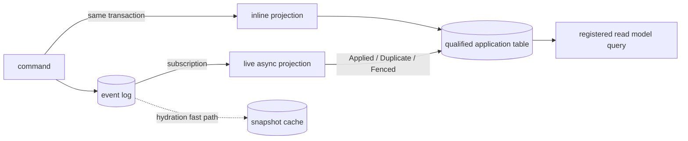

Keiro's read side has three related primitives. A **projection** is the verb that folds events into
derived application data. A **read model** is the named, registered noun that queries that data. A
**snapshot** is an advisory cache used only to accelerate aggregate hydration.

## Projection: the writer

An `InlineProjection` runs inside the event append transaction. If its table update fails, the
events roll back too. This is ideal when the write cost is small and immediate visibility matters.

An `AsyncProjection` is driven later by an application-owned Kiroku subscription worker. Keiro
supplies transactional deduplication and a registry fence, then reports:

- `AsyncApplied`: the dedup key and application update committed;
- `AsyncDuplicate`: retained dedup state suppressed a redelivery; or
- `AsyncFenced`: the read model is missing or not `Live`, so nothing was written.

The worker may checkpoint the first two outcomes. It must not checkpoint `AsyncFenced`, because a
rebuild currently owns the model and the event must be retried after promotion.

Both projection flavors write an application-owned, schema-qualified table. Keiro's framework
tables live in `keiro`; Kiroku's store tables live in `kiroku`. `qualifiedTableName` and
`qualifyTable` keep those namespaces explicit.

## Read model: the guarded query

A `ReadModel` names the application table and schema, registry identity (`name`, `version`, and
`shapeHash`), subscription cursor, default consistency, strong wait scope, and query transaction.
The application must call `registerReadModel` at startup. Querying is intentionally read-only with
respect to the registry: a missing row returns `ReadModelUnregistered`.

For a registered model, `runQuery` validates version/hash and `Live` status, optionally waits, then
runs the query. Drift and lifecycle state are hard failures because the data is user-facing.
`StrongScope` makes the wait match the worker: `EntireLog` targets `$all`, while
`CategoryHead category` targets only the latest event originating in that category.

## Snapshot: the disposable hydration cache

A snapshot stores one aggregate's folded `(state, registers)` at a stream version. Application
queries never read it. A missing, incompatible, or undecodable snapshot falls back to replaying the
event log; correctness is unchanged and only hydration latency suffers.

That contrasts deliberately with a read model:

| Primitive problem | Runtime response | Why |
| --- | --- | --- |
| Snapshot missing or incompatible | Full event replay | The event log remains durable truth. |
| Read model unregistered or schema-stale | Reject the query | Serving an unknown table shape would expose incorrect user-facing data. |
| Read model rebuilding | Fence live async writers and reject queries | One rebuilder must own destructive in-place repopulation. |

## Rebuild ownership

`startRebuild` changes the registry to `Rebuilding`, truncates the qualified table, clears only the
named projection dedup keys, and resets the subscription cursor in one transaction. Live writers
then return `AsyncFenced`. The rebuilder alone uses `applyAsyncProjectionUnfenced`, verifies the
result, and calls guarded `finishRebuild`. This is an offline in-place workflow, not a shadow-table
swap.

Continue with [Consistency and snapshots](/docs/keiro/explanation/consistency-and-snapshots), or
build the path in [Your first read model](/docs/keiro/tutorials/your-first-read-model).
