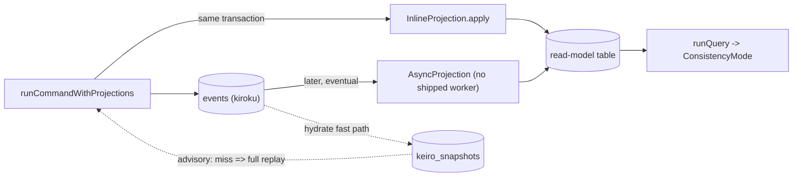

keiro's read side has **three** distinct primitives. They are easy to conflate because all three
touch derived state, but they answer different questions and fail in different ways.

A **projection** is the *verb*: the worker that folds events into a table. A **read model** is the
*noun*: a named, versioned table plus the query that reads it, with an explicit consistency mode.
A **snapshot** is a *cache*: a folded copy of one aggregate's state, used only to skip replay
during hydration and **never** queried by application code.

<Callout type="warn">
The failure modes are deliberately asymmetric. A read model whose schema has drifted **hard-fails**
the query (`ReadModelStaleSchema`) — it guards user-facing data. A snapshot that is missing, stale,
or undecodable is a **silent cache miss**: hydration falls back to a full replay. One protects
correctness; the other only protects latency.
</Callout>

## Where each one lives on the flow

## A projection is a verb

A projection folds events into a read-side table. keiro ships two flavors. An **inline** projection
(`InlineProjection`) runs in the *same* transaction as the command's append — strong consistency, and
an exception in its `apply` aborts the append. An **async** projection (`AsyncProjection`) is meant to
run *later*, off a subscription, with at-least-once delivery (hence an idempotency key). See
[The command cycle](/docs/keiro/explanation/the-command-cycle) for the write path the inline flavor
rides on.

## A read model is a noun

A read model is the queryable thing: a `name`, a `tableName`, a schema identity
(`version` + `shapeHash`), a `subscriptionName` cursor, a `defaultConsistency` mode, and the `query`
itself. You read it with `runQuery`, which first checks the registered schema and the model's
liveness, then (depending on the mode) maybe waits, then runs the query.

## A snapshot is a cache

A snapshot is a folded copy of one aggregate's `(state, registers)` at some version, stored in
`keiro_snapshots`. It exists for exactly one reason: to let hydration skip replaying the whole log.
Application code never queries it. If it is absent or incompatible, hydration simply replays from the
beginning — correctness is unaffected, only speed.

Continue with [Consistency and snapshots](/docs/keiro/explanation/consistency-and-snapshots) for the
modes and the hydration fast path, or jump to
[Your first read model](/docs/keiro/tutorials/your-first-read-model).
