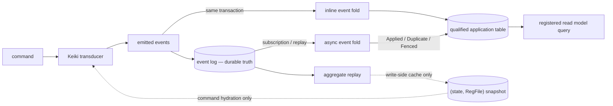

Keiro has two read-side primitives and one nearby write-side cache. A **projection** is a fold over
ordered events. A **read model** is the queryable result materialized by that fold. A **snapshot**
is not read-side data at all: it is an advisory cache used only to accelerate aggregate command
hydration.

<Callout type="warn">
**The event log is the source of truth for every projection and read model.** A projection may use
the decoded event, its `RecordedEvent` metadata, and the read-model rows accumulated by earlier
events. It must never use Keiki's `RegFile`, a Keiro `SnapshotSeed`, or a `deriveView` machine-state
view. Projection replay does not hydrate the aggregate.
</Callout>

## The rebuildability invariant

For an initial projection state `p0` and ordered events `[e1, e2, …, en]`, a projection has the
ordinary fold shape:

```haskell
projectAll = foldl' applyEvent p0
```

Keiro's SQL callbacks implement the same fold incrementally: the application table is the
accumulator, and each event performs one transactional update. Inline and asynchronous delivery
change *when* `applyEvent` runs, not what its inputs are.

A projection is rebuildable when truncating its derived table and folding the selected event
history again produces the intended model. If an old event does not contain a fact the projection
needs, the register snapshot is not a fallback: evolve the event schema and its historical
upcasters, or define another durable event-backed source. Keiki's replay validation proves that the
aggregate machine can reconstruct its own `(state, RegFile)`; it does not prove that every
application read model has enough event data.

| Component | Source of truth | May feed a projection rebuild? |
| --- | --- | --- |
| Kiroku event log | Stored domain events in order | **Yes — this is the input.** |
| Projection table | Accumulator derived from earlier events | Recreated or reset by the rebuild. |
| Keiki `RegFile` / `deriveView` | Current aggregate decision state | **No.** |
| Keiro `(state, RegFile)` snapshot | Disposable aggregate-hydration cache | **No.** |



## Projection: the writer

An `InlineProjection` runs inside the event append transaction. If its table update fails, the
events roll back too. This is ideal when the write cost is small and immediate visibility matters.
`runCommandWithProjections` receives a `ValidatedEventStream` to run the aggregate command, then
calls `apply :: co -> RecordedEvent -> Transaction ()` for each emitted event. The projection
callback receives neither the aggregate state nor its register file.

An `AsyncProjection` is driven later by an application-owned Kiroku subscription worker. Keiro
supplies transactional deduplication and a registry fence, then reports:

- `AsyncApplied`: the dedup key and application update committed;
- `AsyncDuplicate`: retained dedup state suppressed a redelivery; or
- `AsyncFenced`: the read model is missing or not `Live`, so nothing was written.

The worker may checkpoint the first two outcomes. It must not checkpoint `AsyncFenced`, because a
rebuild currently owns the model and the event must be retried after promotion.

Both projection flavors write an application-owned, schema-qualified table. Keiro's framework
tables live in `keiro`; Kiroku's store tables live in `kiroku`. `qualifiedTableName` and
`qualifyTable` keep those namespaces explicit.

## Read model: the guarded query

A `ReadModel` names the application table and schema, registry identity (`name`, `version`, and
`shapeHash`), subscription cursor, default consistency, strong wait scope, and query transaction.
The application must call `registerReadModel` at startup. Querying is intentionally read-only with
respect to the registry: a missing row returns `ReadModelUnregistered`.

For a registered model, `runQuery` validates version/hash and `Live` status, optionally waits, then
runs the query. Drift and lifecycle state are hard failures because the data is user-facing.
`StrongScope` makes the wait match the worker: `EntireLog` targets `$all`, while
`CategoryHead category` targets only the latest event originating in that category.

The read model is derived state, not a second authority. Its registry identity prevents the runtime
from serving a table whose declared shape is unknown, while rebuild restores its contents from
events.

## Snapshot: the disposable hydration cache

A snapshot stores one aggregate's folded `(state, registers)` at a stream version. Application
queries and projection callbacks never read it. Projection rebuild never reads it. A missing,
incompatible, or undecodable snapshot falls back to replaying the event log; correctness is
unchanged and only command-hydration latency suffers.

That contrasts deliberately with a read model:

| Primitive problem | Runtime response | Why |
| --- | --- | --- |
| Snapshot missing or incompatible | Full event replay | The event log remains durable truth. |
| Read model unregistered or schema-stale | Reject the query | Serving an unknown table shape would expose incorrect user-facing data. |
| Read model rebuilding | Fence live async writers and reject queries | One rebuilder must own destructive in-place repopulation. |

## Rebuild ownership

`startRebuild` changes the registry to `Rebuilding`, truncates the qualified table, clears only the
named projection dedup keys, and resets the subscription cursor in one transaction. Live writers
then return `AsyncFenced`. The rebuilder reads ordered events from the chosen log position and uses
`applyAsyncProjectionUnfenced` for each one, verifies the result, and calls guarded
`finishRebuild`. It never hydrates an aggregate or consults `keiro_snapshots`. This is an offline
in-place workflow, not a shadow-table swap.

Continue with [Consistency and snapshots](/docs/keiro/explanation/consistency-and-snapshots), build
the runtime path in [Your first read model](/docs/keiro/tutorials/your-first-read-model), or declare
the table/registry/query facts with [Author a registered read model and
router](/docs/keiro/how-to/author-a-read-model-and-router). To configure the hydration cache, follow
[Add a snapshot](/docs/keiro/how-to/add-a-snapshot).
