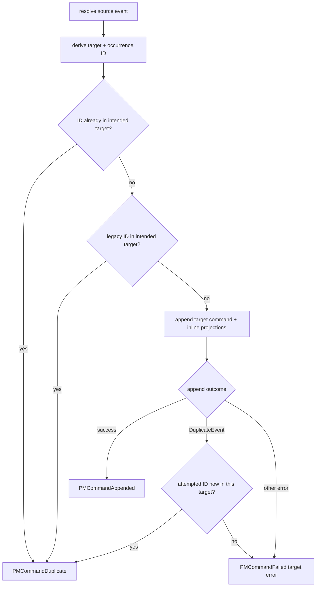

A Keiro router answers: *which target streams should this source event become a command on now?*
It is a content-based dynamic recipient list—zero, one, or many targets found through an effectful,
normally read-only lookup.

## Stateless means resolution can repeat

```haskell
resolve :: input -> Eff es [PMCommand targetCi]
```

The router has no state stream. `resolve` runs on every delivery, then Keiro dispatches the returned
commands independently. A retry can therefore see a different target order or membership. The
durable recipient set across attempts is the union of those results: completed old targets stay
completed, and newly resolved targets are added.

This is safe for idempotent fan-out, but it is not a snapshot of one exact recipient set. If exact
membership matters, materialize/freeze it in a stateful process manager instead of depending on a
fresh router query.

## IDs follow targets, not list positions

The current router ID is derived from:

```text
router name
correlation key
source event id
resolved target stream name
occurrence among commands for that same target
```

Text fields use length-prefixed UTF-8 in the UUIDv5 name. Reordering distinct targets cannot move an
ID to another stream. Resolving the same stream twice still creates occurrences 0 and 1.

Before Keiro 0.2, routers reused the process manager's positional emit index. The current runner
checks that legacy ID in the *same* target as a compatibility probe. This avoids cross-target false
success, but it is not a forever guarantee when resolver output and deployment code change together:
an old logical dispatch may be repeated once under its new target-derived ID. Keep resolution stable
during the upgrade window.

## Duplicate proof is target-scoped



Kiroku event IDs are globally unique. An ID collision in another stream is not benign, even if the
store reports the expected ID. Point lookup against the intended target is the proof. Without it,
the worker halts instead of acknowledging a target command that never ran.

## Acknowledgement is policy, not exactly-once magic

Each target append is its own transaction; the entire fan-out is not atomic. Deterministic IDs and
redelivery fill partial progress. The live worker decides once per source event:

- all appended or confirmed duplicate => `AckOk`;
- any systemic deterministic failure => `AckHalt`;
- otherwise any transient failure => `AckRetry`;
- otherwise all failures are rejection-class and use `RejectedHalt`, `RejectedDeadLetter`, or
  `RejectedSkip`.

`RejectedDeadLetter` writes the failed target(s) to `keiro.keiro_dead_letters` before `AckOk`.
`RejectedSkip` consumes without durable rows. Keep the default halt unless that loss/repair choice is
intentional, and model benign target outcomes as total commands.

## Router or process manager?

| Question | Router | Process manager |
| --- | --- | --- |
| Own durable state? | No | Yes, a manager stream |
| Target decision | Fresh effectful lookup | Pure reaction tied to manager history |
| Recipient drift | Union across attempts | Stable pure command order for the same input |
| Timers | No | Yes |
| Typical use | Route to the current roster | Coordinate a multi-step saga |

Use a router when a repeated fresh lookup is the desired contract. Use a process manager when the
coordinator must remember which facts arrived or freeze a decision.

Continue with [Route events to commands](/docs/keiro/how-to/route-events-to-commands), declare the
stable router/read-model topology with [Author a registered read model and
router](/docs/keiro/how-to/author-a-read-model-and-router), or consult the [Router
reference](/docs/keiro/reference/router).
