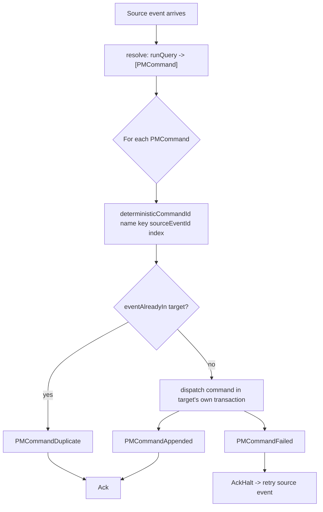

A keiro **router** answers one question for every event it sees: *which target streams should this
event become a command on, right now?* It is the smallest reactive primitive keiro ships — no state,
no history, just a data-dependent fan-out. This page builds the mental model so the
[reference](/docs/keiro/reference/router) and the [how-to](/docs/keiro/how-to/route-events-to-commands)
read as detail rather than mystery.

## The Enterprise Integration Patterns lineage

The name is precise, not decorative. In *Enterprise Integration Patterns* a **content-based router**
inspects a message and forwards it to one of several destinations *based on its content* — the
routing decision is data, not a fixed wire. keiro's `Router` is that pattern with one twist that
matters: it is also a **dynamic recipient list**. A single event can fan out to *zero, one, or many*
targets, and the recipient set is computed per event rather than declared up front.

Concretely: an `IncidentRaised` event does not name the people to page. The *roster* names them, and
the roster changes over time. So the router does not pattern-match the event to a hard-coded target —
it **looks the targets up**, then dispatches one command to each. That lookup is the whole point of
the pattern, and it is where the [`resolve` seam](#the-resolve-seam) lives.

<Callout type="info">
A router is **content-based**, not type-based. If your fan-out is a fixed function of the event's
*type* (every `OrderPlaced` always goes to exactly one inventory stream named after the order), you
do not need a router's effectful lookup at all — a plain command dispatch will do. Reach for a router
when the target *set* depends on data the event does not carry.
</Callout>

## Why it is stateless

A router keeps **no memory between events**. It does not have its own event stream, it does not fold
a history, and it cannot "remember" that it saw a related event yesterday. Every dispatch decision is
made fresh, from (a) the incoming event and (b) whatever it reads in `resolve` at that instant —
typically a read model.

That statelessness is the feature, not a limitation. It means a router has nothing to hydrate,
nothing to snapshot, and no version to advance; two replicas running the same router over the same
event reach the same decision because there is no local state to diverge. The price is that a router
*cannot* coordinate a multi-step flow — for that you want the thing that does keep state, a
[process manager](#router-vs-process-manager).

This is why `RouterResult` has no manager-state field. Compare it to `ProcessManagerResult`, which
carries a `managerResult` describing how the coordinator's own stream advanced. A router has no such
stream, so there is nothing to report:

```haskell
newtype RouterResult target = RouterResult { commandResults :: [PMCommandResult target] }
```

## The `resolve` seam

`resolve` is the one effectful hook in the whole type, and it is where developers most often get
stuck — usually because they expect it to *do* the dispatch. It does not. `resolve` only **computes
the target set**; keiro does the dispatching.

```haskell
resolve :: input -> Eff es [PMCommand targetCi]
```

Read that signature literally: given the decoded source event (`input`), produce a list of
`PMCommand`s — each pairing a **target stream** with the **command** to run on it. The `Eff es` is
what lets the computation read the world: in practice it `runQuery`s a read model. Returning `[]` is
legal and means "this event routes nowhere" (a silent, intentional no-op, not an error).

Here is the jitsurei paging router's `resolve` in full — note that the *only* effect is the
read-model query; everything after it is a pure list comprehension turning roster rows into commands:

```haskell
resolve = \raised -> do
  result <- runQuery Nothing serviceOncallReadModel raised.service
  let responders = either (const []) id result
  pure
    [ PMCommand
        { target  = pageCommandStream raised.incidentId responder.responderId
        , command = SendPage (SendPageData { incidentId = raised.incidentId, responderId = responder.responderId })
        }
    | responder <- responders
    ]
```

Three things to internalize about the seam:

- **It is a *query*, not a write.** `resolve` should read (a read model, a config table) and return.
  It must not append events or mutate state itself — keiro owns the writes, idempotently, *after*
  `resolve` returns. Keeping `resolve` side-effect-free except for reads is what makes a replayed
  event safe.
- **The target set may be empty, one, or many.** That is the dynamic-recipient-list behaviour.
  Fanning out to N responders, or to zero because nobody is on call, are both ordinary outcomes.
- **It runs on *every* delivery.** Because the worker retries on failure (see
  [lifecycle](#lifecycle-resolve-then-dispatch-then-ack)), `resolve` can run more than once for the
  same source event. That is fine precisely because it is a pure query; the *dispatch* it feeds is
  made idempotent by deterministic ids.

## Lifecycle: resolve, then dispatch, then ack

The two entry points share one core. `runRouterOnce` does a single event; `runRouterWorker` is the
long-running version that drains a [shibuya](/docs/keiro/explanation/the-keiro-stack) `Adapter` and
acks each message. For one event the sequence is:



The load-bearing detail is that **each dispatched command commits in its own transaction**, keyed by
a `deterministicCommandId` derived from `(router name, correlation key, source event id, emit
index)`. Re-running the same source event re-derives the *same* ids, so `eventAlreadyIn` (and, as a
backstop, the store's uniqueness constraint) collapses the second attempt to a `PMCommandDuplicate`
that writes nothing. That is what "exactly-once-per-target" means here, and it is why the worker can
safely retry: a forced replay is idempotent by construction. The `key :: input -> Text` field exists
to feed that id — it is the correlation string (an incident id, a transaction id) that makes the
derived ids stable and per-instance.

<Callout type="warn">
A `PMCommandFailed` is **fatal** to the worker: it finalizes `AckHalt` and the source event is
retried forever. Model benign domain rejections (a target that declines a command because no edge
matches in its current state) as **total** transitions in the keiki transducer so they never surface
as a failure. See [Keep target commands total](/docs/keiro/how-to/keep-target-commands-total).
</Callout>

## Router vs. process manager

This is the decision developers most want a straight answer to. Both react to events and dispatch
commands to target aggregates; the difference is **memory**.

| | Router | Process manager |
|---|---|---|
| Own state | none | its own event-sourced stream |
| Decides from | the incoming event + a fresh read-model lookup | the manager state folded from everything it has seen |
| Can schedule timers | no | yes (durable `keiro_timers`) |
| Result type | `RouterResult` (no manager field) | `ProcessManagerResult` (carries `managerResult`) |
| Typical job | "route this event to the right target(s)" | "coordinate a multi-step workflow / saga" |

The test is one question: **does the *next* action depend on a history the coordinator must
remember?**

- *No* — each event maps to its targets independently (page the current on-call roster; record a
  transaction against every overlapping chapter). Use a **router**. It is simpler, stateless, and has
  nothing to hydrate.
- *Yes* — the reaction depends on what happened before ("the order shipped, but only escalate if it
  was already flagged late, and only after a 30-minute timer"). Use a **process manager**; it folds
  its own stream and can schedule timers.

A **saga** is not a third option — it is a process manager whose job is *compensation* (emitting undo
commands on failure). See [process managers and sagas](/docs/keiro/explanation/process-managers-and-sagas).

<Callout type="info">
A router and a process manager compose. A common shape is a stateful process manager that, on some
step, hands off to a stateless router for the fan-out — the manager remembers *where the flow is*,
the router computes *who to dispatch to right now*.
</Callout>

## Where it sits in the framework

A router is a thin, reactive cap on the same machinery as everything else: it dispatches ordinary
commands through the [command cycle](/docs/keiro/explanation/the-command-cycle) against an ordinary
[`EventStream`](/docs/keiro/reference/event-stream-and-stream), and it reuses the *exact* idempotency
primitives (`deterministicCommandId`, `eventAlreadyIn`) that the
[process manager](/docs/keiro/reference/process-manager) uses. There is no separate "router runtime" —
just a stateless resolver wired onto the write path.

<Cards>
  <Card title="Router reference" href="/docs/keiro/reference/router" />
  <Card title="Route events to commands" href="/docs/keiro/how-to/route-events-to-commands" />
  <Card title="Fan out an event with a router" href="/docs/keiro/cookbook/event-fan-out-with-routers" />
  <Card title="Process managers and sagas" href="/docs/keiro/explanation/process-managers-and-sagas" />
</Cards>
