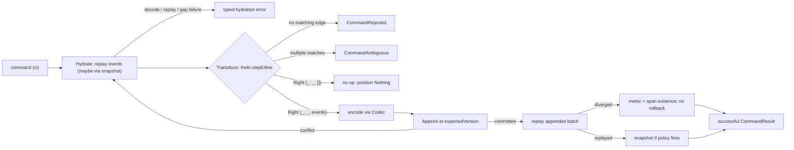

keiro's write path is one pipeline with three phases. A **command** (an instruction such as "place
this order") is turned into **events** (facts such as `OrderPlaced`) and appended to the target
aggregate's **stream** (its ordered slice of the log).

The public runners accept a `ValidatedEventStream`, not a bare `EventStream`. That wrapper is built
by `mkEventStream`/`mkEventStreamWith` after keiki has checked the transducer for hidden input,
first-event recoverability, inversion ambiguity, guarded input reads, state-changing output-free
edges, structural determinism, and dead edges, and after keiro has checked snapshot-policy coherence
and the initial snapshot encode. The durable boundary always forces head-recoverability and
state-changing-output-free checks on, even when custom validation options request otherwise.

1. **Hydrate** — replay the stream's stored events (optionally fast-forwarding from a snapshot)
   through the keiki transducer to recover the current `(state, registers)` and the stream's current
   `StreamVersion`. Replay failures retain a typed reason; a non-contiguous per-stream read is a
   separate truncation gap.
2. **Transduce** — step the transducer with the command. The transducer either rejects the command
   (yielding `CommandRejected`), matches more than one edge (yielding `CommandAmbiguous`), or accepts
   it and emits a list of events. An accepted command that emits *no* events is a **no-op**.
3. **Append** — encode the emitted events with the stream's `Codec` and append them at the expected
   version. A concurrency conflict triggers a bounded rehydrate-and-retry; exhausting the budget
   yields `RetryExhausted`. After a successful append, keiro replays the new batch from the
   pre-command state by default, witnessing an unreplayable append immediately.

<Callout type="info">
  New to **transducers**? A transducer is a state machine that, on each input, both moves to a next
  state *and* emits output — so stepping keiki's machine on a command yields the next state and the
  events to emit. See [What is a transducer?](/docs/keiro/explanation/the-keiro-stack#what-is-a-transducer)
  for a one-screen primer.
</Callout>

The legacy source anchor throughout this set is the `jitsurei` order aggregate — its
`OrderCommand`/`OrderEvent`/`OrderState` types live in `jitsurei/src/Jitsurei/Domain.hs` and the
`EventStream` that ran them lives in `jitsurei/src/Jitsurei/OrderStream.hs`. Use those names to
follow the architecture, not as current package or build evidence; see the [legacy example
status](/docs/keiro/explanation/the-jitsurei-example).

## Optimistic concurrency

The append states what it expects the stream's current version to be. keiro derives that from the
hydrated version:

```haskell
expectedVersion :: StreamVersion -> ExpectedVersion
expectedVersion (StreamVersion 0) = NoStream          -- first write: the stream must not exist yet
expectedVersion version           = ExactVersion version
```

If another writer appended first, the store rejects the append and keiro **re-hydrates, re-transduces,
and retries** up to `retryLimit` times (default 3) before returning `RetryExhausted` with the
configured limit and the last store error.

<Callout type="warn">
Both `WrongExpectedVersion` (someone bumped an existing stream) **and** `StreamAlreadyExists` (someone
won the race to create the stream) are treated as **retryable** conflicts. A lost new-stream race is
therefore *retried*, not surfaced — your caller never sees `StreamAlreadyExists`.
</Callout>

## Command outcomes are not interchangeable

`runCommand` returns `Either CommandError (CommandResult …)`. Four things a caller must tell apart:

- **Rejected** — `Left CommandRejected`: the transducer had no edge for this command in the hydrated
  state. Nothing was written.
- **Ambiguous** — `Left (CommandAmbiguous edgeIndices)`: multiple edges matched. Nothing was written,
  but this is an aggregate-definition defect, not a business rejection.
- **No-op** — `Right CommandResult { eventsAppended = 0 }`: the command was accepted but produced no
  events. Nothing was written, `globalPosition = Nothing`, and it was *not* a rejection.
- **Store failure** — `Left (StoreFailed …)` or `Left (RetryExhausted …)`: the events could not be
  persisted.

## The pipeline



## Hydration failures point to different repairs

`HydrationDecodeFailed` is a codec/schema problem. `HydrationReplayFailed version reason` is a
decoded-history problem: the reason is `HydrationNoInvertingEdge`, `HydrationAmbiguousInversion`,
`HydrationQueueMismatch`, or `HydrationTruncatedChain`. `HydrationGapDetected expected observed`
means the per-stream sequence was not contiguous, usually because a Kiroku truncation marker hid a
prefix that the chosen snapshot did not cover. Kiroku does not delete those events from `$all`; fix
stream visibility or supply a covering snapshot before retrying the command.

Append-time replay verification is deliberately post-commit. If it detects divergence, it records
`keiro.snapshot.apply.divergence` and annotates the command span with `keiro.replay.divergence`; it
cannot truthfully return failure for a transaction that already committed. The next hydration will
surface the corresponding typed replay failure. `verifyReplayOnAppend` defaults to `True`; a
snapshot-enabled stream always performs the fold because the resulting state feeds snapshotting.

<Cards>
  <Card title="Codec and schema evolution" href="/docs/keiro/explanation/codec-and-schema-evolution" />
  <Card title="Why SymTransducer, not Decider" href="/docs/keiro/explanation/why-symtransducer-not-decider" />
  <Card title="Command reference" href="/docs/keiro/reference/command" />
</Cards>
