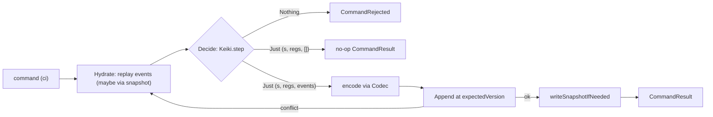

keiro's write path is one pipeline with three phases. A **command** (an instruction such as "place
this order") is turned into **events** (facts such as `OrderPlaced`) and appended to the target
aggregate's **stream** (its ordered slice of the log).

1. **Hydrate** — replay the stream's stored events (optionally fast-forwarding from a snapshot)
   through the keiki transducer to recover the current `(state, registers)` and the stream's current
   `StreamVersion`.
2. **Decide** — step the transducer with the command. The transducer either rejects the command
   (yielding `CommandRejected`) or accepts it and emits a list of events. An accepted command that
   emits *no* events is a **no-op**.
3. **Append** — encode the emitted events with the stream's `Codec` and append them at the expected
   version. A concurrency conflict triggers a bounded rehydrate-and-retry; exhausting the budget
   yields `RetryExhausted`.

The worked example throughout this set is the `jitsurei` order aggregate — its
`OrderCommand`/`OrderEvent`/`OrderState` types live in `jitsurei/src/Jitsurei/Domain.hs` and the
`EventStream` that runs them in `jitsurei/src/Jitsurei/OrderStream.hs`. Run it with `just
jitsurei-fulfillment`.

## Optimistic concurrency

The append states what it expects the stream's current version to be. keiro derives that from the
hydrated version:

```haskell
expectedVersion :: StreamVersion -> ExpectedVersion
expectedVersion (StreamVersion 0) = NoStream          -- first write: the stream must not exist yet
expectedVersion version           = ExactVersion version
```

If another writer appended first, the store rejects the append and keiro **re-hydrates, re-decides,
and retries** up to `retryLimit` times (default 3) before returning `RetryExhausted` with the
configured limit and the last store error.

<Callout type="warn">
Both `WrongExpectedVersion` (someone bumped an existing stream) **and** `StreamAlreadyExists` (someone
won the race to create the stream) are treated as **retryable** conflicts. A lost new-stream race is
therefore *retried*, not surfaced — your caller never sees `StreamAlreadyExists`.
</Callout>

## Three outcomes, one return type

`runCommand` returns `Either CommandError (CommandResult …)`. Three things a caller must tell apart:

- **Rejected** — `Left CommandRejected`: the transducer had no edge for this command in the hydrated
  state. Nothing was written.
- **No-op** — `Right CommandResult { eventsAppended = 0 }`: the command was accepted but produced no
  events. Nothing was written, but it was *not* a rejection.
- **Store failure** — `Left (StoreFailed …)` or `Left (RetryExhausted …)`: the events could not be
  persisted.

## The pipeline



<Cards>
  <Card title="Codec and schema evolution" href="/docs/keiro/explanation/codec-and-schema-evolution" />
  <Card title="Why SymTransducer, not Decider" href="/docs/keiro/explanation/why-symtransducer-not-decider" />
  <Card title="Command reference" href="/docs/keiro/reference/command" />
</Cards>
