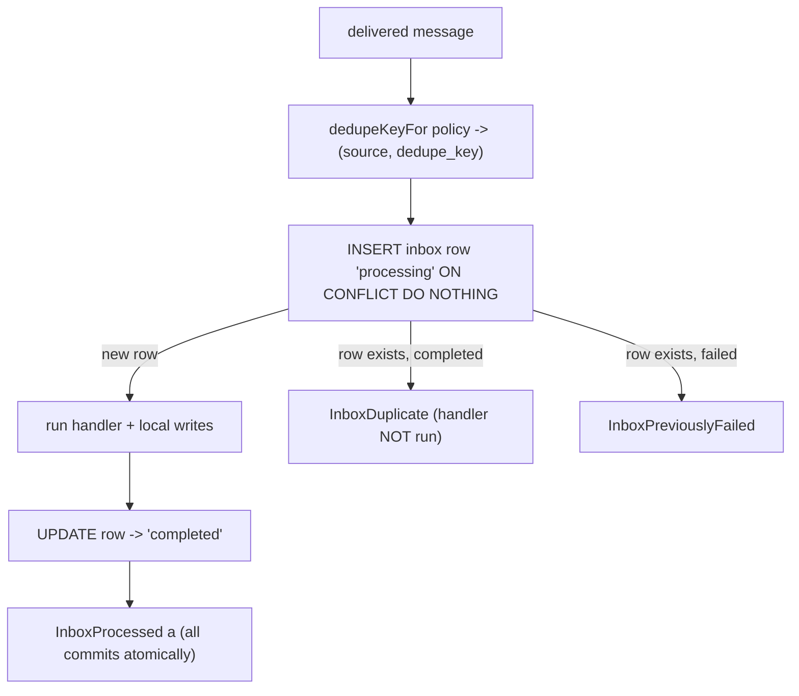

A broker only promises **at-least-once delivery** — on a consumer crash, a partition rebalance,
an offset retry, or a producer republish, the *same* message can arrive again. So a consumer that
naively applies every delivery will double-apply. The **inbox pattern** fixes this: it makes the
consumer **idempotent**, so the same message produces the same result no matter how many times it
arrives.

## Exactly-once effect = at-least-once delivery + idempotent receive

You cannot get exactly-once *delivery* over a broker — it is impossible in general. What you can
get, and what you actually want, is an **exactly-once effect**: even though a message may be
delivered many times, its *effect* (a local database write) happens **at most once**. keiro
reaches this by pairing at-least-once delivery with an idempotent receive. The inbox is that
idempotent receive.

## The single-transaction boundary

The inbox lives in the **consuming** service's database, in the `keiro_inbox` table. When a
message arrives, `runInboxTransaction` runs your handler **at most once per `(source,
dedupe_key)`**, all inside *one* PostgreSQL transaction:

The inbox-row insert, the handler's local writes, and the `status = 'completed'` update **commit
together or not at all**. This is the crux of the idempotency:

- If this is the **first** delivery, the row is new, the handler runs, and everything commits.
- If a **duplicate** arrives, the `INSERT … ON CONFLICT (source, dedupe_key) DO NOTHING` finds the
  existing row; the handler does **not** run, and you get `InboxDuplicate`.
- If the handler **raises or condemns** the transaction, the whole transaction rolls back —
  *including the inbox-row insert*. The next delivery sees no row and starts clean.

Because the handler runs inside the transaction, it is an `IntegrationEvent -> Tx.Transaction a`
(not arbitrary `IO`): its writes are part of the same atomic unit as the dedupe bookkeeping.

When you want poison-message accounting, use `runInboxTransactionWithRetries`. A synchronous handler
exception is recorded as a failed attempt in a second transaction, and failed rows below the attempt
ceiling are retried on later deliveries. Once `attempt_count` reaches the ceiling, the wrapper returns
`InboxPreviouslyFailed` without running the handler; the failed inbox row becomes the durable
operator record.

## The dedupe key is identity, not the offset

The dedupe key comes from an `InboxDedupePolicy`. The default,
`PreferIntegrationMessageId`, keys on `(source, messageId)` — and `messageId` is stable across
publish retries because it lives in the producer's outbox row. The Kafka topic/partition/offset
are **delivery metadata**: they shift on a rebalance or republish, so keying on them
(`KafkaDeliveryIdentity`) would let a redelivery at a new offset slip through as "new". Use the
offset as the dedupe key only as a last resort. (See [Choose an inbox dedupe
policy](/docs/keiro/how-to/choose-an-inbox-dedupe-policy).)

## The GC window *is* the duplicate-detection window

Completed inbox rows are not kept forever — `garbageCollectCompleted` deletes completed rows older
than a retention window. The catch: **the retention window is the duplicate-detection window.** A
redelivery that arrives *after* its completed row has been GC'd will be treated as new and
processed again. So the retention must exceed the maximum delivery delay you tolerate — the user
guide recommends **30 days**. Failed rows are **never** GC'd (an operator must review them).

## A v1 detail: `InboxProcessing` never escapes a transaction

The `InboxProcessing` status and the reserved `markFailedTx` primitive exist for a *future* async
path. In the shipped v1 single-transaction wrapper, a row is only ever observed as `completed` (or
absent, after a rollback) — `processing` never escapes the transaction, and `markFailedTx` is not
called by `runInboxTransaction`. So `InboxInProgress` and `InboxPreviouslyFailed` results are
reachable only from those future paths; the v1 happy path is `InboxProcessed` then `InboxDuplicate`
on redelivery. The retrying wrapper is the exception: it records `failed` rows explicitly for
operator-visible poison accounting.

## Trade-offs

The inbox costs you a table and a write on every consumed message, and it requires your handler to
fit inside a Postgres transaction. In exchange you get a genuinely idempotent consumer with no
distributed coordination — the dedupe and the effect commit atomically in the one database you
already control. The bound you must respect is the GC window; size it for your worst redelivery
delay. The producing half of the story is the [outbox
pattern](/docs/keiro/explanation/the-outbox-pattern).

<Cards>
  <Card title="Integration events" href="/docs/keiro/explanation/integration-events" />
  <Card title="The outbox pattern" href="/docs/keiro/explanation/the-outbox-pattern" />
  <Card title="Inbox reference" href="/docs/keiro/reference/inbox" />
  <Card title="Consume an integration event" href="/docs/keiro/tutorials/consume-an-integration-event" />
</Cards>
