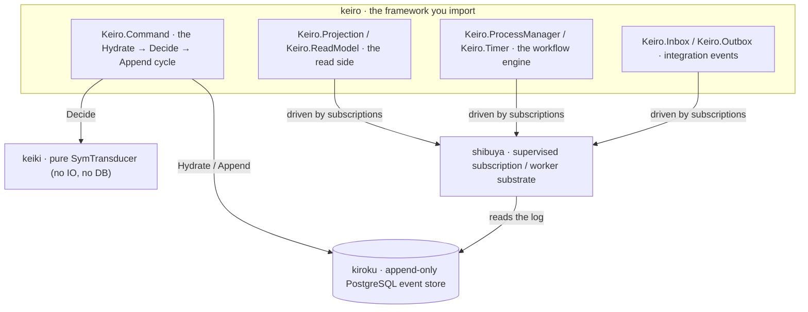
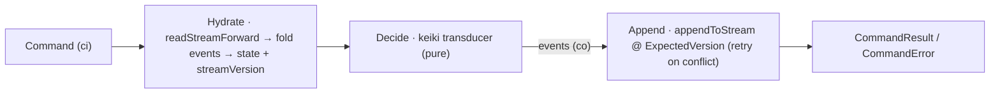

keiro is not a monolith. It is a thin framework that **composes three lower libraries**, each of
which does one job well, and adds the glue that turns them into an event-sourcing and workflow
framework. Understanding the seam between the three is the fastest way to understand what keiro
does and does not do.

## Three libraries, one framework

- **kiroku** (記録, "record") is the **event store**: an append-only, ordered, immutable log of
  events in PostgreSQL, with optimistic concurrency on append and subscriptions that deliver
  history then live events. keiro reads and writes every event through kiroku. It owns durability
  and ordering; keiro never talks to Postgres for events except via kiroku.
- **keiki** is the **pure decision core**: the `SymTransducer phi rs s ci co` and its combinators.
  It performs **no IO** and touches **no database** — it is just the mathematics of "given this
  state and this input, what is the next state and what events come out". This purity is what
  makes the decision logic trivially testable and replay-deterministic.
- **shibuya** is the **supervised subscription/worker substrate**: it runs the long-lived workers
  that drive projections, process managers, and the outbox off of kiroku subscriptions, with
  supervision and lifecycle management. The command cycle does not need shibuya; the read side and
  the workflow engine do.

keiro's own job is the glue: marrying a keiki transducer to a codec in an `EventStream`, running
the Hydrate → Decide → Append cycle against kiroku in `Keiro.Command`, and wiring projections,
process managers, and the outbox onto shibuya workers.

## The core event-sourcing concepts, as keiro uses them

- **Stream** — a single ordered sequence of events for one entity. In keiro a stream is a typed
  `Stream a` (`Keiro.Stream`): a `newtype` over kiroku's `StreamName`, tagged with a phantom type
  so a name built for one aggregate cannot accidentally be used for another. You build one with
  `stream :: Text -> Stream a` and recover the underlying name with `streamName :: Stream a ->
  StreamName`.
- **Command** — the input `ci` you feed to `runCommand`. It is a *request* to change a stream; it
  may be rejected. Commands are not stored.
- **Event** — the output `co` the transducer emits, serialized by the stream's `Codec` and
  appended to kiroku. Events *are* the stored, immutable truth; state is always a fold over them.
- **Optimistic concurrency** — keiro never locks a stream. `runCommand` hydrates the stream to a
  `streamVersion`, decides, and then appends asserting that the stream is *still* at that version
  (an `ExpectedVersion` derived from the hydrated version). If another writer advanced the stream
  first, the append is rejected and `runCommand` re-hydrates and retries, up to `retryLimit`
  (default 3); when retries are exhausted it returns `RetryExhausted`. This is how keiro stays
  correct under concurrency without a lock.

The store-level mechanics of these concepts live in kiroku's own documentation:

- [Streams and categories](/docs/kiroku/explanation/streams-and-categories)
- [Optimistic concurrency](/docs/kiroku/explanation/optimistic-concurrency)
- [The `$all` stream and global order](/docs/kiroku/explanation/all-stream-and-global-order)

## The cycle, end to end

Every write in keiro is the same three beats. `runCommand` reads the target stream into state
(**Hydrate**), runs the keiki transducer to turn the command into events (**Decide**), and appends
them to kiroku under optimistic concurrency (**Append**), retrying on conflict:

The read side, the workflow engine, and the integration-event path all build on top of this one
cycle — they consume the events it appends. Follow it hands-on in
[Get started with keiro](/docs/keiro/tutorials/getting-started).
