When a service records a domain change *and* publishes a message about it, a crash between the two
leaves the database and the broker disagreeing — the **dual-write problem**. The **outbox
pattern** removes the second write from the danger zone: enqueue the to-be-published message as a
row in the *same transaction* as the domain change, and publish it later from that durable row.

## The dual-write problem

Imagine: write `OrderSubmitted` to your event store, then call `kafkaProduce`. If the process dies
after the store commit but before the produce, the order exists but no one is ever told. Swap the
order and you can publish a message for a change that then rolls back. There is no ordering of two
independent systems that is safe — you need them in **one** transaction. But you cannot put Kafka
in a Postgres transaction. The outbox is the way out: the only thing that joins the domain
transaction is a *row*, in the same database.

## The pipeline

```mermaid
flowchart LR
  Cmd["command -> private domain event (Postgres A)"] --> Prod["IntegrationProducer subscription"]
  Prod -- "writes ONE keiro_outbox row in the checkpoint txn" --> Outbox[("keiro_outbox")]
  Outbox --> Worker["publishClaimedOutbox (FOR UPDATE SKIP LOCKED + per-key head-of-line)"]
  Worker -- "produce, then mark sent after ack" --> Kafka["Kafka topic billing.orders.v1"]
  Kafka --> FromKafka["integrationEventFromKafka"]
  FromKafka --> Inbox["runInboxTransaction (dedupe on source, messageId)"]
  Inbox -- "handler + complete in one txn" --> DB[("local handler (Postgres B)")]
```

Two surfaces enqueue rows:

- The canonical **`IntegrationProducer`** subscription reads the private event stream, maps each
  event to an integration event, and writes one `keiro_outbox` row in the subscription's
  checkpoint transaction.
- The inline escape hatch **`enqueueIntegrationEventTx`** lets a saga or process manager enqueue
  an event directly inside its `runCommandWithSqlEvents` transaction (see [Publish with the
  outbox](/docs/keiro/how-to/publish-with-the-outbox)).

A separate worker, `publishClaimedOutbox`, claims pending rows, hands each to your publish
function, and marks it sent only **after the broker acknowledges**.

## At-least-once publish (and why that's fine)

The worker marks a row `sent` only after the broker acks. If it crashes between produce and mark,
the row stays claimable and is published **again** — at-least-once publish. That double-send is
harmless precisely because the consuming [inbox](/docs/keiro/explanation/the-inbox-pattern)
deduplicates on the stable `messageId`. The two patterns are designed as a pair: at-least-once
publish + idempotent receive = exactly-once effect.

## Ordering and head-of-line blocking

The claim query enforces an `OrderingPolicy`:

- **`PerKeyHeadOfLine`** (the default) — within a `source`, a non-terminal row with key `k` blocks
  every *later* row with the same key, preserving per-aggregate order; rows with a `Nothing` key
  bypass the block. This head-of-line blocking is **intentional**: it is how per-key order is
  preserved. One stuck aggregate cannot stall traffic on *other* aggregates.
- **`PerSourceStream`** — any non-terminal row blocks every later row in the source (strict order
  across keys; rare).
- **`StopTheLine`** — the worker halts on the first failure and records it in `haltedOn` (for
  workflows that need manual review on every failure).
- **`BestEffort`** — no blocking; opt-in only, safe when events have no per-key/causal relationship.

See [Choose an outbox ordering policy](/docs/keiro/how-to/choose-an-outbox-ordering-policy).

## Auto-dead-letter

Each failed publish bumps `attempt_count` and sets `next_attempt_at = now + backoff`. After
`maxAttempts` consecutive failures the row transitions to `dead` (terminal) and stays in the table
for an operator to inspect — it never silently disappears, and it never blocks forever under
`PerKeyHeadOfLine` (a `dead` row is terminal, so it stops blocking its key).

<Callout type="warn">
**Known gap — stale `publishing` rows are not reclaimed.** The claim query selects only `pending`
and `failed` rows. A worker that crashes *between* claiming a row (which sets `publishing`) and
marking it sent/failed strands the row in `publishing` forever — and under `PerKeyHeadOfLine` /
`PerSourceStream` that stranded non-terminal row head-of-line-blocks its key. There is **no**
automatic reclaim in keiro 0.1.0.0; recovery is a manual runbook step (reset the row to
`pending`). See [Choose an outbox ordering
policy](/docs/keiro/how-to/choose-an-outbox-ordering-policy#recovering-stranded-publishing-rows).
</Callout>

## Trade-offs

The outbox adds a table, a publisher worker to schedule, and a small publish latency (a row is
published on the next worker pass, not synchronously). In return it makes cross-service publishing
*correct under crashes* with nothing but your existing Postgres — no distributed transaction, no
two-phase commit. The one sharp edge to operate around is the stale-`publishing` gap above.

<Cards>
  <Card title="Integration events" href="/docs/keiro/explanation/integration-events" />
  <Card title="The inbox pattern" href="/docs/keiro/explanation/the-inbox-pattern" />
  <Card title="Outbox reference" href="/docs/keiro/reference/outbox" />
  <Card title="Publish with the outbox" href="/docs/keiro/how-to/publish-with-the-outbox" />
</Cards>
