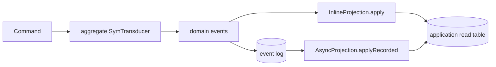

If you have written event-sourced aggregates before, you know the **decide/evolve** pattern: a
`decide` function turns `(state, command)` into events, and an `evolve` function folds
`(state, event)` into the next state. kiroku's own
[decider-and-evolve tutorial](/docs/kiroku/tutorials/decider-and-evolve) teaches exactly this. keiro
does **not** use it. An `EventStream` carries a keiki `SymTransducer phi rs s ci co` directly, and
the command runner steps that transducer. This page explains why.

## What the command cycle actually calls

In `Keiro.Command`, the Transduce phase is one call into keiki:

```haskell
-- evaluateCommand, simplified: step the transducer with the command in the hydrated state
Keiki.step transducer (state, registers) command :: Maybe (s, RegFile rs, [co])
```

`Nothing` means the transducer **rejected** the command (no edge applies in this state) → keiro
returns `CommandRejected`. `Just (state', registers', events)` is an accepted transition: the new
control state, the new register file, and the events to emit. There is no separate `evolve`: stepping
the transducer *is* both the decision and the state advance.

## What a SymTransducer gives you that decide/evolve does not

A `SymTransducer phi rs s ci co` is one object with three capabilities a plain decide/evolve split
cannot express:

- **A typed register file `RegFile rs`.** Beyond the control state `s` (the named states like
  `Placed`, `Shipped`), the machine carries typed working memory between transitions — counters,
  accumulated ids, deadlines. In a decide/evolve design this data has to be smuggled inside `state`
  by hand; here it is first-class and typed.
- **ε-edges.** The transducer can advance **without consuming a command** — an internal transition
  that fires on a guard alone. This is how a workflow moves itself forward (e.g. "once both approvals
  are in, advance") rather than waiting for an external trigger.
- **A guard alphabet `phi`.** Transitions branch on predicates drawn from a guard algebra
  (`BoolAlg phi (RegFile rs, ci)` is the constraint the command runner needs to evaluate a guard
  against the registers and the incoming command). Guards are data the framework can reason about,
  not opaque Haskell `if`s buried in `decide`.

## What the framework can prove about it

Because guards are *data* and the register file is typed, keiki can analyse a transducer
**statically** — no SMT solver, no running it. The load-bearing property is **replay-safety**: every
command field an edge consumes must be recoverable from the event(s) that edge emits, or replaying
the log would not reconstruct the same state. A decide/evolve split has nowhere to even state this
property; here it falls out of the structure.

keiro surfaces that check at the `EventStream` boundary in `Keiro.EventStream.Validate`:
`validateEventStream label es` returns labelled warnings (empty when sound) and `mkEventStream` is a
fail-fast smart constructor. Alongside replay-safety it checks guard determinism and dead edges. Run
it in a test or at start-up so an unsafe stream fails before it ever corrupts hydration — see the
[event stream reference](/docs/keiro/reference/event-stream-and-stream#validatedeventstream-and-replay-safety-validation).
The *same* transducer can also be rendered as a diagram for review; see keiki's
[diagrams from one declaration](/docs/keiki/explanation/diagrams-from-one-declaration).

## Where the analogy stops: projections are not transducers

This is the migration trap for developers coming from `tan-event-source`. That library put several
event-sourcing roles behind records with an `evolve` field:

| Legacy role | keiro / keiki role |
| --- | --- |
| `Decider.decide` + `Decider.evolve` | An aggregate's `EventStream` contains a `SymTransducer`; the command runner steps it and replay reconstructs its decision state. |
| `Process.react` / process-manager state | A keiro process manager produces `ProcessManagerAction`s, then runs its own and its targets' commands through their `EventStream` transducers. |
| `View.evolve` or the view added by `deciderWithView` | An `InlineProjection.apply` or `AsyncProjection.applyRecorded` callback folds events into an application-owned table; a `ReadModel` queries it. |

### Migrating a legacy `TanES.View`

Legacy `TanES.View` is an event fold:

```haskell
data View e si so = View
  { initialState :: so
  , evolve       :: si -> e -> so
  , isTerminal   :: si -> Bool
  }

type View' e s = View e s s
```

Map those responsibilities as follows:

| `TanES.View` responsibility | Keiro replacement |
| --- | --- |
| `initialState` | The empty/application-initialized projection table, or an explicitly event-derived rebuild base. |
| `evolve state event` | `InlineProjection.apply` or `AsyncProjection.applyRecorded`, with the table as the accumulated fold state. |
| `isTerminal` | Usually no equivalent; subscriptions keep folding later relevant events. Constrain event selection explicitly when a projection truly has a bounded history. |
| `deciderWithView` | No replacement. Do not attach projection state to the aggregate `EventStream`, state pair, or `RegFile`. |

For example, the fold must branch on the event:

```haskell
applyOrderSummary :: OrderEvent -> RecordedEvent -> Tx.Transaction ()
applyOrderSummary event recorded =
  case event of
    OrderPlaced payload     -> upsertStatus payload.orderId "placed" recorded
    PaymentApproved payload -> upsertStatus payload.orderId "paid" recorded
    OrderPacked payload     -> upsertStatus payload.orderId "packed" recorded
    OrderShipped payload    -> upsertStatus payload.orderId "shipped" recorded
    OrderCancelled payload  -> upsertStatus payload.orderId "cancelled" recorded
```

Replaying those `OrderEvent` values from an empty table is the projection rebuild. No aggregate
hydration occurs.

### Keiki's generated `View` is a different type

Keiki also uses the word `View`, but `deriveView` generates a vertex witness, a vertex-indexed View
GADT, and a function like:

```haskell
userView :: SUserVertex v -> RegFile UserRegRegs -> UserView v
```

That function is a typed accessor over **current machine state**. It is not `TanES.View`: it has no
event input, no initial projection state, and no event fold. It is also not a Keiro projection or
read model. Because it is derived from the vertex and register declarations, transducer evolution
can change its API; that coupling is intentional for machine-local presentation and disqualifies it
as a durable read-model contract.

The shared word *evolve* did not make those jobs the same. A transducer's control state and
`RegFile` are **write-side decision state**. They must be reconstructible from one event stream and
remain compatible with the machine's replay and snapshot rules. Projection state is **derived read
data**. It may combine many entity streams, filter events, denormalize rows, and change or rebuild on
its own schedule.

Keiro therefore never models a projection as a `SymTransducer` and never stores projection data in
the transducer's `RegFile`. Coupling them would make an unrelated read-model change part of the
aggregate machine's register shape and snapshot lifecycle. It would also force a category-wide or
global projection into the lifecycle of one entity stream.



`runCommandWithProjections` takes a `ValidatedEventStream`, but only because it first runs the
**command-producing** half of this diagram. After the append has recorded the outputs, the
projection half receives event values and recorded-event metadata; it does not step or evolve the
machine.

<Callout type="info">
Use a transducer when the component accepts or rejects an input and emits durable outputs that
reconstitute its decision state. Use a projection when recorded events are being folded into
discardable, rebuildable query data. If you need a pure projection fold in a unit test, write an
ordinary fold over the events; do not introduce a `SymTransducer`.
</Callout>

<Callout type="warn">
  If a projection needs a value that exists only in `RegFile`, the projection is not replayable.
  Put the required fact in the durable event schema (with historical upcasting where necessary)
  instead of reading the current aggregate or its snapshot.
</Callout>

For the projection lifecycle and its independent evolution boundary, see
[Projections, read models, and snapshots](/docs/keiro/explanation/projections-read-models-and-snapshots).

## The payoff: one formalism for decision-producing machines

Aggregates and the event-sourced state machines driven by process managers use the same
`SymTransducer` decision core, differing in what `ci` and `co` mean. They share command handling,
replay, validation, and snapshot semantics. A decide/evolve façade would split those semantics
across hand-written functions; the native transducer keeps them in one object.

That unification is intentionally narrower than "everything is a transducer." Projections, read
models, routers, and runtime delivery mechanics keep APIs suited to their jobs.

For the record that marries a transducer to its codec and store wiring, see the
[Event stream and Stream handle reference](/docs/keiro/reference/event-stream-and-stream); for the
pipeline that steps it, see [The command cycle](/docs/keiro/explanation/the-command-cycle).
