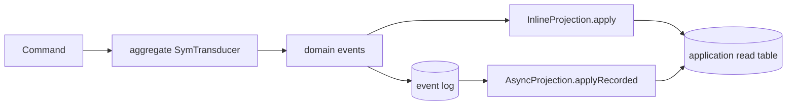

If you have written event-sourced aggregates before, you know the **decide/evolve** pattern: a
`decide` function turns `(state, command)` into events, and an `evolve` function folds
`(state, event)` into the next state. kiroku's own
[decider-and-evolve tutorial](/docs/kiroku/tutorials/decider-and-evolve) teaches exactly this. keiro
does **not** use it. An `EventStream` carries a keiki `SymTransducer phi rs s ci co` directly, and
the command runner steps that transducer. This page explains why.

The diagram compares the two designs.

<Diagram
  src="keiro/concepts/decider-vs-transducer"
  alt="On the left, decide and evolve are two separate functions, so emit and update can drift. On the right, one SymTransducer steps forward on a command and replays by inverting each event to its command and checking the guard again."
  caption="keiro uses one edge set for decisions and replay. A guard or update edit therefore changes how stored events replay."
/>

## What the command cycle actually calls

In `Keiro.Command`, the Transduce phase is one call into keiki:

```haskell
-- evaluateCommand, simplified: step the transducer with the command in the hydrated state
Keiki.step transducer (state, registers) command :: Maybe (s, RegFile rs, [co])
```

`Nothing` means the transducer **rejected** the command (no edge applies in this state) → keiro
returns `CommandRejected`. `Just (state', registers', events)` is an accepted transition: the new
control state, the new register file, and the events to emit. There is no separate `evolve`: stepping
the transducer *is* both the decision and the state advance.

## What a SymTransducer gives you that decide/evolve does not

A `SymTransducer phi rs s ci co` is one object with three capabilities a plain decide/evolve split
cannot express:

- **A typed register file `RegFile rs`.** Beyond the control state `s` (the named states like
  `Placed`, `Shipped`), the machine carries typed working memory between transitions — counters,
  accumulated ids, deadlines. In a decide/evolve design this data has to be smuggled inside `state`
  by hand; here it is first-class and typed.
- **ε-edges.** The transducer can advance **without consuming a command** — an internal transition
  that fires on a guard alone. This is how a workflow moves itself forward (e.g. "once both approvals
  are in, advance") rather than waiting for an external trigger.
- **A guard alphabet `phi`.** Transitions branch on predicates drawn from a guard algebra
  (`BoolAlg phi (RegFile rs, ci)` is the constraint the command runner needs to evaluate a guard
  against the registers and the incoming command). Guards are data the framework can reason about,
  not opaque Haskell `if`s buried in `decide`.

## What the framework can prove about it

Because guards are *data* and the register file is typed, keiki can analyse a transducer
**statically** — no SMT solver, no running it. The load-bearing property is **replay-safety**: every
command field an edge consumes must be recoverable from the event(s) that edge emits, or replaying
the log would not reconstruct the same state. A decide/evolve split has nowhere to even state this
property; here it falls out of the structure.

keiro surfaces that check at the `EventStream` boundary in `Keiro.EventStream.Validate`:
`validateEventStream label es` returns labelled warnings (empty when sound) and `mkEventStream` is a
fail-fast smart constructor. Alongside replay-safety it checks guard determinism and dead edges. Run
it in a test or at start-up so an unsafe stream fails before it ever corrupts hydration — see the
[event stream reference](/docs/keiro/reference/event-stream-and-stream#validatedeventstream-and-replay-safety-validation).
The *same* transducer can also be rendered as a diagram for review; see keiki's
[diagrams from one declaration](/docs/keiki/explanation/diagrams-from-one-declaration).

## The bill for one edge set: your decide logic *is* your replay surface

The single-edge-set design has a cost, and it is worth naming rather than discovering.

Hydration does not merely fold events. It **re-inverts** each stored event back to the command that
produced it, and **re-checks that edge's guard** against the recovered command. So an edit to a
guard, an output template, or a register `update` is not "just logic" — it changes how every event
already in your log replays. Tighten a guard and stored events that satisfied the old rule can lose
their inverting edge (`HydrationReplayFailed HydrationNoInvertingEdge`); loosen or overlap guards and
one event can invert to two (`HydrationAmbiguousInversion`).

keiki's answer is a **scoped, explicit** reintroduction of the split: `EdgeMode` gives an `Edge` a
`Live`/`ReplayOnly` mode. A `ReplayOnly` edge is never taken by forward stepping and exists so events
emitted under a retired rule keep an inverting edge; its `update` defines how that history folds
today. Inversion is two-phase — live edges are tried first, replay-only edges only when no live edge
attributes an event — so the pattern is robust and the static ambiguity check can scope itself to
same-mode pairs.

That is deliberately narrow. A replay-only twin **cannot drift** the way a decide/evolve pair can: it
still couples its event to its writes. It merely stops accepting new commands. The
single-edge-set virtue — emit/update drift unrepresentable — is fully preserved for live behaviour.

The full treatment, including the two-stage retirement protocol and the real-log audit that says
whether stored data still exercises a retired rule, is
[Evolution and replayability](/docs/keiro/explanation/evolution-and-replayability).

## Where the analogy stops: projections are not transducers

Keiro separates aggregate decisions, process coordination, and projection updates:

| Role | Keiro contract |
| --- | --- |
| Aggregate decisions | An `EventStream` contains a `SymTransducer`. Commands step it; replay reconstructs its decision state. |
| Process coordination | A process manager produces `ProcessManagerAction`s. It runs commands through its own and its targets' aggregate contracts. |
| Projection updates | `InlineProjection.apply` or `AsyncProjection.applyRecorded` updates an application-owned table from events. A `ReadModel` queries that table. |

### Keiki's generated `View` is a different type

Keiki also uses the word `View`, but `deriveView` generates a vertex witness, a vertex-indexed View
GADT, and a function like:

```haskell
userView :: SUserVertex v -> RegFile UserRegRegs -> UserView v
```

The function reads current machine state through a typed interface.
It has no event input, initial projection state, or event fold.
Vertex and register declarations determine its API, so transducer changes can alter it.
Use it for machine-local presentation.

A transducer's control state and `RegFile` contain command decision state.
Events in one stream must reconstruct this state under the replay and snapshot rules.
Projection data can combine many streams, filter events, and rebuild independently.

Keiro therefore never models a projection as a `SymTransducer` and never stores projection data in
the transducer's `RegFile`. Coupling them would make an unrelated read-model change part of the
aggregate machine's register shape and snapshot lifecycle. It would also force a category-wide or
global projection into the lifecycle of one entity stream.


```mermaid
flowchart LR
  Command --> Machine["aggregate SymTransducer"]
  Machine --> Events["domain events"]
  Events --> Log[("event log")]
  Events --> Inline["InlineProjection.apply"]
  Log --> Async["AsyncProjection.applyRecorded"]
  Inline --> Table[("application read table")]
  Async --> Table
```

`runCommandWithProjections` takes a `ValidatedEventStream`, but only because it first runs the
**command-producing** half of this diagram. After the append has recorded the outputs, the
projection half receives event values and recorded-event metadata; it does not step or evolve the
machine.

<Callout type="info">
Use a transducer when the component accepts or rejects an input and emits durable outputs that
reconstitute its decision state. Use a projection when recorded events are being folded into
discardable, rebuildable query data. If you need a pure projection fold in a unit test, write an
ordinary fold over the events; do not introduce a `SymTransducer`.
</Callout>

<Callout type="warn">
  If a projection needs a value that exists only in `RegFile`, the projection is not replayable.
  Put the required fact in the durable event schema (with historical upcasting where necessary)
  instead of reading the current aggregate or its snapshot.
</Callout>

For the projection lifecycle and its independent evolution boundary, see
[Projections, read models, and snapshots](/docs/keiro/explanation/projections-read-models-and-snapshots).

## The payoff: one formalism for decision-producing machines

Aggregates and the event-sourced state machines driven by process managers use the same
`SymTransducer` decision core, differing in what `ci` and `co` mean. They share command handling,
replay, validation, and snapshot semantics. A decide/evolve façade would split those semantics
across hand-written functions; the native transducer keeps them in one object.

That unification is intentionally narrower than "everything is a transducer." Projections, read
models, routers, and runtime delivery mechanics keep APIs suited to their jobs.

For the record that marries a transducer to its codec and store wiring, see the
[Event stream and Stream handle reference](/docs/keiro/reference/event-stream-and-stream); for the
pipeline that steps it, see [The command cycle](/docs/keiro/explanation/the-command-cycle).
