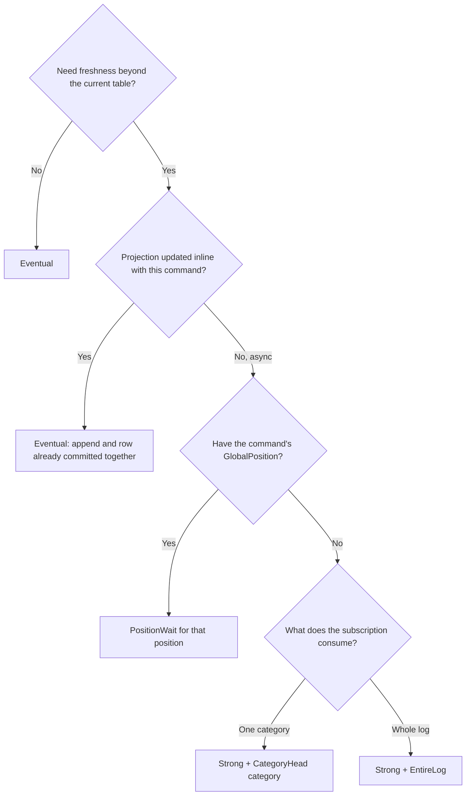

Choose the mode from how the projection is fed and what freshness the caller needs. All modes first
require an explicitly registered, `Live`, schema-compatible read model.

## Decision guide



### `Eventual`

Read the table immediately. This is the normal mode for inline projections because the read-model
write and emitted events commit in the same transaction.

### `PositionWait`

When an async projection must reflect a known command, wait for that command result's
`GlobalPosition`:

```haskell
let waitOptions = PositionWaitOptions
      { target = result ^. #globalPosition
      , timeoutMicros = 2_000_000
      , pollMicros = 50_000
      }

runQueryWith Nothing (PositionWait waitOptions) orderSummaryReadModel orderId
```

`CommandResult.globalPosition` is already a `Maybe GlobalPosition`; a no-op command supplies
`Nothing`, and a `PositionWait` with `target = Nothing` skips waiting. A deadline returns
`ReadModelWaitTimeout name target observed` and records `keiro.projection.wait.timeouts` when metrics
are enabled.

### `Strong`

`Strong` captures a head at query start and waits for the model's `subscriptionName` cursor:

```haskell
ordersReadModel = ReadModel
  { defaultConsistency = Strong
  , strongScope = CategoryHead "order"
  , ...
  }
```

- Use `CategoryHead "order"` when the worker consumes the `order` category. The target is the latest
  global position originating in that category; unrelated traffic cannot create an unreachable
  target.
- Use `EntireLog` only when the worker observes the whole log. It targets the `$all` head.
- For a model fed by several categories, use a known `PositionWait` target or an all-stream worker
  with `EntireLog`.

Kiroku currently does not move a category checkpoint when an empty fetch sees only unrelated
traffic. Pairing a category worker with `EntireLog` can therefore time out even though it has
processed every relevant event.

<Callout type="warn">
  Do not use `Strong` for an inline-only model: no worker can advance its subscription cursor while
  the query waits. Also ensure startup called `registerReadModel`; otherwise the query returns
  `ReadModelUnregistered` before performing any wait.
</Callout>

See [Read model](/docs/keiro/reference/read-model) for exact defaults and position helpers.
