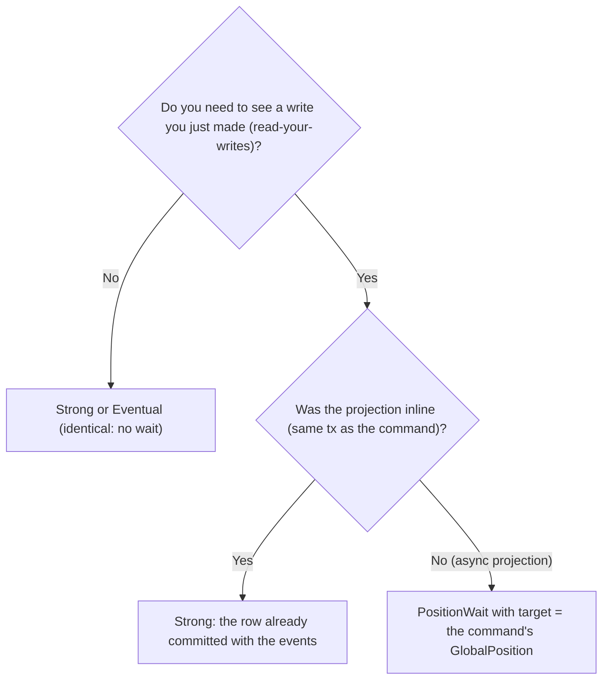

You are about to query a read model and need to decide how fresh the result must be. keiro offers
three `ConsistencyMode`s, but only one of them actually waits.

<Callout type="info">
  Assumes you have a read model (see [Your first read model](/docs/keiro/tutorials/your-first-read-model)).
</Callout>

## Goal

Choose the right `ConsistencyMode` for a query, and use `PositionWait` for read-your-writes.

## The decision



- **Inline projection** → the read-model row commits in the *same* transaction as the events, so a
  plain `Strong`/`Eventual` read after a successful command already sees it.
- **Async projection** → the projection runs later, so you must wait. Pass the `GlobalPosition` the
  command returned as the `PositionWait` target:

```haskell
let waitOpts = PositionWaitOptions
      { target        = Just (result ^. #globalPosition)   -- from the command you just ran
      , timeoutMicros = 2_000_000
      , pollMicros    = 50_000
      }
runQueryWith (PositionWait waitOpts) orderSummaryReadModel (OrderSummaryQuery oid)
```

`PositionWait` polls `subscriptions.last_seen` until the target position is reached or
`timeoutMicros` elapses (→ `ReadModelWaitTimeout`).

<Callout type="warn">
Under `runQuery`, **`Strong` and `Eventual` do not wait — they are identical**. Neither gives
read-your-writes against an async projection. Use `PositionWait` with a `Just target` when you need
to observe a specific write.
</Callout>

## Verify it worked

Run an async-fed query immediately after a command with `Strong` and observe a stale/empty result;
switch to `PositionWait` with the command's `GlobalPosition` and observe the fresh row (or a
`ReadModelWaitTimeout` if the projection is not running).

## Related

- [Read model reference](/docs/keiro/reference/read-model) — `ConsistencyMode`, `PositionWaitOptions`.
- [Consistency and snapshots](/docs/keiro/explanation/consistency-and-snapshots) — the modes explained.
