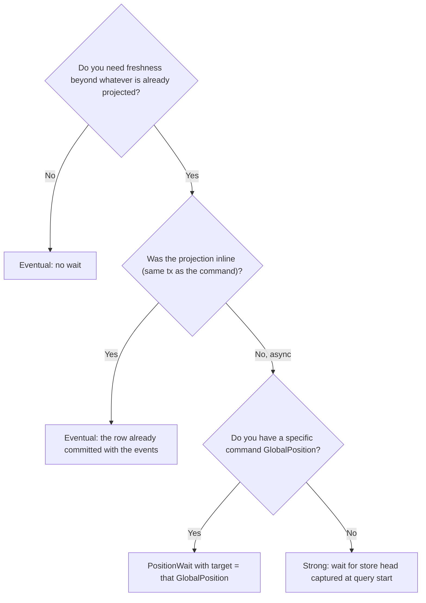

You are about to query a read model and need to decide how fresh the result must be. keiro offers
three `ConsistencyMode`s: one for immediate reads, one for "catch up to the head as of query start",
and one for "catch up to this specific command result".

<Callout type="info">
  Assumes you have a read model (see [Your first read model](/docs/keiro/tutorials/your-first-read-model)).
</Callout>

## Goal

Choose the right `ConsistencyMode` for a query, and use either `Strong` or `PositionWait` when an
async projection must catch up before the query runs.

## The decision



- **Inline projection** → the read-model row commits in the *same* transaction as the events, so a
  plain `Eventual` read after a successful command already sees it.
- **Async projection, known write** → pass the `GlobalPosition` the command returned as the
  `PositionWait` target:

```haskell
let waitOpts = PositionWaitOptions
      { target        = Just (result ^. #globalPosition)   -- from the command you just ran
      , timeoutMicros = 2_000_000
      , pollMicros    = 50_000
      }
runQueryWith Nothing (PositionWait waitOpts) orderSummaryReadModel (OrderSummaryQuery oid)
-- leading `Nothing` = opt-in metrics handle; pass `Just metrics` to record keiro.projection.wait.timeouts
```

`PositionWait` polls `subscriptions.last_seen` until the target position is reached or
`timeoutMicros` elapses (→ `ReadModelWaitTimeout`).
- **Async projection, no specific write** → use `Strong`. It captures the `$all` head position at
  query start and waits until the projection subscription reaches that position. This gives "as fresh
  as the store was when I asked", not a permanent linearizable lock on future appends.

<Callout type="warn">
Do not use `Strong` for an inline-only read model with no subscription worker. It will wait for a
subscription checkpoint that cannot advance and eventually return `ReadModelWaitTimeout`. Use
`Eventual` for inline models and `PositionWait` when you have a command result's `GlobalPosition`.
</Callout>

## Verify it worked

Run an async-fed query immediately after a command with `Eventual` and observe a stale/empty result;
switch to `PositionWait` with the command's `GlobalPosition` and observe the fresh row. For a general
"latest as of now" read, use `Strong` and confirm it returns only after the subscription reaches the
head captured when the query started.

## Related

- [Read model reference](/docs/keiro/reference/read-model) — `ConsistencyMode`, `PositionWaitOptions`.
- [Consistency and snapshots](/docs/keiro/explanation/consistency-and-snapshots) — the modes explained.
