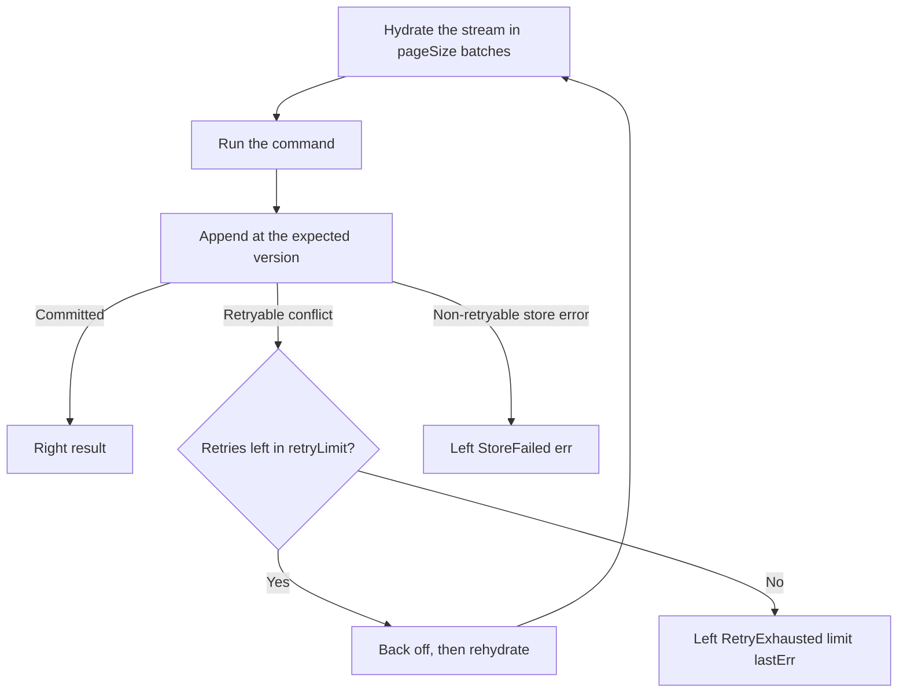

A hot stream takes concurrent commands; keiro appends under optimistic concurrency and retries on
conflict. You need to tune how hard it retries and how it reads during hydration, and to handle the
case where retries run out.

<Callout type="info">
  Assumes you understand the command cycle (see
  [The command cycle](/docs/keiro/explanation/the-command-cycle)).
</Callout>

## Goal

Override `retryLimit` and `pageSize`, and react correctly to `RetryExhausted`.

## Steps

1. Override the options. `retryLimit` is the number of rehydrate-and-replay attempts after a
   conflict (default 3); `pageSize` is the read-batch size during hydration (default 256):

   ```haskell
   let options = defaultRunCommandOptions { retryLimit = 8, pageSize = 512 }
   runCommand options orderEventStream (orderStream oid) command >>= \case
     Left (RetryExhausted limit lastErr) -> -- contention too high: limit attempts ran out
       ...
     Left (StoreFailed err) -> -- a non-retryable store error
       ...
     Right result -> ...
   ```

2. Distinguish the two failure shapes. `RetryExhausted limit lastErr` means a *retryable* conflict
   kept losing the race until the budget ran out; `StoreFailed err` is a *non-retryable* store error
   that is surfaced immediately.

The flowchart shows where each failure shape comes from in the command loop.



<Callout type="warn">
`RetryExhausted` carries the configured `retryLimit` and the **last** store error. Persistent
exhaustion on one stream is a signal that the aggregate is too hot — model it as several streams
rather than raising the limit forever (the same lesson as kiroku's
[optimistic concurrency](/docs/kiroku/explanation/optimistic-concurrency)).
</Callout>

## Verify it worked

Drive concurrent commands at one stream in a test; confirm most succeed after a retry or two and that
sustained contention produces `RetryExhausted` with your configured `limit`.

## Related

- [Command reference](/docs/keiro/reference/command) — `RunCommandOptions` and `CommandError`.
- [The command cycle](/docs/keiro/explanation/the-command-cycle) — the retry loop in context.
