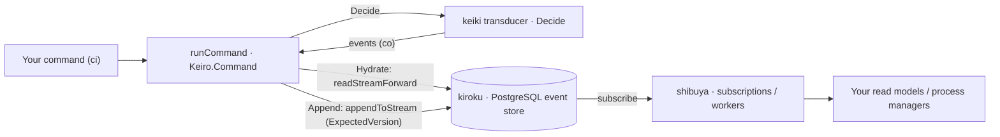

**keiro** (経路, "route / path") is a Haskell **library you import** — not a server you operate —
that composes three lower libraries into one event-sourcing and workflow framework:
**kiroku** (記録, the append-only PostgreSQL event store), **keiki** (the pure symbolic-register
finite-state transducer that is the decision core), and **shibuya** (the supervised
subscription/worker substrate). Its thesis: aggregates, process managers, sagas, and the planned
durable workflows are all the *same* mathematical object — keiki's `SymTransducer phi rs s ci co`
— persisted to *one* substrate, your Postgres.

<Callout type="warn">
  keiro is in **active development** (`0.1.0.0`). APIs may change; pin a version. The v2
  durable-execution workflow engine is a roadmap item and is **not** documented here as if it
  shipped.
</Callout>

## How it fits together

A command runs through keiro's **Hydrate → Decide → Append** cycle: `runCommand` reads the
target stream into state (Hydrate), runs the keiki transducer to turn the command into events
(Decide), and appends them to kiroku under optimistic concurrency (Append), retrying on conflict.

## Where to go next

<Cards>
  <Card title="Tutorials" href="/docs/keiro/tutorials" description="Run your first command through the Hydrate → Decide → Append cycle." />
  <Card title="How-To Guides" href="/docs/keiro/how-to" description="Task-oriented recipes for the command cycle, read side, workflows, and integration events." />
  <Card title="Reference" href="/docs/keiro/reference" description="Exact Haskell signatures and PostgreSQL schema for each subsystem." />
  <Card title="Explanation" href="/docs/keiro/explanation" description="What keiro is, the stack it composes, and the jitsurei worked example." />
  <Card title="Cookbook" href="/docs/keiro/cookbook" description="Short, copy-paste recipes for common problems." />
  <Card title="Code Walkthrough" href="/docs/keiro/walkthrough" description="Ordered tours through keiro's real source." />
</Cards>
