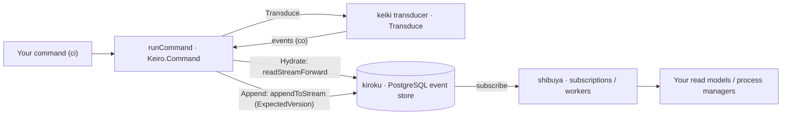

**keiro** is a Haskell library for event-sourced applications and durable workflows.
It runs inside the application and stores durable state in PostgreSQL.
It composes three libraries:

- **keiki** defines transducers and replay behavior.
- **kiroku** stores events and subscription progress.
- **shibuya** supervises message workers.

`Keiro.Workflow` provides named steps, waits, child workflows, journal rotation, and patches.
The application owns its workflow registry, workers, and deployment.

## Service authoring

Language 6 is the only supported Keiro DSL language in this release documentation.
Declare `language keiro-dsl 6` in every complete source file.
Use the [DSL tutorial](/docs/keiro/tutorials/author-a-service-with-keiro-dsl) to define and generate a service.
Read [release compatibility](/docs/getting-started/compatibility-and-upgrades) before selecting packages.

<Callout type="warn">
  Command runners require a `ValidatedEventStream`.
  Construct it with `mkEventStream` or `mkEventStreamWith` before hydration.
  These functions check replay safety and snapshot coherence.
</Callout>

## How it fits together

A command runs through keiro's **Hydrate → Transduce → Append** cycle: `runCommand` reads the
target stream into state (Hydrate), runs the keiki transducer to turn the command into events
(Transduce), and appends them to kiroku under optimistic concurrency (Append), retrying on conflict.
The stream passed to that runner is a `ValidatedEventStream`: a raw `EventStream` record can describe
the transducer, codec, snapshot policy, and name resolver, but it must pass keiki replay-safety
validation before it can reach the write path.

```mermaid
flowchart LR
  Cmd["Your command (ci)"]
  RC["runCommand · Keiro.Command"]
  Keiki["keiki transducer · Transduce"]
  Kiroku[("kiroku · PostgreSQL event store")]
  Shibuya["shibuya · subscriptions / workers"]
  Read["Your read models / process managers"]

  Cmd --> RC
  RC -->|"Hydrate: readStreamForward"| Kiroku
  RC -->|"Transduce"| Keiki
  Keiki -->|"events (co)"| RC
  RC -->|"Append: appendToStream (ExpectedVersion)"| Kiroku
  Kiroku -->|"subscribe"| Shibuya
  Shibuya --> Read
```

<Callout type="warn">
**Already deployed?** In keiro one edge set serves both execution and replay, so editing a guard, an
output, or a register `update` changes how every event *already in your log* replays. Read
[Evolution and replayability](/docs/keiro/explanation/evolution-and-replayability) before changing a
live aggregate or process manager, and gate the deploy with
[Deploy ordering](/docs/keiro/reference/deploy-ordering) and the
[real-log replay audit](/docs/keiro/reference/replay-audit).
</Callout>

## Where to go next

<Cards>
  <Card title="Evolution and replayability" href="/docs/keiro/explanation/evolution-and-replayability" description="Changing a deployed service is a change to data you already stored: the six gates, the safe procedure per change class, and what is still not gated." />
  <Card title="Tutorials" href="/docs/keiro/tutorials" description="Run the command cycle, build read-side and workflow paths, or author a service from a typed .keiro specification." />
  <Card title="How-To Guides" href="/docs/keiro/how-to" description="Task-oriented recipes for the command cycle, read side, workflows, integrations, background work, and keiro-dsl evolution." />
  <Card title="Reference" href="/docs/keiro/reference" description="Exact Haskell signatures, PostgreSQL schema, and the complete keiro-dsl notation and CLI contracts." />
  <Card title="Explanation" href="/docs/keiro/explanation" description="Framework roles, runtime contracts, and design decisions." />
  <Card title="Cookbook" href="/docs/keiro/cookbook" description="Short, copy-paste recipes for common problems." />
  <Card title="Code Walkthrough" href="/docs/keiro/walkthrough" description="Ordered tours through keiro's real source." />
</Cards>
