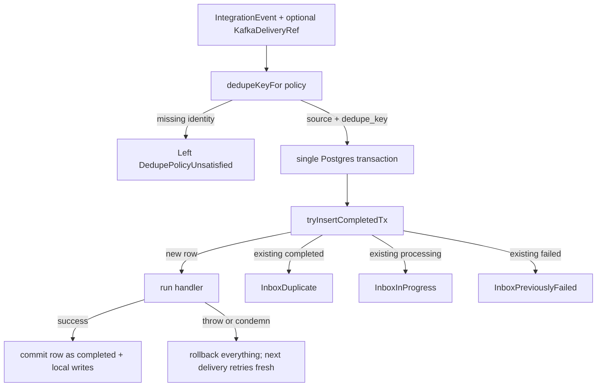
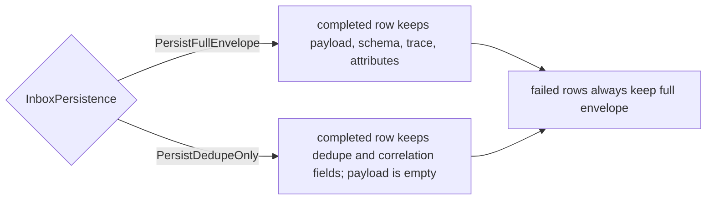
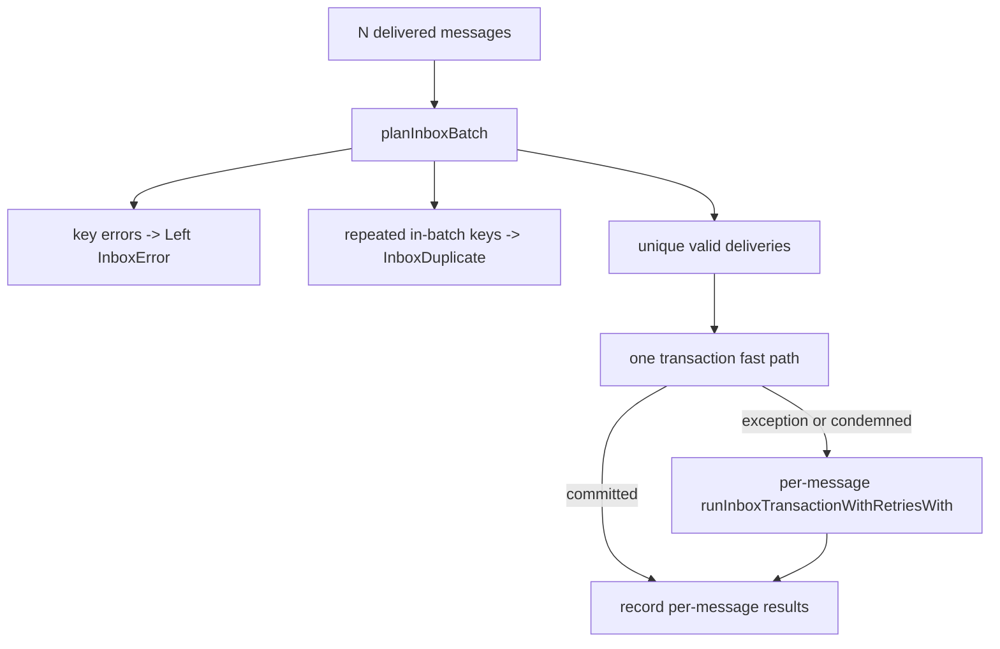

The types and functions on this page live in `Keiro.Inbox` (which re-exports `Keiro.Inbox.Types`),
`Keiro.Inbox.Kafka`, and `Keiro.Inbox.Schema`. The inbox provides idempotent consumption of
integration events in the consuming bounded context. For the narrative, see [The inbox
pattern](/docs/keiro/explanation/the-inbox-pattern).

## `runInboxTransaction`

Run `handler` at most once per `(source, dedupe_key)`. Computes the dedupe key from the policy,
then in one transaction inserts a fresh successful row directly as `completed`, runs the handler if
the row is new, or branches on the existing row's status if it is a duplicate.

```haskell
runInboxTransaction ::
  forall a es. (IOE :> es, Store :> es) =>
  Maybe KeiroMetrics -> InboxDedupePolicy -> IntegrationEvent -> Maybe KafkaDeliveryRef ->
  (IntegrationEvent -> Tx.Transaction a) ->
  Eff es (Either InboxError (InboxResult a))
```

Returns `Left (DedupePolicyUnsatisfied …)` if the policy's required field is absent; otherwise
`Right` the classified `InboxResult`. The handler runs **inside** the inbox transaction, so it is a
`Tx.Transaction a` — a thrown exception or `Tx.condemn` rolls back the whole transaction including
the inbox row. The leading `Maybe KeiroMetrics` is the opt-in
[metrics](/docs/keiro/reference/telemetry#metrics-surface) handle: each transaction records the
`keiro.inbox.processed`, `keiro.inbox.duplicates`, and `keiro.inbox.failed` counters. Pass `Nothing`
to disable them.



## `runInboxTransactionWith`

```haskell
data InboxPersistence = PersistFullEnvelope | PersistDedupeOnly

runInboxTransactionWith ::
  forall a es. (IOE :> es, Store :> es) =>
  Maybe KeiroMetrics -> InboxPersistence -> InboxDedupePolicy ->
  IntegrationEvent -> Maybe KafkaDeliveryRef ->
  (IntegrationEvent -> Tx.Transaction a) ->
  Eff es (Either InboxError (InboxResult a))
```

`PersistFullEnvelope` is the default used by `runInboxTransaction`. `PersistDedupeOnly` keeps enough
columns for dedupe and operator correlation but stores an empty payload and omits schema, trace, and
attributes for successfully processed rows. Failed rows always persist the full envelope because the
failed inbox row is the operator's dead-letter record.



## `runInboxTransactionWithKey`

The lower-level variant: the caller supplies `source` and the dedupe key directly. Use when the
policy cannot express the identity scheme (a key joined from several headers, or derived from the
payload).

```haskell
runInboxTransactionWithKey ::
  forall a es. (IOE :> es, Store :> es) =>
  Maybe KeiroMetrics -> Text -> Text -> IntegrationEvent -> Maybe KafkaDeliveryRef ->
  (IntegrationEvent -> Tx.Transaction a) ->
  Eff es (InboxResult a)
```

## `runInboxTransactionWithRetries`

Opt-in poison-message accounting around the same inbox identity scheme.

```haskell
runInboxTransactionWithRetries ::
  forall a es. (IOE :> es, Store :> es) =>
  Maybe KeiroMetrics -> Int -> InboxDedupePolicy -> IntegrationEvent -> Maybe KafkaDeliveryRef ->
  (IntegrationEvent -> Tx.Transaction a) ->
  Eff es (Either InboxError (InboxResult a))

runInboxTransactionWithRetriesKey ::
  forall a es. (IOE :> es, Store :> es) =>
  Maybe KeiroMetrics -> Int -> Text -> Text -> IntegrationEvent -> Maybe KafkaDeliveryRef ->
  (IntegrationEvent -> Tx.Transaction a) ->
  Eff es (InboxResult a)
```

The `Int` is the attempt ceiling. A synchronous handler exception rolls back the handler transaction,
then records a failed attempt in a second transaction and returns `InboxHandlerFailed err attempts`.
A failed row with `attempt_count < ceiling` is retried; a failed row at or above the ceiling returns
`InboxPreviouslyFailed` without running the handler, letting the consumer commit its offset and leave
the failed inbox row as the operator-visible dead-letter record. `Tx.condemn` keeps the original
rollback semantics and is not counted as a handler exception by this wrapper.

`runInboxTransactionWithRetriesWith` is the persistence-controlling variant; it accepts the same
`InboxPersistence` argument as `runInboxTransactionWith`.

## `runInboxTransactionBatch`

```haskell
runInboxTransactionBatch ::
  forall a es. (IOE :> es, Store :> es) =>
  Maybe KeiroMetrics ->
  Int ->
  InboxDedupePolicy ->
  InboxPersistence ->
  [(IntegrationEvent, Maybe KafkaDeliveryRef)] ->
  (IntegrationEvent -> Tx.Transaction a) ->
  Eff es [Either InboxError (InboxResult a)]
```

The batch wrapper computes all dedupe keys, suppresses repeated keys within the batch as
`InboxDuplicate`, and runs the remaining deliveries through one transaction. If any handler throws
or the transaction is condemned, keiro falls back to the retrying single-message path for every
original delivery so one poison message cannot discard unrelated batch mates.



## `InboxDedupePolicy`

Which identity becomes the inbox primary key.

```haskell
data InboxDedupePolicy
  = PreferIntegrationMessageId   -- default: (source, messageId)
  | PreferSourceEventIdentity    -- the producing private event's id / global position
  | KafkaDeliveryIdentity        -- last resort: topic:partition:offset
  | CustomDedupeKey !Text        -- caller-supplied key
```

See [Choose an inbox dedupe policy](/docs/keiro/how-to/choose-an-inbox-dedupe-policy).

## `dedupeKeyFor`

Compute the dedupe key for an event under a policy. Returns `Left` when the policy demands a field
the envelope lacks.

```haskell
dedupeKeyFor :: InboxDedupePolicy -> IntegrationEvent -> Maybe KafkaDeliveryRef -> Either InboxError Text
```

## `InboxStatus`

```haskell
data InboxStatus = InboxProcessing | InboxCompleted | InboxFailed
```

`InboxProcessing` is reserved for a future async path — in the v1 single-transaction wrapper it
does not escape a transaction on fresh successful intake. Legacy `processing` rows can still decode.
`InboxCompleted` and `InboxFailed` are terminal.

## `InboxResult`

The classified outcome of `runInboxTransaction`.

```haskell
data InboxResult a
  = InboxProcessed !a             -- first delivery; handler ran, returned a
  | InboxDuplicate                -- a prior delivery already completed; handler NOT run
  | InboxInProgress               -- a prior attempt is in-flight (async paths only); transient
  | InboxPreviouslyFailed !(Maybe Text)  -- a prior attempt recorded a permanent failure
  | InboxHandlerFailed !Text !Int -- retrying wrapper: handler raised; carries error and attempts
```

## `InboxError`

```haskell
data InboxError = DedupePolicyUnsatisfied !InboxDedupePolicy
```

## `KafkaDeliveryRef`

Optional Kafka-delivery metadata, used by `KafkaDeliveryIdentity` and stored on the row regardless
of policy so operators can correlate with Kafka logs.

```haskell
data KafkaDeliveryRef = KafkaDeliveryRef { topic :: !Text, partition :: !Int64, offset :: !Int64 }
```

## `garbageCollectCompleted`

Delete completed inbox rows older than `keepFor` from `now`; returns the number deleted.

```haskell
garbageCollectCompleted :: (Store :> es) => NominalDiffTime -> UTCTime -> Eff es Int
```

<Callout type="warn">
The retention window **is** the duplicate-detection window: a redelivery arriving after GC has run
is processed again. Size `keepFor` above your maximum tolerated delivery delay (the user guide
recommends 30 days). Failed rows are never GC'd.
</Callout>

## `countInboxBacklog`

Count non-terminal inbox rows — those still `processing` (in flight) or `failed` (awaiting a retry).
This is the source for the [`keiro.inbox.backlog`](/docs/keiro/reference/telemetry#metric-catalogue)
gauge; call `sampleInboxBacklog metrics` on a timer to record it. The retrying wrapper also records
`keiro.inbox.poisoned` when a handler failure reaches the configured attempt ceiling.

```haskell
countInboxBacklog :: (Store :> es) => Eff es Int
sampleInboxBacklog :: (IOE :> es, Store :> es) => Maybe KeiroMetrics -> Eff es ()
```

## `lookupInbox` / `listInbox`

```haskell
lookupInbox :: (Store :> es) => Text -> Text -> Eff es (Maybe InboxRow)
listInbox   :: (Store :> es) => Text -> Eff es [InboxRow]
```

Inspection helpers (`lookupInbox source dedupeKey`; `listInbox source`). Rows written with
`PersistDedupeOnly` read back with an empty `payloadBytes`, no attributes, no trace context, and no
schema reference; identity, source-event ids, occurrence time, and Kafka diagnostics remain.
`Keiro.Inbox.Schema` also exposes lower-level SQL primitives such as `tryInsertCompletedTx`,
`markCompletedTx`, and `markFailedTx`.

## The Kafka decoder (`Keiro.Inbox.Kafka`)

Pure; no broker dependency. The caller's Kafka adapter supplies the bytes and a `[(Text, Text)]`
header map.

```haskell
data KafkaInboundRecord = KafkaInboundRecord
  { topic :: !Text, partition :: !Int64, offset :: !Int64
  , key :: !(Maybe Text), payload :: !ByteString
  , headers :: ![(Text, Text)], receivedAt :: !UTCTime }

data KafkaDecodeError = MissingHeader !Text | InvalidIntHeader !Text !Text | InvalidUuidHeader !Text !Text

integrationEventFromKafka :: KafkaInboundRecord -> Either KafkaDecodeError (IntegrationEvent, KafkaDeliveryRef)
```

`integrationEventFromKafka` reconstructs the envelope from the [canonical
headers](/docs/keiro/reference/integration-event#canonical-header-names): a missing required header
→ `MissingHeader`; a malformed numeric/UUID header → `InvalidIntHeader` / `InvalidUuidHeader`.
Optional headers are silently absent. See [Wire a Kafka consumer to the
inbox](/docs/keiro/how-to/wire-a-kafka-consumer-to-the-inbox).

## The `keiro_inbox` table

```sql
CREATE TABLE IF NOT EXISTS keiro_inbox (
  source TEXT NOT NULL,
  dedupe_key TEXT NOT NULL,
  message_id TEXT,
  source_event_id UUID,
  source_global_position BIGINT,
  destination TEXT,
  event_type TEXT,
  schema_version BIGINT,
  content_type TEXT NOT NULL,
  schema_registry TEXT,
  schema_subject TEXT,
  schema_version_ref BIGINT,
  schema_id BIGINT,
  schema_fingerprint TEXT,
  causation_id UUID,
  correlation_id UUID,
  traceparent TEXT,
  tracestate TEXT,
  kafka_topic TEXT,
  kafka_partition BIGINT,
  kafka_offset BIGINT,
  payload_bytes BYTEA NOT NULL,
  attributes JSONB,
  occurred_at TIMESTAMPTZ,
  status TEXT NOT NULL DEFAULT 'processing',
  received_at TIMESTAMPTZ NOT NULL DEFAULT now(),
  completed_at TIMESTAMPTZ,
  failed_at TIMESTAMPTZ,
  last_error TEXT,
  attempt_count BIGINT NOT NULL DEFAULT 0,
  PRIMARY KEY (source, dedupe_key)
);

CREATE INDEX IF NOT EXISTS keiro_inbox_completed_idx ON keiro_inbox (completed_at) WHERE status = 'completed';
CREATE INDEX IF NOT EXISTS keiro_inbox_backlog_idx ON keiro_inbox (status) WHERE status IN ('processing', 'failed');
```

The `PRIMARY KEY (source, dedupe_key)` is what makes the `INSERT … ON CONFLICT DO NOTHING` dedupe
atomic. Fresh successful intake inserts directly as `completed`; `processing` remains the default and
the legacy/on-disk status, but the current fresh path does not perform a visible
`processing -> completed` update. The partial `keiro_inbox_completed_idx` keeps
`garbageCollectCompleted` cheap, and `keiro_inbox_backlog_idx` supports backlog sampling. The older
`keiro_inbox_received_idx` was dropped because no hot path reads by `received_at`.

<Cards>
  <Card title="The inbox pattern" href="/docs/keiro/explanation/the-inbox-pattern" />
  <Card title="Integration event reference" href="/docs/keiro/reference/integration-event" />
  <Card title="Outbox reference" href="/docs/keiro/reference/outbox" />
  <Card title="Verify durable worker outcomes" href="/docs/keiro/how-to/verify-durable-worker-outcomes" />
</Cards>
