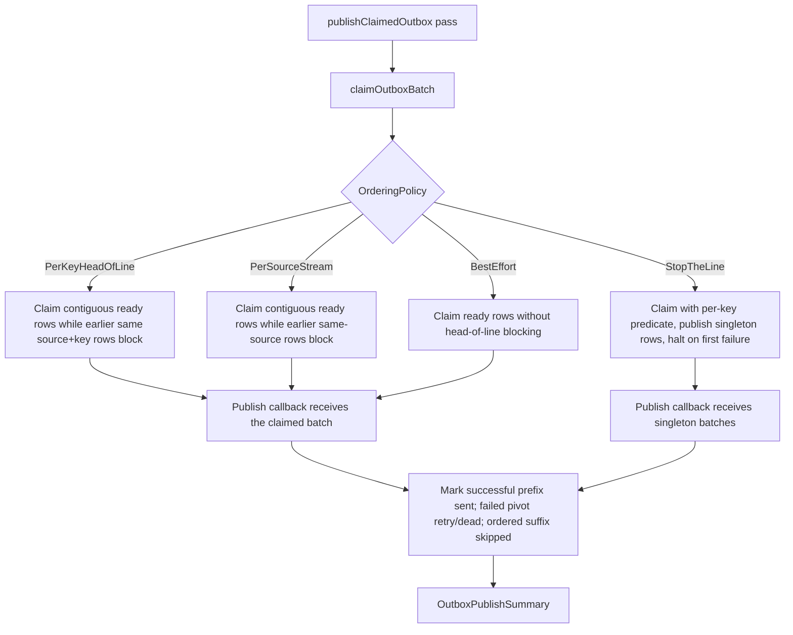
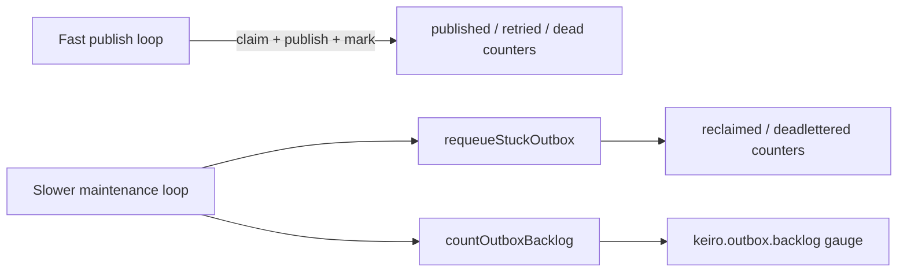

The types and functions on this page live in `Keiro.Outbox` (which re-exports
`Keiro.Outbox.Types`), `Keiro.Outbox.Kafka`, and `Keiro.Outbox.Schema`. The outbox is the durable
transactional handoff from "decided to publish" to "published". For the narrative, see [The outbox
pattern](/docs/keiro/explanation/the-outbox-pattern).

## `OutboxId`

```haskell
newtype OutboxId = OutboxId { unOutboxId :: UUID }
```

Primary key of a `keiro_outbox` row, stable across publish retries. Has `ToJSON`/`FromJSON`
instances (as UUID text).

## `OutboxStatus`

```haskell
data OutboxStatus = OutboxPending | OutboxPublishing | OutboxSent | OutboxRejected | OutboxFailed | OutboxDead
```

`OutboxPending` (never attempted), `OutboxPublishing` (held by a worker between claim and mark),
`OutboxSent` (acked; terminal), `OutboxRejected` (permanently refused; retained for audit), `OutboxFailed` (will retry after `next_attempt_at`), `OutboxDead`
(terminal failure after `maxAttempts`, kept for inspection).

<Callout type="info">
A row stranded in `OutboxPublishing` by a worker crash is reclaimed by the separately scheduled
`outboxMaintenancePass`, not by the publish hot path. Stale publishing rows below `maxAttempts` move
back to `failed`; rows at or above the ceiling move to `dead`. This is at-least-once publishing: a
crash after broker ack but before `markOutboxSent` can republish the same event, so consumers still
dedupe with the inbox.
</Callout>

## `OrderingPolicy`

```haskell
data OrderingPolicy = PerKeyHeadOfLine | PerSourceStream | StopTheLine | BestEffort
```

`PerKeyHeadOfLine` (default) preserves the outbox's `(created_at, outbox_id)` order per key by blocking
later same-key rows behind a non-terminal one (null-keyed rows bypass); `PerSourceStream` applies the
same order across all keys in a source;
`StopTheLine` halts the worker on the first failure; `BestEffort` never blocks. See [Choose an
outbox ordering policy](/docs/keiro/how-to/choose-an-outbox-ordering-policy).

<Callout type="warn">
**That is enqueue order, not database commit order.** PostgreSQL's `now()` fills `created_at` from the
transaction start time. The canonical `IntegrationProducer` subscription serializes same-key
enqueues, so its order is stable. Two callers using `enqueueIntegrationEventTx` concurrently for the
same key or source can commit opposite their timestamps; `PerKeyHeadOfLine` and `PerSourceStream` are
best-effort for that escape hatch unless the application serializes those enqueues.
</Callout>



## `BackoffSchedule` and `ExponentialBackoffOptions`

```haskell
data BackoffSchedule
  = ConstantBackoff !NominalDiffTime
  | ExponentialBackoff !ExponentialBackoffOptions

data ExponentialBackoffOptions = ExponentialBackoffOptions
  { initial :: !NominalDiffTime, maxDelay :: !NominalDiffTime, multiplier :: !Double }

nextDelay :: BackoffSchedule -> Int -> NominalDiffTime
```

`nextDelay` computes the retry delay for a 1-based attempt number;
`ExponentialBackoff` is `min maxDelay (initial * multiplier ^ (attempt - 1))`.

## `OutboxMessage` and `OutboxRow`

```haskell
data OutboxMessage = OutboxMessage { outboxId :: !OutboxId, event :: !IntegrationEvent }

data OutboxRow = OutboxRow
  { outboxId :: !OutboxId, event :: !IntegrationEvent, status :: !OutboxStatus
  , attemptCount :: !Int, nextAttemptAt :: !UTCTime, lastError :: !(Maybe Text)
  , publishedAt :: !(Maybe UTCTime), createdAt :: !UTCTime, updatedAt :: !UTCTime }
```

## `OutboxPublishOptions` and `OutboxPublishSummary`

```haskell
data OutboxPublishOptions = OutboxPublishOptions
  { batchSize :: !Int, maxAttempts :: !Int, backoff :: !BackoffSchedule
  , orderingPolicy :: !OrderingPolicy, publishingTimeout :: !NominalDiffTime
  , tracer :: !(Maybe Tracer) }

data OutboxPublishSummary = OutboxPublishSummary
  { claimed :: !Int, published :: !Int, retried :: !Int, dead :: !Int, haltedOn :: !(Maybe OutboxId) }
```

<TypeTable
  type={{
    batchSize:      { type: "Int", description: "Rows claimed per pass.", default: "32" },
    maxAttempts:    { type: "Int", description: "Consecutive failures before a row goes dead.", default: "10" },
    backoff:        { type: "BackoffSchedule", description: "Retry delay curve.", default: "ConstantBackoff 2" },
    orderingPolicy: { type: "OrderingPolicy", description: "Claim-time ordering predicate.", default: "PerKeyHeadOfLine" },
    publishingTimeout: { type: "NominalDiffTime", description: "How old a publishing row must be before the next publisher pass reclaims it.", default: "300" },
    tracer:         { type: "Maybe Tracer", description: "Optional OpenTelemetry producer-span tracer.", default: "Nothing" },
  }}
/>

```haskell
-- batch 32, maxAttempts 10, ConstantBackoff 2, PerKeyHeadOfLine, 300 s publishing timeout, no tracer
defaultPublishOptions :: OutboxPublishOptions
mkOutboxPublishOptions :: OutboxPublishOptions -> Either OutboxPublishConfigError OutboxPublishOptions
```

`published + rejected + retried + dead` counts rows durably finalized by the pass. It can be
less than `claimed` when stale-worker recovery wins a race. `retried`
also includes rows skipped after an earlier failure in the same ordered group; those skipped rows are
returned to retryable state without consuming an attempt. `haltedOn` is populated only under
`StopTheLine` and names the failed pivot row, which is already counted in `retried` or `dead`.

## Inline escape hatch

```haskell
freshOutboxId             :: (IOE :> es) => Eff es OutboxId
enqueueIntegrationEventTx :: OutboxId -> IntegrationEvent -> Tx.Transaction ()
```

`enqueueIntegrationEventTx` enqueues an event from inside the caller's transaction (e.g. a saga
running in `runCommandWithSqlEvents`). Supply a **stable** `OutboxId` so retried command attempts
coalesce on the `(source, message_id)` unique constraint. See [Publish with the
outbox](/docs/keiro/how-to/publish-with-the-outbox).

If concurrent transactions can enqueue the same message key or source, serialize them when strict
ordering matters. `created_at` is their transaction-start timestamp, so commit order alone cannot
repair the ordering after the fact.

## The producer helper

```haskell
data IntegrationProducer e = IntegrationProducer
  { name :: !Text, source :: !Text, messageIdPrefix :: !Text
  , mapEvent :: !(RecordedEvent -> e -> Maybe IntegrationEventDraft) }

data IntegrationEventDraft = IntegrationEventDraft
  { destination :: !Text, key :: !(Maybe Text), eventType :: !Text, schemaVersion :: !Int
  , contentType :: !IntegrationContentType, schemaReference :: !(Maybe SchemaReference)
  , sourceEventId :: !(Maybe EventId), sourceGlobalPosition :: !(Maybe GlobalPosition)
  , payloadBytes :: !ByteString, occurredAt :: !UTCTime
  , causationId :: !(Maybe EventId), correlationId :: !(Maybe EventId)
  , traceContext :: !(Maybe TraceContext), attributes :: !(Maybe Value) }

freshIntegrationEvent  :: (IOE :> es) => IntegrationProducer e -> IntegrationEventDraft -> Eff es IntegrationEvent
draftToEvent           :: Text -> Text -> IntegrationEventDraft -> IntegrationEvent
enqueueProducerEventTx ::
  IntegrationProducer e -> RecordedEvent -> Word32 -> IntegrationEventDraft ->
  Tx.Transaction ProducerEnqueueOutcome
```

`IntegrationEventDraft` is `IntegrationEvent` minus `messageId` and `source`; the producer fills
those in. `mapEvent` returning `Nothing` skips an event without enqueuing a row.

For the canonical subscription path, `enqueueProducerEventTx` derives replay-stable identity from
the producer source/name, the recorded source event ID, and the zero-based `emissionIndex`. The
outbox ID is a deterministic UUIDv8 and the message ID has the opaque form
`<messageIdPrefix>_v1_<sha256>`. Missing source provenance defaults from the `RecordedEvent`; pass
index zero for today's single-draft mapper.

```haskell
data ProducerEventKey = ProducerEventKey
  { sourceEventId :: EventId, emissionIndex :: Word32 }

data ProducerIdentity = ProducerIdentity
  { outboxId :: OutboxId, messageId :: Text, derivationVersion :: Word16 }

data ProducerEnqueueOutcome
  = ProducerInserted ProducerIdentity
  | ProducerDuplicateIdentical ProducerIdentity
  | ProducerIdentityConflict ProducerIdentity (NonEmpty ConflictField)

data ConflictField
  = IdentityField | RoutingField | SchemaField | PayloadField | OccurredAtField
  | CausalField | TraceField | AttributesField | ProvenanceField
```

An identical replay is reported explicitly. Reusing an identity for different canonical envelope
content reports only field classes—never payload or metadata values. Condemn the surrounding
checkpoint transaction on `ProducerIdentityConflict`, then call
`recordProducerEnqueueOutcome metrics outcome` once after the transaction runner returns so SQL
serialization retries do not multiply `keiro.outbox.identity.conflict`.

`deriveProducerIdentity`, `producerIdentityBytes`, `producerContentDigest`,
`differingContentFields`, and `normalizeProducerEvent` expose the pure identity and comparison
rules. Suppression is bounded by outbox retention, but the wire identity remains deterministic
after a row is collected.

`freshIntegrationEvent` remains for deliberately fresh, immediately persisted envelopes. The old
name `mintIntegrationEvent` is a deprecated alias. It has no producer replay identity or provenance
defaulting and must not be used as the canonical subscription retry path.

<Callout type="warn">
  Moving an existing producer from random TypeID/outbox IDs to deterministic producer identity is a
  cutover even though it needs no schema migration. Drain its subscription and checkpoint before
  deploying every writer that shares that producer identity, then resume. Otherwise one source
  event can exist under both identity families.
</Callout>

## `publishClaimedOutbox`

```haskell
data PublishOutcome = PublishSucceeded | PublishFailed !Text | PublishRejected !PublishRejection

publishClaimedOutbox ::
  (IOE :> es, Store :> es) =>
  ([OutboxRow] -> Eff es [(OutboxId, PublishOutcome)]) -> OutboxPublishOptions -> Maybe KeiroMetrics ->
  Eff es OutboxPublishSummary
```

**One claim pass per call** — it claims a batch, calls your publish function with the claimed rows in
claim order, marks the successful prefix sent, marks a failed pivot retryable or dead, skips any
later rows in the same ordered group without consuming attempts, and returns. It does **not** loop;
the application schedules it repeatedly (e.g. once per process-compose tick). Mark a row sent only
after the broker acks (return `PublishSucceeded` for that row); the inbox dedupes any double-send.
See [Bridge the outbox to
Kafka](/docs/keiro/how-to/bridge-the-outbox-to-kafka).

The trailing `Maybe KeiroMetrics` is the opt-in
[metrics](/docs/keiro/reference/telemetry#metrics-surface) handle: per publish pass it records only
the `keiro.outbox.published`, `keiro.outbox.rejected`, `keiro.outbox.retried`, and
`keiro.outbox.deadlettered` counters, derived from committed conditional updates. Pass
`Nothing` to disable them.

For `StopTheLine`, the worker calls the publish function with singleton batches and halts after the
first failure. For the other policies, the publish function receives the whole claimed batch so a
Kafka adapter can pipeline or batch broker sends. If the callback omits an outcome for a claimed row,
keiro treats it as `PublishFailed "publisher returned no outcome"`; if the callback throws, every row
in that callback is treated as failed.

## Terminal rejection (Keiro 0.14+)

Construct `PublishRejection` through `mkPublishRejection`; the type is abstract and its
implementation module is private. Codes match `[a-z][a-z0-9._-]*` and contain 1–64 ASCII
characters. Present detail must be non-empty and at most 1024 UTF-8 bytes. Invalid values
are refused without normalization or truncation.

```haskell
mkPublishRejection :: Text -> Maybe Text -> Either PublishRejectionError PublishRejection

data PublishRejectionError
  = InvalidPublishRejectionCode !Text
  | PublishRejectionDetailEmpty
  | PublishRejectionDetailTooLong !Int
```

Read values with `publishRejectionCode` and `publishRejectionDetail`. `OutboxRow` adds
`rejectedAt :: !(Maybe UTCTime)` and `rejection :: !(Maybe PublishRejection)`;
`OutboxPublishSummary` adds `rejected :: !Int`. Direct record construction and exhaustive
outcome/status matches must be updated.

A rejection records terminal audit truth, clears `last_error`, schedules no retry, and
releases per-key/per-source successors. `StopTheLine` continues after rejection and stops
on `PublishFailed`. Rejected rows are excluded from claims, recovery, backlog and sent-row
GC, so sent retention does not erase the refusal evidence.

All outcome classes for a claimed batch finalize in one transaction, conditional on each
row still being `publishing`. A callback can run again if finalization fails before commit;
both transport delivery and refusal decisions must be idempotent by message identity.
See [Handle terminal outbox rejection](/docs/keiro/how-to/handle-terminal-outbox-rejection).

## `outboxMaintenancePass` and `sampleOutboxBacklog`

```haskell
data OutboxMaintenanceOptions = OutboxMaintenanceOptions
  { maxAttempts :: !Int, publishingTimeout :: !NominalDiffTime }

data OutboxMaintenanceSummary = OutboxMaintenanceSummary
  { requeued :: !Int, deadLettered :: !Int, backlog :: !Int }

defaultMaintenanceOptions :: OutboxMaintenanceOptions

outboxMaintenancePass ::
  (IOE :> es, Store :> es) =>
  OutboxMaintenanceOptions -> Maybe KeiroMetrics -> Eff es OutboxMaintenanceSummary

sampleOutboxBacklog :: (IOE :> es, Store :> es) => Maybe KeiroMetrics -> Eff es ()
```

Schedule `outboxMaintenancePass defaultMaintenanceOptions metrics` on a slower cadence than
publishing. It reclaims stale `publishing` rows, records `keiro.outbox.reclaimed` /
`keiro.outbox.deadlettered`, counts backlog, and records `keiro.outbox.backlog`. Use
`sampleOutboxBacklog` when you only want the backlog gauge without crash reclamation.



## `countOutboxBacklog`

Count rows awaiting publish — those in `pending` or `failed` status. This is the source for the
[`keiro.outbox.backlog`](/docs/keiro/reference/telemetry#metric-catalogue) gauge; schedule
`outboxMaintenancePass` or `sampleOutboxBacklog` to record it.

```haskell
countOutboxBacklog :: (Store :> es) => Eff es Int
```

## Schema primitives (`Keiro.Outbox.Schema`)

```haskell
enqueueOutboxTx   :: OutboxMessage -> Tx.Transaction ()                                   -- INSERT … ON CONFLICT (source, message_id) DO NOTHING
claimOutboxBatch  :: (Store :> es) => OrderingPolicy -> Int -> UTCTime -> Eff es [OutboxRow]
requeueStuckOutbox :: (Store :> es) => Int -> NominalDiffTime -> UTCTime -> Eff es (Int, Int)
markOutboxSent    :: (Store :> es) => OutboxId -> UTCTime -> Eff es Bool
markOutboxSentBatch :: (Store :> es) => [OutboxId] -> UTCTime -> Eff es Int
markOutboxFailedTx :: OutboxId -> Text -> Int -> NominalDiffTime -> UTCTime -> Tx.Transaction (Maybe OutboxStatus)
lookupOutbox      :: (Store :> es) => OutboxId -> Eff es (Maybe OutboxRow)
listOutbox        :: (Store :> es) => Text -> Eff es [OutboxRow]
garbageCollectSent :: (Store :> es) => NominalDiffTime -> UTCTime -> Eff es Int
listStuckOutbox            :: (Store :> es) => NominalDiffTime -> UTCTime -> Eff es [OutboxRow]
listSentOutboxGcCandidates :: (Store :> es) => NominalDiffTime -> UTCTime -> Eff es [OutboxRow]
```

```haskell
markOutboxSentBatchTx :: [OutboxId] -> UTCTime -> Tx.Transaction Int
markOutboxRejectedTx :: OutboxId -> PublishRejection -> UTCTime -> Tx.Transaction Bool
markOutboxSkippedTx :: OutboxId -> Text -> UTCTime -> Tx.Transaction Bool
```

`markOutboxRejectedTx` and `markOutboxSkippedTx` return whether the conditional update
changed a row. `markOutboxFailedTx` now returns `Maybe OutboxStatus`: `Nothing` means a stale,
missing, or terminal row was not changed. Include these counts only after the transaction commits.

`listStuckOutbox` and `listSentOutboxGcCandidates` are the read-only operator **previews** for
`requeueStuckOutbox` and `garbageCollectSent`: they list the rows a pass would consider or delete,
oldest first, without mutating anything. They back
[`keiro-ops outbox requeue-stuck` and `gc-sent`](/docs/keiro/reference/keiro-ops-cli#outbox--transactional-outbox).
*New in Keiro 0.12.0.0.*

`claimOutboxBatch` selects `WHERE status IN ('pending', 'failed') AND next_attempt_at <= now`,
applies the ordering predicate, `ORDER BY (created_at, outbox_id) LIMIT n FOR UPDATE SKIP LOCKED`,
and transitions claimed rows to `publishing` with `attempt_count + 1`. `markOutboxFailedTx` reads
the attempt count: `>= maxAttempts` → `OutboxDead`, else `OutboxFailed` with `next_attempt_at = now +
delay`. `requeueStuckOutbox maxAttempts olderThan now` reclaims stale `publishing` rows and returns
`(requeued, deadLettered)`. `garbageCollectSent` prunes sent rows older than a retention window.

<Callout type="info">
**Deterministic claim order.** Both the claim order and the per-key head-of-line "is there an
earlier sibling?" predicate break ties on the **`(created_at, outbox_id)`** pair, not `created_at`
alone — rows minted in the same transaction share a timestamp, and `UPDATE … RETURNING` does not
otherwise guarantee row order. The claim re-orders its `RETURNING` rows through a CTE so a batch is
returned in the same stable `(created_at, outbox_id)` order it was selected in. This makes claim and
retry order deterministic for the rows that were enqueued; it does not turn concurrent transaction
start timestamps into commit order.
</Callout>

## Kafka conversion (`Keiro.Outbox.Kafka`)

Pure; no librdkafka dependency.

```haskell
data KafkaProducerRecord = KafkaProducerRecord
  { topic :: !Text, key :: !(Maybe ByteString), payload :: !ByteString, headers :: ![(ByteString, ByteString)] }

outboxRowToKafkaRecord        :: OutboxRow -> KafkaProducerRecord
integrationEventToKafkaRecord :: IntegrationEvent -> KafkaProducerRecord
```

`topic` is the envelope's `destination`; `key` and `headers` are UTF-8-encoded from the envelope.

## The `keiro_outbox` table

The following is the original table/index shape; migration `0031` below updates rejection auditing
and head-of-line predicates in the current `keiro` schema.

```sql
CREATE TABLE IF NOT EXISTS keiro_outbox (
  outbox_id UUID PRIMARY KEY,
  message_id TEXT NOT NULL,
  source TEXT NOT NULL,
  destination TEXT NOT NULL,
  message_key TEXT,
  event_type TEXT NOT NULL,
  schema_version BIGINT NOT NULL,
  content_type TEXT NOT NULL,
  schema_registry TEXT,
  schema_subject TEXT,
  schema_version_ref BIGINT,
  schema_id BIGINT,
  schema_fingerprint TEXT,
  source_event_id UUID,
  source_global_position BIGINT,
  causation_id UUID,
  correlation_id UUID,
  traceparent TEXT,
  tracestate TEXT,
  payload_bytes BYTEA NOT NULL,
  attributes JSONB,
  occurred_at TIMESTAMPTZ NOT NULL,
  status TEXT NOT NULL DEFAULT 'pending',
  attempt_count BIGINT NOT NULL DEFAULT 0,
  next_attempt_at TIMESTAMPTZ NOT NULL DEFAULT now(),
  last_error TEXT,
  published_at TIMESTAMPTZ,
  created_at TIMESTAMPTZ NOT NULL DEFAULT now(),
  updated_at TIMESTAMPTZ NOT NULL DEFAULT now(),
  UNIQUE (source, message_id)
);

CREATE INDEX IF NOT EXISTS keiro_outbox_pending_idx
  ON keiro_outbox (status, next_attempt_at, created_at);

CREATE INDEX IF NOT EXISTS keiro_outbox_claim_order_idx
  ON keiro_outbox (next_attempt_at, created_at, outbox_id)
  WHERE status IN ('pending', 'failed');

CREATE INDEX IF NOT EXISTS keiro_outbox_head_of_line_idx
  ON keiro_outbox (source, message_key, created_at)
  WHERE status NOT IN ('sent', 'dead') AND message_key IS NOT NULL;

CREATE INDEX IF NOT EXISTS keiro_outbox_sent_gc_idx
  ON keiro_outbox (published_at)
  WHERE status = 'sent';

CREATE INDEX IF NOT EXISTS keiro_outbox_source_order_idx
  ON keiro_outbox (source, created_at, outbox_id)
  WHERE status NOT IN ('sent', 'dead');
```

Migration `0031` (Keiro 0.14+) applies this additional SQL:

```sql
-- add terminal outbox rejection outcome

ALTER TABLE keiro.keiro_outbox
  ADD COLUMN rejected_at TIMESTAMPTZ,
  ADD COLUMN rejection_code TEXT,
  ADD COLUMN rejection_detail TEXT,
  ADD CONSTRAINT keiro_outbox_rejection_audit_check CHECK (
    (
      status = 'rejected'
      AND rejected_at IS NOT NULL
      AND rejection_code IS NOT NULL
    )
    OR
    (
      status <> 'rejected'
      AND rejected_at IS NULL
      AND rejection_code IS NULL
      AND rejection_detail IS NULL
    )
  ),
  ADD CONSTRAINT keiro_outbox_rejection_code_check CHECK (
    rejection_code IS NULL
    OR rejection_code ~ '^[a-z][a-z0-9._-]{0,63}$'
  ),
  ADD CONSTRAINT keiro_outbox_rejection_detail_check CHECK (
    rejection_detail IS NULL
    OR octet_length(rejection_detail) BETWEEN 1 AND 1024
  );

-- Rejected rows are terminal and must not remain in head-of-line indexes.
DROP INDEX IF EXISTS keiro.keiro_outbox_head_of_line_idx;
CREATE INDEX keiro_outbox_head_of_line_idx
  ON keiro.keiro_outbox (source, message_key, created_at)
  WHERE status NOT IN ('sent', 'dead', 'rejected') AND message_key IS NOT NULL;

DROP INDEX IF EXISTS keiro.keiro_outbox_source_order_idx;
CREATE INDEX keiro_outbox_source_order_idx
  ON keiro.keiro_outbox (source, created_at, outbox_id)
  WHERE status NOT IN ('sent', 'dead', 'rejected');
```

The `UNIQUE (source, message_id)` constraint coalesces idempotent re-enqueues; the partial
`keiro_outbox_claim_order_idx` backs the hot claim order, while `keiro_outbox_head_of_line_idx` backs
the per-key head-of-line predicate. The source-order index supports `PerSourceStream`, including null
keys, and the sent-GC index keeps retention pruning cheap.

<Cards>
  <Card title="The outbox pattern" href="/docs/keiro/explanation/the-outbox-pattern" />
  <Card title="Integration event reference" href="/docs/keiro/reference/integration-event" />
  <Card title="Publish with the outbox" href="/docs/keiro/how-to/publish-with-the-outbox" />
  <Card title="Verify durable worker outcomes" href="/docs/keiro/how-to/verify-durable-worker-outcomes" />
</Cards>
