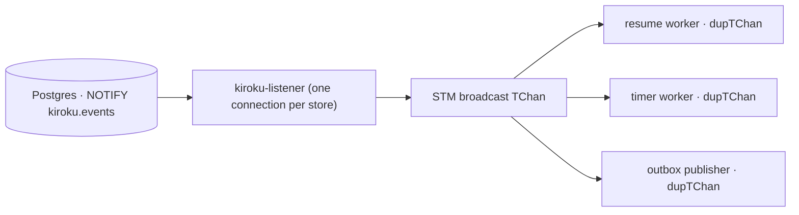

The types and functions on this page live in the **`Keiro.Wake`** module. They let keiro's poll-loop
workers — the [workflow resume worker](/docs/keiro/reference/durable-workflows#the-resume-worker), the
[durable-timer worker](/docs/keiro/reference/timers), the [outbox publisher](/docs/keiro/reference/outbox) —
*wait to be woken* by a Postgres `NOTIFY` instead of sleeping out a fixed poll interval, so they react
within sub-second of an append rather than after up to a full interval.

For the concept and when push helps, read [Scaling the workers](/docs/keiro/explanation/scaling-the-workers);
for the task, [Enable push delivery](/docs/keiro/how-to/enable-push-delivery).

<Callout type="info">
**Push is an optimization over a durable poll, never a replacement.** A Postgres `NOTIFY` is
best-effort: if the listener is momentarily disconnected the notification is dropped, and the payload
is advisory. Correctness never depends on a notification arriving — a missed `NOTIFY` only delays the
next pass to the fallback interval, exactly as the old fixed-poll loop did. The durable, idempotent
*pass* is the unit of work; the wake only shortens the gap between passes.
</Callout>

## The wake signal

```haskell
data WakeReason = WokenByNotify | WokenByTimeout
  deriving (Eq, Show)

newtype WakeSignal = WakeSignal
  { waitForWake :: Int -> IO WakeReason }   -- block until a notification arrives OR the timeout (µs) elapses
```

A `WakeSignal` blocks until either a relevant append notification arrives (`WokenByNotify`) or a
bounded fallback timeout elapses (`WokenByTimeout`). Both reasons mean "run another pass"; the
distinction is kept only for telemetry.

```haskell
wakeSignalFromStore :: KirokuStore -> IO WakeSignal
neverWake           :: WakeSignal
```

<TypeTable
  type={{
    wakeSignalFromStore: { type: "KirokuStore -> IO WakeSignal", description: "Build a signal from a running store's notifier. Duplicates the store's broadcast tick channel (an STM dupTChan), so this consumer has its own cursor and ticks queued between waits are not lost." },
    neverWake: { type: "WakeSignal", description: "A signal that never fires a notification — every wait elapses the fallback. Used to simulate 'all NOTIFYs dropped' (proving push is an optimization over the durable poll) and to give a fixed-poll worker an unchanged cadence under the same push-aware driver." },
  }}
/>

## Where the wake comes from — and why it adds no connection

The kiroku event store already fires a Postgres `NOTIFY` on channel `<schema>.events` (default
`kiroku.events`) on every append, and already runs **one dedicated long-lived listener connection per
store** (`Kiroku.Store.Notification.Notifier`, started once by `withStore`). That listener fans every
notification out to an in-process STM broadcast channel.

`wakeSignalFromStore` calls `dupTChan` on that broadcast channel — an STM operation, **not** a database
connection. So N keiro workers over one store share the single existing listener connection plus N
cheap STM cursors:



Push therefore adds **zero** new long-lived connections, and the query pool is sized exactly as before.
keiro treats the notification as an opaque "something was appended, go look" wake and re-queries
durably, ignoring the `NOTIFY` payload entirely.

## The push-aware loop

```haskell
runPollLoopWith :: WakeSignal -> Int -> IO () -> IO ()
--                 wake signal    fallback µs   one pass (already in IO)
```

`runPollLoopWith wake fallbackMicros pass` runs one `pass`, then blocks on `wake` with the given
fallback, forever. The pass is the durable unit; the wake only shortens the gap between passes. Both
wake reasons mean "run another pass", so the `WakeReason` is ignored for control flow. The same pattern
applies mechanically to the timer worker and the outbox publisher (their pass is already idempotent);
the shipped push entry point is for the resume worker.

```haskell
runWorkflowResumeWorkerPush
  :: KirokuStore
  -> WorkflowResumeOptions
  -> WorkflowRegistry '[Store, Error StoreError, IOE]
  -> IO ()
```

`runWorkflowResumeWorkerPush` runs `resumeWorkflowsOnce` each pass and waits on the store's notifier
between passes, falling back to `pollInterval`. It is the push-aware sibling of
`runWorkflowResumeWorker(With)`, which remain unchanged as the durable fixed-poll baseline.

<Callout type="info">
The `pollInterval` field of [`WorkflowResumeOptions`](/docs/keiro/reference/durable-workflows#the-resume-worker)
is **repurposed** under the push worker: its meaning shifts from "fixed gap between passes" to "maximum
gap when no notification arrives" — strictly better for latency, identical in the no-notification worst
case. The worker takes the `KirokuStore` directly (to reach the notifier) and pins the registry's
effect row to `'[Store, Error StoreError, IOE]`, the row `runStoreIO` eliminates; a richer effect row
can use `runPollLoopWith` directly with its own `runStoreIO`-equivalent pass.
</Callout>

<Cards>
  <Card title="Scaling the workers" href="/docs/keiro/explanation/scaling-the-workers" />
  <Card title="Enable push delivery" href="/docs/keiro/how-to/enable-push-delivery" />
  <Card title="Durable workflows reference" href="/docs/keiro/reference/durable-workflows" />
  <Card title="The scaling walkthrough" href="/docs/keiro/walkthrough/scaling/00-start-here" />
</Cards>
