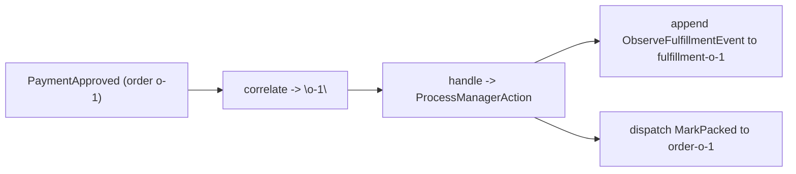

In this tutorial you will build a small **process manager**: a coordinator that watches an order's
events, keeps its own event-sourced memory of each order's fulfillment, and — when payment is
approved — dispatches a `MarkPacked` command to the order aggregate. By the end you will have wired
a `correlate` function, a manager `EventStream`, a target `EventStream`, and a `handle`, and run the
whole reaction once against a fresh store.

<Callout type="info">
This is a tutorial: a guided lesson. Follow every step in order. You need only the keiro
[getting-started tutorial](/docs/keiro/tutorials/getting-started) behind you (so you can open a
store and run a command). The worked example mirrors `jitsurei/src/Jitsurei/FulfillmentProcess.hs`
in the keiro repo — run it for real with `just jitsurei-fulfillment`.
</Callout>

## What you will build

A `ProcessManager` named `"jitsurei-fulfillment"`. It correlates on the order id, folds every order
event into a private `fulfillment-<orderId>` state stream, and on a `PaymentApproved` event
dispatches one command (`MarkPacked`) back to the order aggregate. You will react to a single
event with `runProcessManagerOnce` and inspect the `ProcessManagerResult`.



## Before you begin

You need a running PostgreSQL with the keiro migrations applied (the
[getting-started tutorial](/docs/keiro/tutorials/getting-started) covers this), and the order
aggregate from `jitsurei` in scope: `OrderCommand` / `OrderEvent` / `OrderState`,
`orderEventStream`, and `orderCommandStream` (see the [EventStream and Stream
reference](/docs/keiro/reference/event-stream-and-stream)).

## Steps

<Steps>
<Step>

### Define the correlation function

The manager must decide *which* instance handles each incoming order event. Correlate on the order
id, turned into text:

```haskell
correlate :: OrderEvent -> Text
correlate = orderIdText . eventOrderId
```

Every event for order `o-1` now maps to the same correlation key `"o-1"`, and therefore to the same
manager state stream.

</Step>
<Step>

### Define and validate the manager's own EventStream

The manager remembers its progress in its own event-sourced stream. Give it a tiny aggregate whose
only command observes an order event. As with any command-side stream, keep the raw definition
separate from the validated value that the process manager accepts:

```haskell
data FulfillmentCommand = ObserveFulfillmentEvent !ObserveFulfillmentEventData
data FulfillmentEvent   = FulfillmentObserved     !FulfillmentObservedData

type FulfillmentEventStream =
  EventStream (HsPred FulfillmentRegs FulfillmentCommand) FulfillmentRegs FulfillmentState FulfillmentCommand FulfillmentEvent

type ValidatedFulfillmentEventStream =
  ValidatedEventStream (HsPred FulfillmentRegs FulfillmentCommand) FulfillmentRegs FulfillmentState FulfillmentCommand FulfillmentEvent

fulfillmentEventStreamDef :: FulfillmentEventStream
fulfillmentEventStreamDef = EventStream
  { transducer       = fulfillmentTransducer
  , initialState     = FulfillmentIdle
  , initialRegisters = RNil
  , eventCodec       = fulfillmentCodec
  , resolveStreamName = Stream.streamName
  , snapshotPolicy   = Never
  , stateCodec       = Nothing
  }

fulfillmentEventStream :: ValidatedFulfillmentEventStream
fulfillmentEventStream =
  mkEventStreamOrThrow "jitsurei-fulfillment" fulfillmentEventStreamDef

fulfillmentStream :: OrderId -> Stream FulfillmentEventStream
fulfillmentStream orderId = stream ("fulfillment-" <> orderIdText orderId)
```

The `fulfillmentStream` function is the `streamFor` you will wire below: it maps a correlation id to
the manager's `Stream` handle (`fulfillment-o-1`). `fulfillmentEventStream` is the validated wrapper;
that is what `ProcessManager.eventStream` requires.

</Step>
<Step>

### Identify the target EventStream

The commands the manager dispatches go to a *target* aggregate. Here the target is the order
aggregate itself — reuse its `EventStream` and its command-stream constructor:

```haskell
-- from jitsurei/src/Jitsurei/OrderStream.hs
orderEventStream   :: ValidatedOrderEventStream
orderCommandStream :: OrderId -> Stream OrderCommand
```

</Step>
<Step>

### Write `handle`

`handle` is the pure reaction. For *every* order event, advance the manager's own state with an
`ObserveFulfillmentEvent` command; *only* on `PaymentApproved`, also dispatch `MarkPacked` to the
order. Schedule no timers:

```haskell
fulfillmentProcessManager :: FulfillmentProcessManager
fulfillmentProcessManager = ProcessManager
  { name = "jitsurei-fulfillment"
  , correlate = orderIdText . eventOrderId
  , eventStream = fulfillmentEventStream
  , streamFor = fulfillmentStream . OrderId
  , targetEventStream = orderEventStream
  , targetProjections = const [orderSummaryInlineProjection]
  , handle = \event ->
      ProcessManagerAction
        { command  = ObserveFulfillmentEvent (ObserveFulfillmentEventData (eventOrderId event) (fulfillmentStatus event))
        , commands = case event of
            PaymentApproved{} -> [ PMCommand (orderCommandStream (eventOrderId event)) (MarkPacked (MarkPackedData (eventOrderId event))) ]
            _ -> []
        , timers   = []
        }
  }
```

Note the shape: a single `ProcessManagerAction` with `command` (advance the manager), `commands`
(dispatch to targets), and `timers`. There is no separate `pmStep` returning `(state, [cmd])`.

</Step>
<Step>

### React to one event

Hand the manager a recorded source event and its decoded payload. `runProcessManagerOnce` appends
the manager state (with any timers) in one transaction, then dispatches each target command in its
own:

```haskell
result <-
  runProcessManagerOnce
    defaultRunCommandOptions
    fulfillmentProcessManager
    recordedPaymentApprovedEvent      -- the RecordedEvent from the order stream
    (PaymentApproved paymentApprovedData)
```

Inspect the `ProcessManagerResult`:

```haskell
case result of
  Left err -> putStrLn ("manager-state append failed: " <> show err)
  Right ProcessManagerResult{ managerResult, commandResults, timersScheduled } -> do
    print managerResult     -- PMStateAppended … (first time) or PMStateDuplicate … (on replay)
    print commandResults    -- [PMCommandAppended …]  (the MarkPacked dispatch)
    print timersScheduled   -- 0
```

On a first run you should see `PMStateAppended` and a single `PMCommandAppended` in
`commandResults`. Run the *same* event again and the manager append collapses to `PMStateDuplicate`
while the dispatch loop still runs and reports `PMCommandDuplicate` — proof the reaction is
idempotent.

</Step>
</Steps>

## What you built

You have a working process manager that maintains its own event-sourced state and dispatches a
command to a target aggregate, all replay-safe under at-least-once delivery. To run the real thing,
use `just jitsurei-fulfillment` in the keiro repo. Next, learn how to run the manager continuously
in [Run a process manager as a
subscription](/docs/keiro/how-to/run-a-process-manager-as-a-subscription), and why target commands
must stay total in [Keep target commands total](/docs/keiro/how-to/keep-target-commands-total).

<Cards>
  <Card title="Understanding process managers and sagas" href="/docs/keiro/explanation/process-managers-and-sagas" />
  <Card title="Keiro.ProcessManager reference" href="/docs/keiro/reference/process-manager" />
  <Card title="Run a process manager as a subscription" href="/docs/keiro/how-to/run-a-process-manager-as-a-subscription" />
</Cards>
