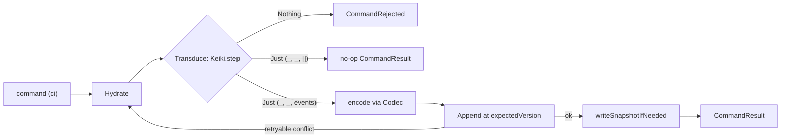

This is an **ordered source tour** of keiro's write path — the command cycle. It reads the real
Haskell in `keiro/src/Keiro/Command.hs`, `keiro-core/src/Keiro/Codec.hs`, and
`keiro/src/Keiro/Router.hs` and explains *why* the code is shaped the way it is. Read the chapters in
order.

## The design in one picture

Every command runs the same three phases — **Hydrate** (rebuild state from stored events), **Transduce**
(step the keiki transducer), **Append** (write the emitted events under optimistic concurrency) — and
retries on conflict:



## The chapters

<Cards>
  <Card title="01 — The command processor" href="/docs/keiro/walkthrough/command-cycle/01-the-command-processor" description="runCommand, hydrate, evaluateCommand, expectedVersion, retryOrFail." />
  <Card title="02 — The transactional write path" href="/docs/keiro/walkthrough/command-cycle/02-the-transactional-write-path" description="runCommandWithSqlEvents, Tx.condemn, reconstructRecorded." />
  <Card title="03 — The codec on the boundary" href="/docs/keiro/walkthrough/command-cycle/03-the-codec-on-the-boundary" description="encodeForAppendWithMetadata, decodeRecorded, migrateToCurrent." />
  <Card title="04 — The router" href="/docs/keiro/walkthrough/command-cycle/04-the-router" description="runRouterOnce, deterministic ids, and the worker ack policy." />
</Cards>

The source files this tour reads:

```text
keiro/src/Keiro/Command.hs        -- the three runners and their internals
keiro-core/src/Keiro/Codec.hs     -- the encode/decode/migrate boundary
keiro/src/Keiro/Router.hs         -- stateless content-based dispatch
```

For the conceptual version of this material, read
[The command cycle](/docs/keiro/explanation/the-command-cycle) first.
