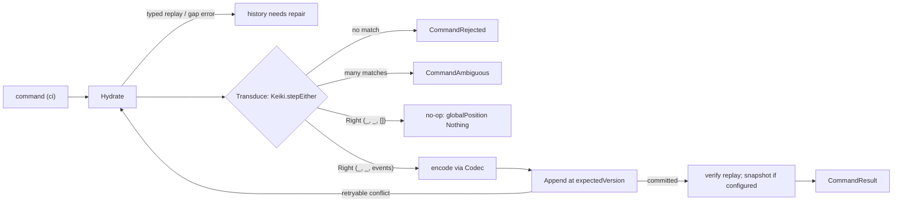

This is an **ordered source tour** of keiro's write path — the command cycle. It reads the real
Haskell in `keiro/src/Keiro/Command.hs`, `keiro-core/src/Keiro/Codec.hs`,
`keiro-core/src/Keiro/EventStream.hs` / `keiro-core/src/Keiro/Stream.hs`, and
`keiro/src/Keiro/Router.hs` end to end — every exported binding of the write path — and explains *why*
the code is shaped the way it is. Read the chapters in order.

## The design in one picture

Every command runs the same three phases — **Hydrate** (rebuild state from stored events), **Transduce**
(step the keiki transducer), **Append** (write the emitted events under optimistic concurrency) — and
retries on conflict:



## The chapters

<Cards>
  <Card title="01 — Command types and errors" href="/docs/keiro/walkthrough/command-cycle/01-command-types-and-errors" description="CommandResult, typed hydration reasons, command ambiguity, RunCommandOptions, and the internal plan types." />
  <Card title="02 — Hydration" href="/docs/keiro/walkthrough/command-cycle/02-hydration" description="Snapshot seeds, contiguous paged decoding, structured replay failures, truncation gaps, and the Settled finish rule." />
  <Card title="03 — The command processor" href="/docs/keiro/walkthrough/command-cycle/03-the-command-processor" description="runCommand, stepEither, append-time replay verification, advisory snapshots, and retryOrFail." />
  <Card title="04 — The transactional write path" href="/docs/keiro/walkthrough/command-cycle/04-the-transactional-write-path" description="Resource-aware SQL runners, enrichment, Tx.condemn, callback lock scope, and reconstructRecorded." />
  <Card title="05 — The codec on the boundary" href="/docs/keiro/walkthrough/command-cycle/05-the-codec-on-the-boundary" description="The Codec record, six CodecError constructors, migrateToCurrent, and the jitsurei upcaster." />
  <Card title="06 — The typed handles" href="/docs/keiro/walkthrough/command-cycle/06-the-typed-handles" description="EventStream, SnapshotPolicy, StateCodec, and the phantom-typed Stream." />
  <Card title="07 — The router" href="/docs/keiro/walkthrough/command-cycle/07-the-router" description="Router, RouterResult, deterministic ids, and the worker ack policy." />
</Cards>

The source files this tour reads:

```text
keiro/src/Keiro/Command.hs          -- the three runners and ALL their internals
keiro-core/src/Keiro/Codec.hs       -- the encode/decode/migrate boundary
keiro-core/src/Keiro/EventStream.hs -- EventStream, SnapshotPolicy, StateCodec
keiro-core/src/Keiro/Stream.hs      -- the phantom-typed Stream handle
keiro/src/Keiro/Router.hs           -- stateless content-based dispatch
```

For the conceptual version of this material, read
[The command cycle](/docs/keiro/explanation/the-command-cycle) first.
