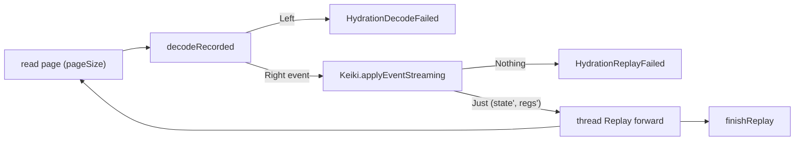

This chapter reads the hydration machine in `keiro/src/Keiro/Command.hs` — the half of the command
cycle that *rebuilds* current state from stored events before a command is ever transduced. The old
sampling tour skipped it; it is a chapter's worth of material on its own. Read
[01 — Command types and errors](/docs/keiro/walkthrough/command-cycle/01-command-types-and-errors)
first, since this chapter uses `Hydrated`, `Replay`, and the `CommandError` constructors throughout.

Hydration is **Hydrate**, the first phase of the cycle. Its job: replay a stream's stored events
through the keiki transducer to recover the current `Hydrated rs s` — the `(state, registers)` pair and
the stream's current `StreamVersion`.

## The two doors: `hydrate` and `hydrateFull`

```haskell
-- keiro/src/Keiro/Command.hs
hydrate options eventStream targetStream =
  snapshotSeed >>= \case
    Nothing -> hydrateFull options eventStream targetStream
    Just seed -> do
      replayed <- replayFrom seed
      case replayed of
        Left _ -> hydrateFull options eventStream targetStream   -- silent fallback
        Right hydrated -> pure (Right hydrated)
  where
    snapshotSeed =
      case eventStream ^. #stateCodec of
        Nothing -> pure Nothing
        Just codec ->
          hydrateWithSnapshot ((eventStream ^. #resolveStreamName) targetStream) codec
```

`hydrate` is the front door. It first asks `snapshotSeed` whether there is a snapshot to fast-forward
from. The answer is `Nothing` whenever the stream has no `stateCodec` — so a stream configured without
snapshotting (like jitsurei's `orderEventStream`) *always* takes the `hydrateFull` path. When there
*is* a `stateCodec`, `hydrateWithSnapshot` may return a `seed`, and `replayFrom` then folds the events
recorded *after* the snapshot on top of it.

<Callout type="warn">
Notice the **silent fallback**: any `Left` out of `replayFrom` drops straight to `hydrateFull`. A
stale snapshot, or one whose state shape no longer matches the current `StateCodec`, can never wedge
hydration — it just costs a full replay that turn. The snapshot is an optimization, never a dependency.
</Callout>

The snapshot read side — `hydrateWithSnapshot`, the `keiro_snapshots` table, and the
`stateCodecVersion`/`shapeHash` reuse gate — belongs to the read side. This tour only walks the *call
site*; for the mechanics see the [snapshot reference](/docs/keiro/reference/snapshot) and the read-side
chapter [Snapshots in the command and hydration path](/docs/keiro/walkthrough/read-side/02-snapshots-in-the-command-and-hydration-path).

## The replay fold

When there is no seed (or the seed was abandoned), `hydrateFull` folds the whole stream from
`StreamVersion 0`:

```haskell
hydrateFull options eventStream targetStream =
  finishReplay
    <$> Streamly.fold
      (Fold.foldlM' applyRecorded (pure (Right initialReplay)))
      (readStreamForwardStream ((eventStream ^. #resolveStreamName) targetStream) (StreamVersion 0) (options ^. #pageSize))
  where
    initialReplay = Replay
      { replayHydrated = Hydrated
          { state = eventStream ^. #initialState
          , registers = eventStream ^. #initialRegisters
          , streamVersion = StreamVersion 0
          , globalPosition = Nothing }
      , replayState = Keiki.Settled (eventStream ^. #initialState)
      , lastObservedStreamVersion = StreamVersion 0 }
```

The fold reads the stream forward in `pageSize`-event batches (`readStreamForwardStream … (StreamVersion 0)
(options ^. #pageSize)`) — a streaming read, so a long stream never has to be held in memory at once.
The accumulator is the `Replay` from chapter 01, seeded with the event stream's `initialState` and
`initialRegisters` and a `Keiki.Settled` replay state. Each event runs through `applyRecorded`:

```haskell
    applyRecorded (Left err) _ = pure (Left err)
    applyRecorded (Right current) recorded =
      case decodeRecorded (eventStream ^. #eventCodec) recorded of
        Left err -> pure (Left (HydrationDecodeFailed err))
        Right event -> pure (applyEvent current recorded event)

    applyEvent current recorded event =
      case Keiki.applyEventStreaming
        (eventStream ^. #transducer)
        (replayState current)
        (registers (replayHydrated current))
        event of
        Nothing -> Left (HydrationReplayFailed (recorded ^. #streamVersion))
        Just (nextReplayState, nextRegisters) ->
          Right current { replayHydrated = updateHydrated nextReplayState nextRegisters
                        , replayState = nextReplayState
                        , lastObservedStreamVersion = recorded ^. #streamVersion }
```

Two steps per event, and each maps to one `CommandError` constructor. First `decodeRecorded` turns the
`RecordedEvent` back into a domain event; a `CodecError` here becomes `HydrationDecodeFailed` (the same
boundary we read in [05 — The codec on the boundary](/docs/keiro/walkthrough/command-cycle/05-the-codec-on-the-boundary)).
Then `Keiki.applyEventStreaming` steps the transducer with that event; a `Nothing` — the machine
rejecting an event that is *already in the log* — becomes `HydrationReplayFailed (recorded ^. #streamVersion)`.
The first `Left` short-circuits the rest of the fold: `applyRecorded (Left err) _ = pure (Left err)`.

The registers are threaded on *every* step via `nextRegisters`, even across steps that leave the
machine `InFlight`. That matters because keiki's register file is the durable side-channel the
transducer carries between events; dropping it on an in-flight step would corrupt the rebuild. For the
conceptual model of `applyEventStreaming`, the register file, and what a transducer *is*, see
[Why a SymTransducer, not a Decider](/docs/keiro/explanation/why-symtransducer-not-decider) and the
foundation tour chapter
[The SymTransducer and step](/docs/keiro/walkthrough/foundation/04-the-symtransducer-and-step).



## `Settled` vs. `InFlight` — the finish rule

The fold produces a `Replay`; `finishReplay` turns it into a `Hydrated`:

```haskell
    finishReplay = \case
      Left err -> Left err
      Right replayed ->
        case replayState replayed of
          Keiki.Settled{} -> Right (replayHydrated replayed)
          Keiki.InFlight{} -> Left (HydrationReplayFailed (lastObservedStreamVersion replayed))
```

This is the subtle invariant a contributor needs to internalize. keiki's replay state is one of two
things at any moment. `Settled s` means the machine has come to rest in a control state `s` — every
event consumed so far completed a transition. `InFlight` means the machine is *mid-walk* between
control states, partway through a multi-event transition, having consumed some but not all of the
events that transition requires.

A healthy stream always *ends* `Settled`: the last committed event finished whatever transition it was
part of. A stream that ends `InFlight` is therefore corrupt — the log stopped partway through a
multi-event transition, leaving the machine suspended. There is no valid current state to return, so
`finishReplay` refuses with `HydrationReplayFailed (lastObservedStreamVersion replayed)`, pointing at
the last version it managed to consume. The same finish rule guards `hydrate`'s snapshot-seeded
`replayFrom`, so a seed that replays into an `InFlight` tail falls back to a full replay exactly as a
decode error would.

Next: [03 — The command processor](/docs/keiro/walkthrough/command-cycle/03-the-command-processor).
