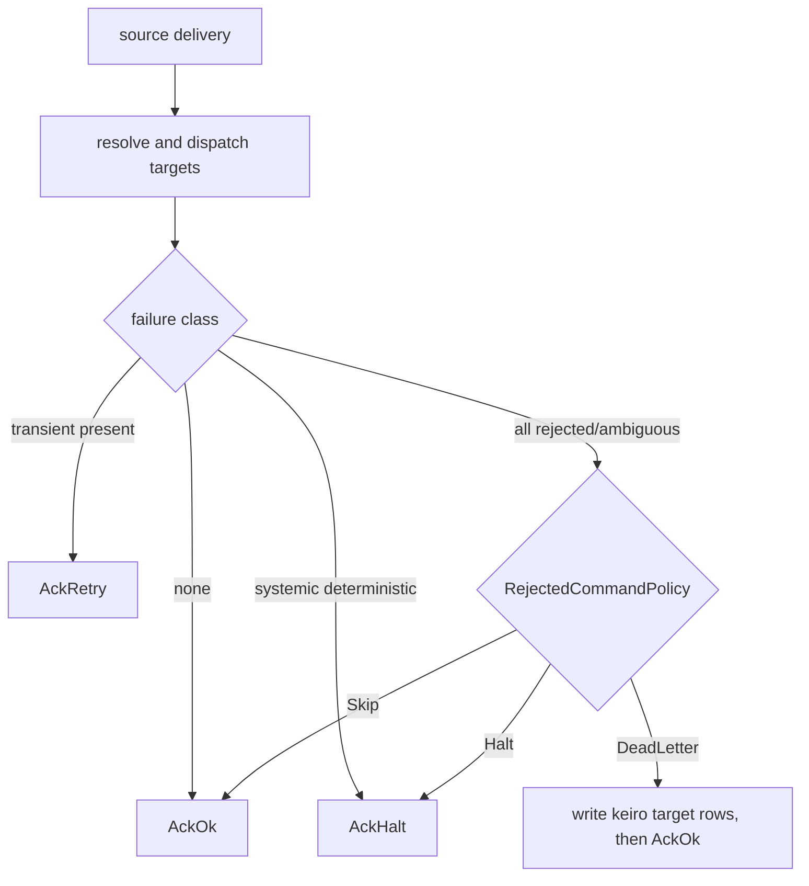

This final command-cycle chapter follows `keiro/src/Keiro/Router.hs`. Read
[06 — The typed handles](/docs/keiro/walkthrough/command-cycle/06-the-typed-handles) first.

## Resolve first, dispatch separately

```haskell
data Router input targetPhi targetRs targetState targetCi targetCo es = Router
  { name              :: Text
  , key               :: input -> Text
  , resolve           :: input -> Eff es [PMCommand targetCi]
  , targetEventStream :: ValidatedEventStream targetPhi targetRs targetState targetCi targetCo
  , targetProjections :: Stream targetCi -> [InlineProjection targetCo]
  }

newtype RouterResult target = RouterResult
  { commandResults :: [PMCommandResult target] }
```

There is no manager-state stream. `resolve` is the effectful target lookup; after it returns, each
command and its target projections commit in that target's own transaction. `RouterResult` has no
outer command error because there is no pre-dispatch manager append; failures remain target-bearing
elements in `commandResults`.

## Annotating same-target occurrences

The source first resolves each concrete target stream name, then uses a `Map StreamName Int` to
annotate occurrences:

```haskell
annotated = snd (mapAccumL occurrenceStep Map.empty (zip [0 ..] named))

occurrenceStep seen (legacyIndex, (targetStreamName, command)) =
  let occurrence = Map.findWithDefault 0 targetStreamName seen
  in ( Map.insert targetStreamName (occurrence + 1) seen
     , (legacyIndex, occurrence, targetStreamName, command)
     )
```

`legacyIndex` retains the old list position only for upgrade probing. `occurrence` counts commands
for the same target, so two commands addressing target A receive A/0 and A/1 even when other targets
appear between them.

## The current ID encodes target identity

```haskell
deterministicRouterCommandId ::
  Text -> Text -> EventId -> StreamName -> Int -> EventId
```

The UUIDv5 name contains `"keiro"`, `"router"`, router name, correlation, source event ID, target
stream name, and occurrence. Every text field is encoded as length-prefixed UTF-8. This avoids the
old positional failure: a reorder can no longer assign target B the ID previously used for A.

Tests cover partial dispatch followed by reorder, newly added targets, full-completion order swaps,
and repeated commands to one target. Across retries the result is a union: old immutable dispatches
remain, and newly resolved targets append.

## The compatibility probe is target-scoped

For each target the runner also derives the old positional ID:

```haskell
legacyCommandId =
  deterministicCommandId routerName correlationId sourceEventId legacyIndex
```

It calls `eventAlreadyIn targetStreamName legacyCommandId`. Scoping the lookup to this target means
an old ID in another target cannot suppress the current command. But if resolver order/membership
changes across the code upgrade, an old logical target may not find its former positional ID and can
receive one new target-derived dispatch. The probe is a bounded transition aid, not a claim across
simultaneous resolver and deployment drift.

## The lost-race path proves the target

After both prechecks miss, the runner calls `runCommandWithProjections`. A successful append becomes
`PMCommandAppended`. Any error is passed to:

```haskell
confirmBenignDuplicate targetStreamName commandId err
```

Only `DuplicateEvent` is eligible, and only when Kiroku's point lookup finds `commandId` in
`targetStreamName`. The event-ID constraint is global, so this check is necessary: a collision in a
different stream says nothing about whether this target ran. False remains
`PMCommandFailed targetStreamName err`.

## The worker classifies the whole result

`runRouterWorkerWith` counts duplicate and failed results, converts each failure to
`DispatchFailure emitIndex targetStreamName error`, then shares `decideForFailures` with process
managers:

1. systemic deterministic => `AckHalt`;
2. otherwise any transient => `AckRetry`;
3. no failures => `AckOk`;
4. all rejection-class => `RejectedCommandPolicy`.

`RejectedHalt` is default. `RejectedDeadLetter` writes one idempotent target-bearing row to
`keiro.keiro_dead_letters` per failure before `AckOk`; `RejectedSkip` acknowledges with metric-only
evidence. `CommandAmbiguous` is rejection-class for policy routing but remains a code defect.



This closes the command-cycle tour. Continue with
[Route events to commands](/docs/keiro/how-to/route-events-to-commands) or
[Inspect a rejected dispatch](/docs/keiro/how-to/inspect-a-rejected-dispatch).
