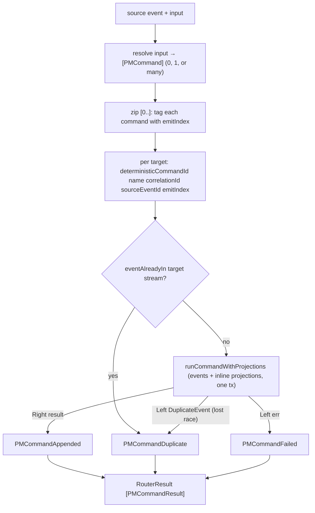

This final chapter reads `keiro/src/Keiro/Router.hs` — keiro's stateless content-based router, which
turns one source event into a fan-out of commands. Read
[06 — The typed handles](/docs/keiro/walkthrough/command-cycle/06-the-typed-handles) first.

## The fan-out in one picture

One source event becomes *zero, one, or many* commands. `resolve` looks the target set up; then each
resolved command is dispatched independently, under a deterministic id, through the same two
idempotency guards. The result is one `PMCommandResult` per target, in resolution order:



## `Router` and `RouterResult`

```haskell
-- keiro/src/Keiro/Router.hs
data Router input targetPhi targetRs targetState targetCi targetCo es = Router
  { name :: !Text                                   -- part of every command's deterministic id
  , key :: !(input -> Text)                         -- correlation string for the source event
  , resolve :: !(input -> Eff es [PMCommand targetCi])  -- effectful target set (e.g. runQuery)
  , targetEventStream :: !(EventStream targetPhi targetRs targetState targetCi targetCo)
  , targetProjections :: !(Stream targetCi -> [InlineProjection targetCo])
  }
  deriving stock (Generic)

newtype RouterResult target = RouterResult { commandResults :: [PMCommandResult target] }
  deriving stock (Generic, Eq, Show)
```

The five fields: `name` is a stable identifier that feeds every dispatched command's deterministic id;
`key` projects the source input to a correlation string; `resolve` computes the data-dependent target
set; `targetEventStream` is the aggregate every resolved command is dispatched to; and
`targetProjections` supplies inline projections run in the same append transaction (return `[]` for
append-only dispatch). `RouterResult` is just a list of `PMCommandResult`, one per resolved target, in
resolution order.

The router is the **stateless** sibling of the process manager: no manager-state stream, no
`correlate`, no self-directed command. Its one new power over the process manager is that `resolve`
runs in `Eff es`, so the fan-out set can be *looked up* — typically a
[`runQuery`](/docs/keiro/reference/process-manager) against a read model — rather than computed purely
from the event.

## Router vs. process manager, at the source

The kinship is not a metaphor — the source comment on `runRouterOnce` states that its per-target
dispatch logic is *identical* to `runProcessManagerOnce`'s `dispatchCommand`. What the router strips
away is everything to do with keeping state:

| Aspect | Process manager (`runProcessManagerOnce`) | Router (`runRouterOnce`) |
| --- | --- | --- |
| Per-target dispatch body | `deterministicCommandId` → `eventAlreadyIn` → `runCommandWithProjections` → fold `DuplicateEvent` | **identical** |
| Own state stream | a manager-state stream, advanced **first** | none |
| Correlation field | `correlate :: input -> Text` | `key :: input -> Text` (same role) |
| Target resolution | a **pure** `handle` over manager state | an **effectful** `resolve :: input -> Eff es [PMCommand]` (a lookup) |
| Result | `ProcessManagerResult` — `managerResult` **plus** command results | `RouterResult` — command results **only** |
| Outer `Either` | `Eff es (Either CommandError …)` — the manager append can fail before dispatch | **no** outer `Either` — there is no pre-dispatch write that can fail |

The whole tour of the process-manager side lives in the workflow walkthrough:
[the dispatch loop](/docs/keiro/walkthrough/workflow/01-the-process-manager-dispatch-loop) and
[the transaction model](/docs/keiro/walkthrough/workflow/02-the-transaction-model).

## `runRouterOnce` / `dispatchCommand`

```haskell
runRouterOnce options router sourceEvent input = do
  let correlationId = (router ^. #key) input
  commands <- (router ^. #resolve) input
  results <- traverse
    (\(emitIndex, command) -> dispatchCommand correlationId (sourceEvent ^. #eventId) emitIndex command)
    (zip [0 ..] commands)
  pure (RouterResult results)
  where
    dispatchCommand correlationId sourceEventId emitIndex command = do
      let commandId = deterministicCommandId (router ^. #name) correlationId sourceEventId emitIndex
          targetOptions = options & #eventIds .~ [commandId]
          targetStream = retarget (command ^. #target)
          targetStreamName = (targetEventStream ^. #resolveStreamName) targetStream
      commandAlreadyProcessed <- eventAlreadyIn options targetStreamName commandId
      if commandAlreadyProcessed
        then pure (PMCommandDuplicate commandId)
        else do
          outcome <- runCommandWithProjections targetOptions targetEventStream targetStream
                       (command ^. #command) ((router ^. #targetProjections) (command ^. #target))
          pure $ case outcome of
            Right result -> PMCommandAppended result
            Left (StoreFailed (DuplicateEvent (Just duplicateId))) | duplicateId == commandId -> PMCommandDuplicate commandId
            Left (StoreFailed (DuplicateEvent Nothing)) -> PMCommandDuplicate commandId
            Left err -> PMCommandFailed err
```

`runRouterOnce` resolves the targets, then dispatches one command per target with a deterministic id.
The id is a pure function of `deterministicCommandId (router name) correlation sourceEventId emitIndex` —
note the `emitIndex` from `zip [0 ..]`, which distinguishes the several commands a single source event
fans out into. Dispatch then layers **two** idempotency guards: the `eventAlreadyIn` pre-check skips a
command already present in the target stream, and even if two workers race past that check, the store
rejects the second append as a `DuplicateEvent` — which the router folds back into a benign
`PMCommandDuplicate`. The command runs via `runCommandWithProjections` (the read-side wrapper over the
transactional runner from [chapter 04](/docs/keiro/walkthrough/command-cycle/04-the-transactional-write-path)),
so a target's events and its inline projections commit together. A genuine failure becomes a
`PMCommandFailed` *element* of the `RouterResult` — never an exception, never an outer `Left`.

### `retarget = coerce`

The one line elided above is `targetStream = retarget (command ^. #target)`, and `retarget` is a
`coerce`:

```haskell
retarget :: Stream targetCi -> Stream (EventStream targetPhi targetRs targetState targetCi targetCo)
retarget = coerce
```

`command ^. #target` is a `Stream targetCi` — a stream tagged by the *command input* type — but
`runCommandWithProjections` wants a `Stream` tagged by the *whole* `EventStream`. A `Stream` is a
phantom-typed newtype over a stream name ([chapter 06](/docs/keiro/walkthrough/command-cycle/06-the-typed-handles)),
so the two are the same runtime value and `retarget` is a zero-cost cast that only rewrites the
phantom. The identical `retarget = coerce` appears in the process manager's
[dispatch loop](/docs/keiro/walkthrough/workflow/01-the-process-manager-dispatch-loop).

## The deterministic id, component by component

Idempotency is *entirely* carried by the command id, so it is worth reading
`deterministicCommandId` (from [`Keiro.ProcessManager`](/docs/keiro/reference/process-manager)) byte
for byte. It is a v5 (namespaced, deterministic) UUID over four colon-joined components:

```haskell
deterministicCommandId managerName correlationId sourceEventId emitIndex =
  EventId $ UUID.V5.generateNamed UUID.V5.namespaceURL $ … $
    Text.intercalate ":"
      [ "keiro", "process-manager", managerName, correlationId
      , UUID.toText (eventIdToUuid sourceEventId), Text.pack (show emitIndex) ]
```

Each component earns its place — drop any one and a class of distinct commands collapses to the same
id, where the second is silently swallowed as a `PMCommandDuplicate`:

- **`managerName`** (`router.name`, e.g. `"jitsurei-paging"`) — namespaces the dispatcher, so a router
  and a process manager that both target the same aggregate never collide on ids.
- **`correlationId`** (`key input`, e.g. the incident id) — ties the id to the business correlation, so
  two unrelated incidents fanning out to an overlapping responder set produce *distinct* page commands.
- **`sourceEventId`** — ties the id to the *specific* source event; without it two different events
  sharing a correlation would mint colliding ids and the second event would write nothing.
- **`emitIndex`** (the `zip [0 ..]`) — distinguishes the N commands a *single* source event fans out
  into; without it every responder paged from one `IncidentRaised` would share an id and only the
  first would ever be appended.

<Callout type="info">
The namespace segment is literally `"process-manager"` even for a router — the router reuses the
process manager's id function rather than minting its own. It is the **`name`** field, not the
segment, that keeps a router's command ids disjoint from a process manager's. Because the UUID is a
pure function of these four inputs, re-deriving it on replay yields the *same* id — which is the whole
basis of the `eventAlreadyIn` pre-check and the `DuplicateEvent` fold.
</Callout>

## `runRouterWorker` / `ackDecisionFor`

```haskell
runRouterWorker options router Adapter{source = adapterSource} decodeMessage =
  Streamly.fold Fold.drain $ Streamly.mapM handleIngested adapterSource
  where
    handleIngested Ingested{envelope = Envelope{payload = message}, ack = AckHandle finalizeAck} = do
      decision <- case decodeMessage message of
        Nothing -> pure (AckHalt (HaltFatal "router worker could not decode message"))
        Just (recorded, input) -> do
          RouterResult results <- runRouterOnce options router recorded input
          pure (ackDecisionFor results)
      finalizeAck decision
      pure decision

    ackDecisionFor results =
      case [err | PMCommandFailed err <- results] of
        (err : _) -> AckHalt (HaltFatal (Text.pack (show err)))
        [] -> AckOk
```

`runRouterWorker` runs the router as a live subscription, draining a shibuya `Adapter` and finalizing
each message's `AckHandle` with a decision. The ack policy is strict: an undecodable message halts
fatally (`AckHalt`); after dispatch, an all-`PMCommandAppended`/`PMCommandDuplicate` batch acks `AckOk`;
and **any** `PMCommandFailed` halts so the source event is retried — which the deterministic ids make
safe, because already-applied targets fold to `PMCommandDuplicate` on the retry.

<Callout type="warn">
Because any `PMCommandFailed` halts and retries the source event, a *benign* domain rejection (a target
with no matching edge) would wedge the worker. Model such rejections as **total** transitions (an
ε-complement self-loop) in the target transducer so they never become `PMCommandFailed`.
</Callout>

## The five fields, filled in: `pagingRouter`

The worked example is jitsurei's `pagingRouter` (`jitsurei/src/Jitsurei/Paging.hs`, run with
`just jitsurei-paging`) — the entire `Router` value, with every abstract field bound to a concrete
escalation-domain value:

```haskell
pagingRouter =
  Router
    { name = "jitsurei-paging"
    , key = \raised -> incidentIdText raised.incidentId
    , resolve = \raised -> do
        result <- runQuery Nothing serviceOncallReadModel raised.service
        let responders = either (const []) id result
        pure
          [ PMCommand
              { target = pageCommandStream raised.incidentId responder.responderId
              , command = SendPage (SendPageData{incidentId = raised.incidentId, responderId = responder.responderId})
              }
          | responder <- responders
          ]
    , targetEventStream = pageEventStream
    , targetProjections = const []
    }
```

Reading it against the five fields:

- **`name = "jitsurei-paging"`** — the deterministic-id namespace from the section above.
- **`key`** projects each `IncidentRaisedData` to its incident-id text — the correlation every page for
  that incident shares.
- **`resolve`** is the effectful lookup: `runQuery` the on-call read model for `raised.service`, then
  emit one `SendPage` `PMCommand` per responder. Note `either (const []) id result` — a *failed* query
  routes **nowhere** (the empty list), the intentional no-op, not an error.
- **`targetEventStream = pageEventStream`** — the page aggregate every `SendPage` is dispatched to.
- **`targetProjections = const []`** — append-only dispatch; no inline read-model write rides along.

This is also where `retarget = coerce` pays off: `pageCommandStream incidentId responderId` builds a
`Stream PageCommand` (the same `"page-<incident>-<responder>"` name as `pageStream`'s
`Stream PageEventStream`), and the `coerce` is exactly what reconciles the command-typed stream
`resolve` returns with the `EventStream`-typed stream the runner appends to.

`PMCommand`, `PMCommandResult`, `deterministicCommandId`, and `eventAlreadyIn` come from
[`Keiro.ProcessManager`](/docs/keiro/reference/process-manager); `InlineProjection` and
`runCommandWithProjections` from [`Keiro.Projection`](/docs/keiro/reference/projection).

That closes the write-path tour — back to
[00 — Start here](/docs/keiro/walkthrough/command-cycle/00-start-here), or on to the
[Router reference](/docs/keiro/reference/router).
