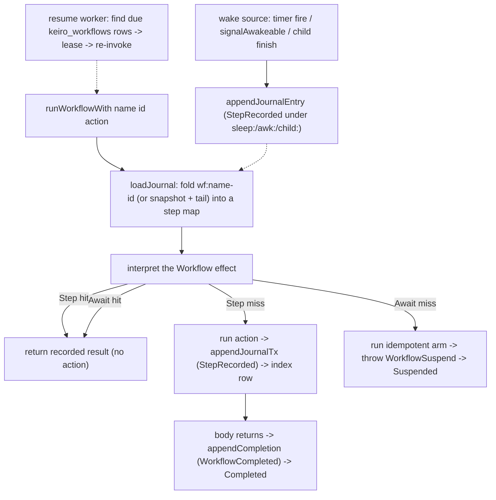

This is an **ordered source tour** of keiro's **durable-execution runtime** — the `Keiro.Workflow`
module family that lets you write a long-running process as an ordinary function whose **named**
checkpoints are journaled, so it can pause across a crash, a redeploy, or an idle wait and resume by
re-invoking it from the top.

If you have not met the concept, read [Understanding durable
execution](/docs/keiro/explanation/durable-execution) first; for the dry signatures, the [durable
workflows reference](/docs/keiro/reference/durable-workflows). This tour reads the real source and
explains *why* it is shaped the way it is.

## The one idea: journal-and-replay over named steps

Everything in this runtime falls out of one mechanism. Each instance owns a kiroku stream named
`wf:<name>-<id>` — its **journal**. A `step name action` either runs `action` and journals its result,
or — on a re-run where `name` is already journaled — returns the recorded result **without running the
action again**. A wait suspends the run after arming an external wake source; the wake source later
appends the awaited step's completion; a later run **replays**, short-circuiting finished steps and
running only the un-journaled tail.

So "resume" is not a special code path — it is **the same function, run again**. The journal makes
re-running it cheap and side-effect-safe. The four authoring primitives (`step`, `sleepNamed`,
`awakeableNamed`, child workflows) and the suspension waits are all built on two effect operations:
`step` (run-once-and-journal) and `awaitStep` (arm-and-suspend, or return-if-resolved).

## Two facts to get right up front

**1. Identity is the step name, not the call position.** Replay matches on the `StepName` string, so
inserting or reordering unrelated code never corrupts an in-flight instance. This is deliberate — it
avoids the positional-history replay nondeterminism that ordinary code movement causes in some
durable-execution systems. The ordinal convenience forms (`sleep`, `awakeable`) trade that safety for
brevity.

**2. The journal stream is the source of truth; the tables are derived.** Four tables
(`keiro_workflow_steps`, `keiro_workflows`, `keiro_awakeables`, `keiro_workflow_children`) are
fast-lookup indexes and operator-visible state, kept in sync **inside the same transaction** as each
journal append. Replay always folds the journal stream; the indexes exist so the hot path can ask
"does this step exist?" and the resume/GC workers can ask "which workflow instances are due?"
without rescanning streams.

## The design in one picture



## The modules this tour reads

```text
keiro/src/Keiro/Workflow/Types.hs        -- identity, the journal codec, reserved step names
keiro/src/Keiro/Workflow.hs              -- the Workflow effect, runWorkflowWith, the replay loop
keiro/src/Keiro/Workflow/Schema.hs       -- the keiro_workflow_steps index + due-instance discovery SQL
keiro/src/Keiro/Workflow/Instance.hs     -- the keiro_workflows lifecycle row, leases, and crash backoff
keiro/src/Keiro/Workflow/Sleep.hs        -- durable sleep on the keiro_timers table
keiro/src/Keiro/Workflow/Awakeable.hs    -- awakeables (+ Awakeable/Schema.hs)
keiro/src/Keiro/Workflow/Child.hs        -- child workflows (+ Child/Schema.hs)
keiro/src/Keiro/Workflow/Resume.hs       -- the resume / crash-recovery worker
keiro/src/Keiro/Workflow/Snapshot.hs     -- the workflow snapshot codec + Keiro.Telemetry instruments
keiro/src/Keiro/Workflow/Gc.hs           -- optional terminal-instance pruning
```

Chapter 09 returns to `Types.hs`, `Schema.hs`, and `Workflow.hs` for the MasterPlan-6 additions —
continue-as-new journal rotation and the `patch` versioning API.

## The chapters

<Cards>
  <Card title="01 — The types and the journal codec" href="/docs/keiro/walkthrough/durable-execution/01-the-types-and-journal-codec" description="WorkflowName/Id/StepName, workflowStreamName, the WorkflowJournalEvent sum and its self-describing codec, the reserved sleep:/awk:/child: prefixes, WorkflowState, and WorkflowOutcome." />
  <Card title="02 — The effect and the replay loop" href="/docs/keiro/walkthrough/durable-execution/02-the-effect-and-replay-loop" description="The Workflow effect, step/awaitStep, runWorkflowWith top to bottom: loadJournal, the hit/miss handler, the WorkflowSuspend sentinel, appendJournalTx, and the deterministic journal id." />
  <Card title="03 — The step index and discovery" href="/docs/keiro/walkthrough/durable-execution/03-the-step-index-and-discovery" description="keiro_workflow_steps, the keiro_workflows lifecycle row, recordStepTx's ON CONFLICT DO NOTHING, stepExists, wake_after, and due-instance discovery." />
  <Card title="04 — Durable sleep" href="/docs/keiro/walkthrough/durable-execution/04-durable-sleep" description="The payload discriminator, the deterministic sleepTimerId, sleepNamed as an awaitStep arm that schedules a keiro_timers row, workflowSleepFireAction, and runWorkflowTimerWorker." />
  <Card title="05 — Awakeables" href="/docs/keiro/walkthrough/durable-execution/05-awakeables" description="The journaled opaque AwakeableId, awaitCancellable, and the idempotent, crash-safe signalAwakeable — why it re-appends the journal entry whenever the row is completed." />
  <Card title="06 — Child workflows" href="/docs/keiro/walkthrough/durable-execution/06-child-workflows" description="spawnChild as a journaled parent step + link row, awaitChild over awaitStep, cancelChild's two-marker dance, failed-child envelopes, and runChildWorkflow/childCompletionHook waking the parent." />
  <Card title="07 — The resume worker" href="/docs/keiro/walkthrough/durable-execution/07-the-resume-worker" description="The registry, resumeWorkflowsOnce's discovery union, instance leases, crash backoff, child routing, and the ResumeSummary." />
  <Card title="08 — Snapshots and telemetry" href="/docs/keiro/walkthrough/durable-execution/08-snapshots-and-telemetry" description="The fixed-shape-hash workflowStateCodec, advisory post-journal snapshot writes, nine keiro.workflow.* instruments, and the withWorkflowSpan run span." />
  <Card title="09 — Versioning and rotation" href="/docs/keiro/walkthrough/durable-execution/09-versioning-and-rotation" description="The generation column and #<g> stream suffix, currentGeneration, the ContinueAsNew/WorkflowRotate unwind and crash-safe rotateGeneration, restoreSeed as an ordinary step, and the patch hit/miss handler keyed on the recorded active patch set." />
</Cards>

## What this tour assumes

It assumes the [command-cycle tour](/docs/keiro/walkthrough/command-cycle/00-start-here) (the
Hydrate → Transduce → Append loop and the codec boundary) and the [workflow-engine
tour](/docs/keiro/walkthrough/workflow/00-start-here) (process managers and the `keiro_timers` table
durable sleep reuses). The durable-execution runtime layers on both: it journals to kiroku streams via
the same codec machinery, and a workflow sleep is a `keiro_timers` row routed by a payload
discriminator. The legacy worked example throughout is jitsurei's
`orderFulfillmentWorkflow`; treat its names as a legacy source-reading anchor,
not a current runnable release test. See the [legacy example
status](/docs/keiro/explanation/the-jitsurei-example).

<Callout type="warn">
**One expectation to reset before you start: this runtime is *not* a keiki `SymTransducer`.** Everywhere
else in keiro the decision core is one — an aggregate, a process manager, and a saga are all the same
keiki transducer ([the foundation tour](/docs/keiro/walkthrough/foundation/04-the-symtransducer-and-step)).
Durable execution is the deliberate exception: `Keiro.Workflow` is an `effectful` effect interpreted by a
**journal-and-replay handler**, with no keiki transducer involved — because a workflow is imperative code
with in-line waits over a *dynamic* step map, not a pure transition relation over a *static* register
file. [Chapter 02](/docs/keiro/walkthrough/durable-execution/02-the-effect-and-replay-loop#this-is-not-a-keiki-transducer-and-that-is-deliberate)
explains the split in full; the two still share the kiroku log and the `Codec` substrate beneath the
decision core.
</Callout>
